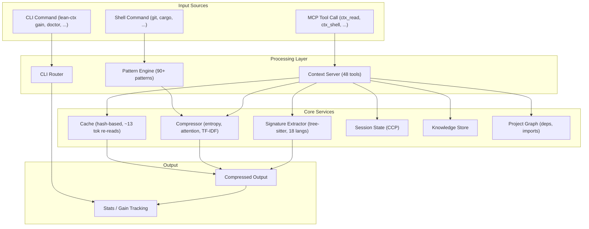

# Architecture

lean-ctx is a single Rust binary that serves as both a **shell hook** (CLI compression) and a **persistent MCP server** (context intelligence for AI agents). This document describes the high-level module structure and data flows.

## Data Flow



## Module Overview

### Entry Points

| Module | Purpose |
|:---|:---|
| `main.rs` | CLI entry point — arg parsing, subcommand dispatch |
| `mcp_stdio.rs` | MCP stdio transport — JSON-RPC framing over stdin/stdout |
| `http_server/` | Streamable HTTP MCP transport |

### Server Layer

| Module | Purpose |
|:---|:---|
| `server/mod.rs` | `LeanCtxServer` — MCP server state, initialization |
| `server/dispatch.rs` | Tool dispatch — routes MCP tool calls to handler functions |
| `server/execute.rs` | Shell command execution within MCP context |
| `server/helpers.rs` | Shared server utilities |
| `tool_defs/` | Tool metadata, JSON schemas, granular vs unified mode |
| `tools/` | 48 tool handlers (`ctx_read`, `ctx_shell`, `ctx_search`, ...) |

### Shell Layer

| Module | Purpose |
|:---|:---|
| `shell.rs` | Shell command execution, output capture, compression |
| `shell_hook.rs` | Shell hook initialization (`lean-ctx init --global`) |
| `core/patterns/` | 52 pattern modules for CLI output compression (git, npm, cargo, docker, ...) |
| `compound_lexer.rs` | Multi-command parsing (`&&`, `||`, pipes) |

### Core Intelligence

| Module | Purpose |
|:---|:---|
| `core/cache.rs` | Content-addressed file cache with hash-based change detection |
| `core/tokens.rs` | tiktoken-based token counting (o200k_base) |
| `core/signatures.rs` | Regex-based signature extraction |
| `core/signatures_ts.rs` | tree-sitter AST signature extraction (18 languages) |
| `core/compressor.rs` | Multi-strategy compression (entropy, attention, TF-IDF codebook) |
| `core/entropy.rs` | Shannon entropy analysis per line |
| `core/attention_model.rs` | U-curve positional weighting for LLM attention |
| `core/session.rs` | Cross-session memory (Context Continuity Protocol) |
| `core/knowledge.rs` | Persistent project knowledge store |
| `core/graph_index.rs` | Project dependency graph |
| `core/import_resolver.rs` | Cross-file import resolution |
| `core/deep_queries.rs` | Import/call/type extraction per language |
| `core/protocol.rs` | Cognitive Efficiency Protocol (CEP) scoring |

### CLI Layer

| Module | Purpose |
|:---|:---|
| `cli/mod.rs` | CLI subcommands (`read`, `diff`, `grep`, `find`, `config`, ...) |
| `cli/dispatch.rs` | HTTP server startup for CLI |
| `cli/cloud.rs` | Cloud sync, login, export |
| `cli/shell_init.rs` | Shell initialization script generation |

### Integration Layer

| Module | Purpose |
|:---|:---|
| `hooks/` | Agent-specific installation (Cursor, Claude Code, Codex, Gemini, ...) |
| `rules_inject.rs` | Rule file injection into project/home directories |
| `setup.rs` | Interactive setup wizard |
| `doctor.rs` | Diagnostics and self-repair |
| `engine/` | `ContextEngine` — programmatic API for tool calls |

### Analytics and UI

| Module | Purpose |
|:---|:---|
| `core/stats.rs` | Token savings persistence and formatting |
| `core/gain/` | Gain scoring, model pricing, task classification |
| `dashboard/` | Web dashboard (localhost:3333) |
| `tui/` | Terminal UI components |
| `report.rs` | Export and reporting |

## Key Design Decisions

1. **Single binary** — No runtime dependencies. Shell hook, MCP server, CLI, and dashboard all in one `lean-ctx` binary.

2. **Persistent MCP server** — Unlike shell-hook-only tools, lean-ctx runs as a long-lived process. This enables file caching (re-reads cost ~13 tokens), session state, and cross-tool dedup.

3. **Pattern-based compression** — Each CLI tool (git, cargo, npm, ...) has a dedicated pattern module in `core/patterns/`. Patterns are handcrafted per subcommand for maximum fidelity.

4. **tree-sitter for signatures** — AST-based extraction handles multi-line signatures, nested scopes, and arrow functions correctly across 18 languages. Falls back to regex for unsupported languages.

5. **Content-addressed caching** — Files are hashed on first read. Subsequent reads return a compact stub (~13 tokens) unless the file changed on disk.

6. **Error strategy** — `thiserror` for typed errors (`LeanCtxError`), `anyhow` for ad-hoc contexts. Tools return user-friendly error messages; internal errors are logged via `tracing`.

7. **Lazy tool loading** — By default, only 9 core tools are exposed. Additional tools are loaded on demand via `ctx_discover_tools` to minimize schema token overhead for smaller models.

## Build

```bash
cd rust
cargo build --release              # Full build with tree-sitter (~17 MB)
cargo build --release --no-default-features  # Without tree-sitter (~5.7 MB)
cargo test --all-features           # Run all 1,200+ tests
cargo clippy --all-targets -- -D warnings
```
