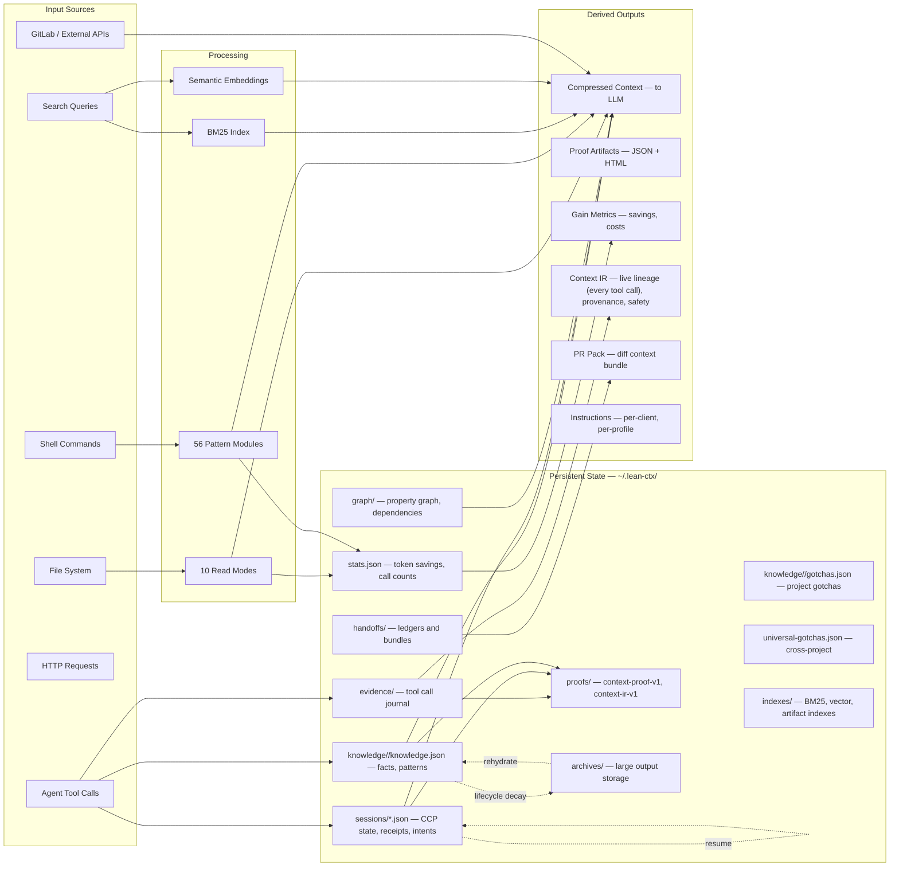
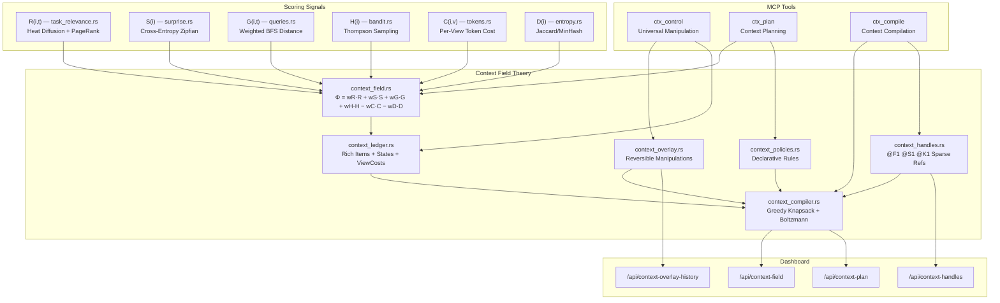

# Architecture

lean-ctx is a single Rust binary that serves as both a **shell hook** (CLI compression) and a **persistent MCP server** (context intelligence for AI agents). This document describes the complete module structure, data flows, and processing pipeline.

## Diagram 1: Complete Architecture Overview

```mermaid
flowchart TB
    subgraph delivery [Delivery Surface]
        MCPStdio["MCP Server — stdio JSON-RPC"]
        HTTPSingle["HTTP MCP Server — lean-ctx serve"]
        HTTPTeam["Team Server — multi-workspace, auth, scopes, audit"]
        CLI["CLI — 75+ subcommands incl. knowledge, session, overview, compress"]
        DaemonUDS["Daemon — Unix Domain Socket, PID lifecycle"]
        ShellHook["Shell Hook — ~/.zshenv interception"]
        SDKClient["SDK — TypeScript client"]
    end

    subgraph dispatch [Dispatch and Governance]
        PrePipeline["Pre-Pipeline — idle, meta-resolve, role, workflow, autonomy, loop, degradation, budget"]
        RoleGuard["Role Guard — tool access by role"]
        WorkflowGate["Workflow Gate — allowed_tools per state"]
        LoopDetect["Loop Detection — throttle/block repeated searches"]
        BudgetGate["Budget / SLO Gate — exhaustion blocking, throttling"]
        DegradationEval["Degradation Policy — evaluate_v1_for_tool"]
        ContextGate["Context Gate — pre: bounce/intent/graph/knowledge; post: ledger, overlays, eviction, elicitation"]
        HybridDispatch["Hybrid Dispatch — Context Server (79 tools)"]
        ToolRegistry["ToolRegistry — 75 trait-based tools (McpTool)"]
        DispatchRegistry["Registry dispatch — dispatch/mod.rs (majority of tools)"]
        PostPipeline["Post-Pipeline — Context IR, tokens, archive, density, translation, verify, enrich, auto-response, evidence, sandbox routing"]
    end

    subgraph contextio [Context I/O]
        ReadPipeline["Read Pipeline — 10 modes: full, map, signatures, diff, task, reference, aggressive, entropy, lines, auto"]
        ShellCompress["Shell Compression — 56 pattern modules (versioned v1)"]
        SearchEngine["Search — BM25, regex, semantic, hybrid"]
        GraphAwareRead["Graph-Aware Read — related files hint in every read"]
        EditSafety["Edit Safety — ctx_edit, TOCTOU guard, path jail"]
        BounceTracker["Bounce Tracker — per-file read events, bounce detection, adjusted savings"]
        TreeSitter["Tree-sitter AST — 18 languages, signature extraction"]
        RegexSig["Regex Signatures — fallback for unsupported languages"]
    end

    subgraph patterns [Shell Patterns — 56 modules]
        PatGit["git — status, log, diff, push, pull, ..."]
        PatCargo["cargo — build, test, clippy, bench, ..."]
        PatNpm["npm/pnpm/bun/deno — install, run, build, ..."]
        PatDocker["docker/kubectl/helm — ps, logs, build, ..."]
        PatGh["gh — pr, issue, run, ..."]
        PatGlab["glab — mr, issue, pipeline, ..."]
        PatFd["fd/fdfind — directory grouping"]
        PatJust["just — recipe compression"]
        PatNinja["ninja — progress/warning dedup"]
        PatClang["clang — diagnostic dedup, include collapse"]
        PatOther["+ 50 more: aws, terraform, make, pip, maven, ..."]
    end

    subgraph policy [Policy Engine]
        Profiles["Profiles — field-wise merge, Option<T> inheritance"]
        Roles["Roles — coder, reviewer, explorer, ops"]
        Budgets["Budgets — tokens, shell calls, cost limits"]
        SLOs["SLOs — compression ratio, latency, cache efficiency"]
        MemPolicy["Memory Policy — knowledge limits, decay, lifecycle"]
        AutonomyDrv["Autonomy Drivers — prefetch, auto-dedup, auto-response"]
        BoundaryPolicy["Boundary Policy — cross-project search/import, audit, universal gotchas"]
    end

    subgraph packaging [Context Packaging]
        PkgManifest["Manifest — schema v1, SHA-256 integrity, provenance"]
        PkgBuilder["Builder — collects Knowledge + Graph + Session + Gotchas"]
        PkgLoader["Loader — merge facts (dedup), import graph, import gotchas"]
        PkgRegistry["Registry — ~/.lean-ctx/packages/, index, versioning"]
        PkgAutoLoad["Auto-Load — marked packages loaded on ctx_overview"]
        PkgExport["Export/Import — .ctxpkg portable format"]
    end

    subgraph routing [Intent and Routing]
        IntentRouter["Intent Router — classify, route, profile select"]
        IntentProtocol["Intent Protocol — infer from tool calls, side-effects"]
        WorkflowEngine["Workflow Engine — planning, coding, testing, done"]
        InstrCompiler["Instruction Compiler — client + profile to instructions"]
        ModePredictor["Mode Predictor — smart_read mode selection"]
        TaskRelevance["Task Relevance — content scoring by task"]
    end

    subgraph compression [Compression and IR]
        ContextIR["Context IR v1 — live lineage recording (hot-path), source, provenance, safety, tokens, freshness"]
        Compressor["Compressor — entropy, attention, TF-IDF codebook"]
        EntropyFilter["Entropy Filter — Shannon entropy per line"]
        AttentionModel["Attention Model — U-curve positional weighting"]
        TokenOptimizer["Neural Token Optimizer — context reorder, line scoring"]
        FileCache["File Cache — hash-based, mtime validation, compressed output cache for map/signatures"]
        MultiTokenizer["Multi-Tokenizer — o200k_base, cl100k_base, Gemini, Llama families"]
        DedupEngine["Dedup Engine — Rabin-Karp rolling hash, cross-file"]
        PopPruning["POP Pruning — intent-conditioned trimming"]
    end

    subgraph postpipeline [Post-Dispatch Output Pipeline]
        PrefixOrdering["Prefix-Cache Ordering — static first, dynamic last"]
        OutputDensity["Output Density — CRP/TDD compression"]
        TokenTranslation["Tokenizer Translation — ascii, legacy, auto per model"]
        OutputVerify["Output Verification — hallucination detect, path validation"]
        ArchiveStore["Archive — large outputs stored, expandable via ctx_expand"]
        RedactionEngine["Redaction — secrets, PII removal"]
        AutoResponse["Autonomy Auto-Response — auto-dedup, graph hints, prefetch"]
        SLOEvaluate["SLO Evaluate — post-call metrics"]
        EvidenceLedger["Evidence Ledger — tool call journal with hashes"]
    end

    subgraph contextos [Context OS — Multi-Agent Runtime]
        ContextBus["Context Bus — SQLite WAL, R/W split, per-stream broadcast, FTS5"]
        SharedSessions["Shared Sessions — LRU-64, workspace/channel keyed, persist-on-evict"]
        ContextOSMetrics["Metrics — events, sessions, active workspaces (TTL)"]
        ContextOSRuntime["Runtime — emit_event, event classification, consistency levels"]
        SSEStream["SSE Streaming — per-stream subscribe, redacted team events"]
        ContextViews["Context Views — /v1/context/summary, /v1/events/search, /v1/events/lineage"]
    end

    subgraph memory [Context Memory]
        Session["Session State — CCP, file refs F1..Fn, task, receipts"]
        KnowledgeStore["Knowledge Store — facts, patterns, history, rooms, inverted token index"]
        GotchaTracker["Gotcha Tracker — project + universal gotchas"]
        EpisodicMem["Episodic Memory — episode tracking"]
        ProceduralMem["Procedural Memory — learned procedures"]
        ProspectiveMem["Prospective Memory — scheduled reminders"]
        KnowledgeRelations["Knowledge Relations — fact-to-fact graph"]
        KnowledgeEmbeddings["Knowledge Embeddings — semantic recall"]
        ConsolidationEngine["Consolidation Engine — merge insights"]
        MemoryLifecycle["Memory Lifecycle — decay, category-grouped consolidation, archive, rehydrate"]
        SurvivalEngine["Session Survival — structured recovery queries"]
    end

    subgraph graph [Graph and Index]
        PropertyGraph["Property Graph — AST nodes, 232+ edges, Multi-Edge BFS, related_files, file_connectivity"]
        GraphIndex["Graph Index — dependency graph, imports"]
        GraphEnricher["Graph Enricher — metadata enrichment"]
        CallGraph["Call Graph — callers/callees"]
        SymbolMap["Symbol Map — symbol to position"]
        BM25Index["BM25 Index — lexical search + dense embeddings"]
        HybridSearch["Hybrid Search — RRF: BM25 + semantic + graph proximity"]
        RRFSearch["RRF Fusion — BM25 + Semantic + Graph Proximity"]
        ArtifactIndex["Artifact Index — proof, pack, bundle indexing"]
    end

    subgraph a2a [Agent-to-Agent]
        AgentRegistry["Agent Registry — register, list, status"]
        HandoffLedger["Handoff Ledger — create, show, list"]
        TransferBundle["Transfer Bundle v1 — privacy-aware export/import"]
        CostAttribution["Cost Attribution — per-agent tracking"]
        RateLimiter["Rate Limiter — per-agent throttle"]
        CtxShare["ctx_share — push/pull file context between agents"]
        CCPBundle["CCP Session Bundle — portable session format"]
    end

    subgraph verification [Verification and Contracts]
        ContextProof["Context Proof v1 — JSON + HTML artifacts, replay hashes"]
        VerifyObserve["Verification Observability — stats, warnings"]
        SafetyNeedles["Safety Needles — secret detection patterns"]
        Integrity["Integrity Checks — contract compliance"]
        Contracts["Contracts — 19 versioned contracts, drift gates"]
        DegPolicy["Degradation Policy v1 — graceful fallback"]
    end

    subgraph cognition [Cognition Drivers]
        TokTranslDriver["Tokenizer Translation Driver — multi-family (O200k, Cl100k, Gemini, Llama)"]
        AttnLayoutDriver["Attention Layout Driver — line ordering for attention"]
        ClientConstraints["Client Constraints — per-IDE capability matrix"]
        ClientCapabilities["Client Capabilities — 9 IDE runtime detection, Tier 1-4, MCP feature gates"]
        LITM["LITM — Lost-in-the-Middle positioning"]
        Adaptive["Adaptive Engine — task complexity, bandits, thresholds"]
        LLMFeedback["LLM Feedback — compression quality signals"]
    end

    subgraph providers [External Providers — Context Engine]
        ProviderFramework["Provider Framework — ctx_provider tool, ProviderRegistry"]
        GitHubProvider["GitHub Provider — issues, PRs, actions"]
        GitLabProvider["GitLab Provider — issues, MRs, pipelines"]
        JiraProvider["Jira Provider — issues, sprints, projects"]
        PostgresProvider["PostgreSQL Provider — tables, schema, queries"]
        McpBridgeProvider["MCP Bridge Provider — mcp:name, HTTP+stdio"]
        ConfigProvider["Config Provider — custom REST via TOML/JSON"]
        ProviderCache["Provider Cache — TTL-based result caching"]
        Consolidation["Consolidation Pipeline — chunks→BM25+Graph+Knowledge+Cache"]
    end

    subgraph infra [Infrastructure]
        PathJail["Path Jail — sandbox, symlink traversal protection"]
        IOBoundary["I/O Boundary — secret-path checks, role-aware"]
        StartupGuard["Startup Guard — single instance, maintenance lock"]
        EditorRegistry["Editor Registry — auto-detect IDE, config writers"]
        DataDir["Data Dir — ~/.lean-ctx persistence"]
        ProjectHash["Project Hash — repo fingerprint via git remote + identity"]
        ConfigLoader["Config — .lean-ctx.toml + env overrides"]
        Doctor["Doctor — 15-point diagnostics incl. SKILL check"]
        HookInstaller["Hook Installer — 34 agent targets, HookMode (MCP/Hybrid)"]
        SkillInstaller["SKILL Installer — Claude, Cursor, Codex skill files"]
        DaemonMgr["Daemon Manager — PID, socket, start/stop/status"]
    end

    subgraph mcpprotocol [MCP Protocol Layer]
        MCPResources["MCP Resources — 5 URI resources, subscribe-capable notifications"]
        MCPPrompts["MCP Prompts — 5 slash commands (/context-focus, -review, -reset, -pin, -budget)"]
        MCPElicitation["Elicitation — rate-limited suggestions, pressure/size/budget triggers"]
        DynamicToolMgr["Dynamic Tools — 6 categories, on-demand loading, tools/list_changed"]
    end

    subgraph dashboardpanel [Dashboard Control Plane]
        DashBounce["/api/context-bounce — bounce statistics"]
        DashClient["/api/context-client — IDE identification"]
        DashPressure["/api/context-pressure — budget pressure gauge"]
        DashDynTools["/api/context-dynamic-tools — tool category status"]
    end

    delivery --> PrePipeline
    PrePipeline --> RoleGuard
    RoleGuard --> WorkflowGate
    WorkflowGate --> LoopDetect
    LoopDetect --> BudgetGate
    BudgetGate --> DegradationEval
    DegradationEval --> ContextGate
    ContextGate --> HybridDispatch

    HybridDispatch -->|"registry (79 tools)"| ToolRegistry
    HybridDispatch -->|"legacy (6 tools)"| DispatchRegistry

    ToolRegistry --> PostPipeline
    DispatchRegistry --> PostPipeline

    DispatchRegistry --> ReadPipeline
    DispatchRegistry --> EditSafety
    DispatchRegistry --> ShellCompress
    DispatchRegistry --> SearchEngine

    ShellCompress --> patterns

    ReadPipeline --> TreeSitter
    ReadPipeline --> RegexSig
    ReadPipeline --> FileCache
    ReadPipeline --> Compressor
    ReadPipeline --> PropertyGraph
    ReadPipeline --> GraphAwareRead

    ToolRegistry --> Session
    ToolRegistry --> KnowledgeStore
    ToolRegistry --> AgentRegistry
    ToolRegistry --> WorkflowEngine

    ToolRegistry --> PropertyGraph
    ToolRegistry --> ContextProof
    ToolRegistry --> ArtifactIndex

    PostPipeline --> PrefixOrdering
    PrefixOrdering --> OutputDensity
    OutputDensity --> TokenTranslation
    TokenTranslation --> OutputVerify
    OutputVerify --> ArchiveStore
    ArchiveStore --> RedactionEngine
    RedactionEngine --> AutoResponse
    AutoResponse --> SLOEvaluate
    SLOEvaluate --> EvidenceLedger

    Session -.->|"task, project_root"| DispatchRegistry
    Session -.->|"receipts, intents"| EvidenceLedger
    Session --> SurvivalEngine

    KnowledgeStore --> MemoryLifecycle
    KnowledgeStore --> KnowledgeRelations
    KnowledgeStore --> KnowledgeEmbeddings
    KnowledgeStore --> ConsolidationEngine
    GotchaTracker --> KnowledgeStore

    PropertyGraph --> GraphIndex
    GraphIndex --> GraphEnricher
    GraphEnricher --> CallGraph
    BM25Index --> HybridSearch
    PropertyGraph --> RRFSearch
    BM25Index --> RRFSearch

    HandoffLedger --> TransferBundle
    AgentRegistry --> CostAttribution
    AgentRegistry --> RateLimiter

    ContextIR --> ContextProof
    EvidenceLedger --> ContextProof
    Contracts --> Integrity

    Compressor --> EntropyFilter
    Compressor --> AttentionModel
    Compressor --> TokenOptimizer
    ToolRegistry --> DedupEngine

    Profiles --> Budgets
    Profiles --> SLOs
    Profiles --> MemPolicy
    Roles --> RoleGuard

    EditSafety --> PathJail
    PathJail --> IOBoundary

    ToolRegistry --> ProviderFramework
    ProviderFramework --> GitHubProvider
    ProviderFramework --> GitLabProvider
    ProviderFramework --> JiraProvider
    ProviderFramework --> PostgresProvider
    ProviderFramework --> McpBridgeProvider
    ProviderFramework --> ConfigProvider
    GitHubProvider --> ProviderCache
    GitLabProvider --> ProviderCache
    ProviderCache --> Consolidation
    Consolidation --> BM25Index
    Consolidation --> GraphIndex
    Consolidation --> KnowledgeStore
    Consolidation --> Session
    ProviderFramework --> ContextIR

    BoundaryPolicy --> KnowledgeStore
    BoundaryPolicy --> GotchaTracker
    BoundaryPolicy --> TransferBundle

    TokTranslDriver --> TokenTranslation
    AttnLayoutDriver --> Compressor
    ClientConstraints --> InstrCompiler
    Adaptive --> ModePredictor
    LLMFeedback --> Adaptive
    Adaptive --> ReadPipeline
    LITM -.->|"position session data"| Session
    LITM --> InstrCompiler

    IntentRouter --> Profiles
    IntentRouter --> IntentProtocol
    IntentRouter -->|"effective_read_mode"| ModePredictor
    IntentProtocol -.->|"infer from calls"| Session
    TaskRelevance --> ReadPipeline
    PopPruning --> ReadPipeline
    ModePredictor -->|"intent-aware mode"| ReadPipeline

    SymbolMap --> CallGraph
    PropertyGraph --> SymbolMap
    BM25Index --> ArtifactIndex

    SafetyNeedles --> ShellCompress
    VerifyObserve --> SLOEvaluate
    VerifyObserve --> ToolRegistry
    DegPolicy --> DegradationEval

    ContextBus --> SharedSessions
    ContextBus --> ContextOSMetrics
    ContextOSRuntime --> ContextBus
    SharedSessions --> Session
    SSEStream --> ContextBus
    ContextViews --> ContextBus
    HTTPTeam --> ContextViews
    HTTPTeam --> SSEStream

    CCPBundle --> Session
    EpisodicMem -.->|"project_hash, actions"| Session
    ProceduralMem --> EpisodicMem
    ProspectiveMem --> GotchaTracker
    ConsolidationEngine --> Session

    ConfigLoader --> Profiles
    ConfigLoader --> Budgets
    ProjectHash --> Session
    DataDir --> Session
    DataDir --> KnowledgeStore
    StartupGuard --> DataDir
    EditorRegistry --> HookInstaller
    Doctor --> EditorRegistry
    Doctor --> StartupGuard

    BounceTracker -.->|"bounce rates"| ContextGate
    ContextGate -.->|"post-dispatch"| EvidenceLedger
    ReadPipeline --> BounceTracker
    ClientCapabilities --> DynamicToolMgr
    ClientCapabilities --> MCPResources
    ClientCapabilities --> MCPPrompts
    ClientCapabilities --> MCPElicitation
    MCPResources -.->|"state"| Session
    MCPResources -.->|"stats"| BounceTracker
    MCPElicitation -.->|"hints"| ContextGate
    DynamicToolMgr --> ToolRegistry
    delivery --> MCPResources
    delivery --> MCPPrompts
    DashBounce -.-> BounceTracker
    DashClient -.-> ClientCapabilities
    DashPressure -.-> BudgetGate
    DashDynTools -.-> DynamicToolMgr
```

## Diagram 2: MCP `call_tool` Request Lifecycle

```mermaid
flowchart TD
    Request["JSON-RPC tools/call request"]
    IdleCheck["check_idle_expiry"]
    MetaResolve["Resolve meta-tool ctx -> ctx_*"]
    RoleCheck["role_guard::check_tool_access"]
    WFCheck{"Workflow active?"}
    WFAllowed{"Tool in allowed_tools?"}
    WFBlocked["Return: Tool blocked by workflow"]
    AutonomyPre["autonomy::session_lifecycle_pre_hook — auto-context injection"]
    LoopThrottle["LoopDetector::record_search/record_call"]
    LoopBlocked{"Blocked?"}
    LoopBlockMsg["Return: Loop detected"]
    DegPolicy2["degradation_policy::evaluate_v1_for_tool"]
    BudgetExhausted{"Budget exhausted?"}
    BudgetBlockMsg["Return: BUDGET EXHAUSTED"]
    SLOCheck{"SLO block/throttle?"}
    SLOBlockMsg["Return: SLO BLOCK"]
    SLOThrottle["Sleep throttle_ms"]
    ShellBudget["BudgetTracker::record_shell if shell tool"]
    DispatchCall["dispatch_inner — ToolRegistry lookup (79 tools)"]
    TokenCount["count_tokens + BudgetTracker::record_tokens"]
    IRRecord["Context IR record — lineage, tokens, duration, compression ratio"]
    AnomalyRecord["anomaly::record_metric"]
    BudgetWarn{"Budget warning level?"}
    ArchiveCheck{"Output large enough to archive?"}
    ArchiveOp["archive::store + redact → firewall digest (ephemeral) or hint"]
    OutputDensity2["protocol::compress_output — CRP density"]
    Translation["tokenizer_translation_driver::translate_tool_output"]
    Verification["output_verification::verify_output"]
    ArchiveHint["Append archive hint"]
    AutoCtx["Prepend auto-context"]
    ThrottleWarn["Append throttle warning"]
    BudgetWarnMsg["Append budget warning"]
    SLOEval["slo::evaluate — observability"]
    ReadEnrich{"ctx_read?"}
    GraphHints["enrich_after_read — graph hints, prefetch, auto-dedup"]
    AutoResp["maybe_auto_response — autonomy post-processing"]
    ShellEfficiency{"ctx_shell?"}
    ShellHint["shell_efficiency_hint"]
    SessionReceipt["session.record_tool_receipt + intent inference"]
    EvidenceRecord["evidence_ledger::record"]
    A2ACost["CostStore::record — per-agent cost"]
    Checkpoint{"Auto-checkpoint?"}
    CheckpointOp["session::auto_checkpoint"]
    SlowLog["slow_log if duration > threshold"]
    Response["Return CallToolResult"]

    Request --> IdleCheck --> MetaResolve --> RoleCheck
    RoleCheck --> WFCheck
    WFCheck -->|yes| WFAllowed
    WFCheck -->|no| AutonomyPre
    WFAllowed -->|yes| AutonomyPre
    WFAllowed -->|no| WFBlocked
    AutonomyPre --> LoopThrottle
    LoopThrottle --> LoopBlocked
    LoopBlocked -->|yes| LoopBlockMsg
    LoopBlocked -->|no| DegPolicy2
    DegPolicy2 --> BudgetExhausted
    BudgetExhausted -->|yes| BudgetBlockMsg
    BudgetExhausted -->|no| SLOCheck
    SLOCheck -->|block| SLOBlockMsg
    SLOCheck -->|throttle| SLOThrottle
    SLOCheck -->|ok| ShellBudget
    SLOThrottle --> ShellBudget
    ShellBudget --> DispatchCall
    DispatchCall --> TokenCount --> IRRecord --> AnomalyRecord
    AnomalyRecord --> BudgetWarn
    BudgetWarn --> ArchiveCheck
    ArchiveCheck -->|yes| ArchiveOp
    ArchiveCheck -->|no| OutputDensity2
    ArchiveOp --> OutputDensity2
    OutputDensity2 --> Translation --> Verification
    Verification --> ArchiveHint --> AutoCtx --> ThrottleWarn --> BudgetWarnMsg
    BudgetWarnMsg --> SLOEval
    SLOEval --> ReadEnrich
    ReadEnrich -->|yes| GraphHints
    ReadEnrich -->|no| AutoResp
    GraphHints --> AutoResp
    AutoResp --> ShellEfficiency
    ShellEfficiency -->|yes| ShellHint
    ShellEfficiency -->|no| SessionReceipt
    ShellHint --> SessionReceipt
    SessionReceipt --> EvidenceRecord --> A2ACost
    A2ACost --> Checkpoint
    Checkpoint -->|yes| CheckpointOp --> SlowLog
    Checkpoint -->|no| SlowLog
    SlowLog --> Response
```



## Context Gate Pipeline

The Context Gate (`server/context_gate.rs`) wraps every tool dispatch with intelligent pre- and post-processing, integrated directly into the main `call_tool` flow between the degradation policy check and hybrid dispatch.

### Pre-Dispatch Gates

Before every `ctx_read` call, the Context Gate evaluates five gates in sequence:

1. **Overlay Override** — Checks the Overlay Store for explicit mode overrides (Pin → full, Exclude → signatures, SetView → specified mode).
2. **Pressure-Based Auto-Downgrade** — When context pressure exceeds 75% (ForceCompression), automatically downgrades read modes (full → map, map → signatures) to reduce token consumption. At >90% (EvictLeastRelevant), even more aggressive downgrading is applied.
3. **Bounce Prevention** — Checks the Bounce Tracker for the target file's extension bounce rate. If it exceeds 30%, overrides compressed modes (map/signatures) to full to avoid wasted re-reads.
4. **Intent-Target Match** — Validates whether the requested read mode aligns with the current intent (e.g., prevents `signatures` mode when the intent is editing).
5. **Graph Proximity + Knowledge Relevance** — Consults the Property Graph and Knowledge Store for structural proximity and factual relevance.

### Post-Dispatch Processing

After every read completes, the Context Gate performs:

1. **Ledger Recording** — Records the read event to the Context Ledger with item ID, mode, tokens, and Φ score computed with the active task context.
2. **Overlay State Check** — Evaluates current overlays to determine if the read result should be modified (pinned, rewritten, or excluded).
3. **Reinjection Plan** — When pressure exceeds ForceCompression, retroactively marks existing "full" entries as "map" in the ledger to reduce effective context load.
4. **Eviction Hints** — Based on budget pressure, suggests items for eviction from the active context.
5. **Elicitation Hints** — When conditions trigger (high pressure, large files, budget exhaustion), appends suggestions to the tool result for supporting clients.
6. **Resource Notification** — When the ledger state changes significantly (new entry, pressure threshold crossed), sends `notifications/resources/updated` to subscribed clients so they can re-fetch context state.

## Diagram 3: Data Flow



## Module Overview

### Entry Points

| Module | Purpose |
|:---|:---|
| `main.rs` | CLI entry point — arg parsing, subcommand dispatch |
| `mcp_stdio.rs` | MCP stdio transport — JSON-RPC framing over stdin/stdout |
| `http_server/mod.rs` | Streamable HTTP MCP transport (single workspace) |
| `http_server/team.rs` | Multi-workspace team server with Bearer auth + scopes |
| `daemon.rs` | Daemon lifecycle — PID file, fork, stop, status |
| `daemon_client.rs` | HTTP-over-UDS client for CLI-to-daemon IPC |

### Server Layer

| Module | Purpose |
|:---|:---|
| `server/mod.rs` | `LeanCtxServer` — MCP server state, `call_tool` pipeline (dispatch + post-processing + Context IR recording) |
| `server/tool_trait.rs` | `McpTool` trait, `ToolOutput`, `ToolContext` — interface for self-contained tools |
| `server/registry.rs` | `ToolRegistry` — HashMap-based tool lookup, `build_registry()` registers all 79 trait-based tools |
| `server/dispatch/mod.rs` | Registry dispatch — `dispatch_inner` resolves every tool through the `ToolRegistry` (79 tools); `ctx_call` routes meta-invocations back through it |
| `server/context_gate.rs` | Context Gate — post-dispatch for ctx_read: ledger recording, eviction/elicitation hints, pressure tracking |
| `server/resources.rs` | MCP Resources — 5 URI-addressable subscribe-capable resources (`lean-ctx://context/*`) |
| `server/prompts.rs` | MCP Prompts — 5 slash commands for context manipulation |
| `server/elicitation.rs` | Elicitation — rate-limited proactive suggestions (max 1 per 20 calls) |
| `server/dynamic_tools.rs` | Dynamic Tool Manager — 6 categories (core, arch, debug, memory, metrics, session), on-demand loading |
| `server/execute.rs` | Shell command execution within MCP context |
| `server/helpers.rs` | Shared server utilities |
| `server/role_guard.rs` | Role-based tool access policy |
| `tool_defs/` | Tool metadata, JSON schemas, granular vs unified mode |
| `tools/` | 51+ tools (granular mode) + `LeanCtxServer` state struct |
| `tools/registered/` | 69 self-contained `McpTool` implementations (schema + handler co-located) |

### Shell Layer

| Module | Purpose |
|:---|:---|
| `shell.rs` | Shell command execution, output capture, compression |
| `shell_hook.rs` | Shell hook initialization (`lean-ctx init --global`) |
| `core/patterns/` | 56 pattern modules (added fd, just, ninja, clang, cargo run/bench) |
| `compound_lexer.rs` | Multi-command parsing (`&&`, `\|\|`, pipes) |

### Core Intelligence

| Module | Purpose |
|:---|:---|
| `core/cache.rs` | Content-addressed file cache with compressed output cache for map/signatures |
| `core/tokens.rs` | Multi-tokenizer counting (o200k_base, cl100k_base, Gemini correction, Llama) |
| `core/signatures.rs` | Signature extraction (regex + tree-sitter AST for 18 languages) |
| `core/compressor.rs` | Multi-strategy compression (entropy, attention, TF-IDF codebook) |
| `core/entropy.rs` | Shannon entropy analysis per line |
| `core/attention_model.rs` | U-curve positional weighting for LLM attention |
| `core/session.rs` | Cross-session memory (CCP), Session Survival Engine (structured recovery queries) |
| `core/hybrid_search.rs` | Hybrid Search with RRF — BM25 + semantic + graph proximity fusion |
| `core/knowledge.rs` | Persistent project knowledge store |
| `core/graph_index.rs` | Project dependency graph |
| `core/property_graph/` | AST-based property graph (node.rs, edge.rs, schema.rs, meta.rs, queries.rs — multi-edge BFS, related_files, file_connectivity) |
| `core/graph_context.rs` | Graph-aware read hints (`build_related_hint`, `build_related_paths_csv`) |
| `core/graph_provider.rs` | Unified graph backend abstraction (PropertyGraph / GraphIndex) |
| `core/graph_enricher.rs` | Metadata enrichment for graph nodes |
| `core/graph_export.rs` | Graph export to DOT/Mermaid/JSON formats |
| `core/dense_backend.rs` | Dense embedding backend for semantic search (ONNX all-MiniLM-L6-v2) |
| `core/embedding_index.rs` | BM25 + embedding index management |
| `core/import_resolver.rs` | Cross-file import resolution |
| `core/import_resolver.rs` + `core/deps.rs` | Import/call/type extraction per language |
| `core/heatmap.rs` | File access frequency tracking (atomic writes, flush/reset) |
| `core/bounce_tracker.rs` | Bounce detection — per-file read events, per-extension bounce rate tracking (30% threshold), adjusted savings |
| `core/client_capabilities.rs` | Client capability detection — 9 IDE runtime identification, Tier 1-4 classification, MCP feature gates |
| `core/updater.rs` | `lean-ctx update` — binary update, daemon restart, hook re-wire |
| `core/workspace_config.rs` | Workspace-level `.lean-ctx.toml` config parsing |
| `core/wrapped.rs` | Session-wrapped reports (savings summary, compression rate) |
| `core/protocol.rs` | Cognitive Efficiency Protocol (CEP) output density |
| `core/pipeline.rs` | Pipeline layer definitions and metrics aggregation |
| `core/context_ir.rs` | Context IR v1 — provenance, safety, token tracking |
| `core/context_proof.rs` | Machine-readable proof artifacts |
| `core/evidence_ledger.rs` | Tool call journal with verification hashes |
| `core/output_verification.rs` | Output quality checks (hallucination, paths) |
| `core/redaction.rs` | Secret/PII removal from outputs |
| `core/safety_needles.rs` | Secret detection patterns for output scanning |
| `core/sandbox.rs` | Sandboxed shell execution (ctx_execute) |
| `core/semantic_chunks.rs` | Semantic chunking for embedding indexing |
| `core/semantic_cache.rs` | Semantic similarity cache for near-duplicate detection |
| `core/rabin_karp.rs` | Rolling hash for cross-file deduplication |
| `core/codebook.rs` | TF-IDF codebook for compression vocabulary |
| `core/compression_safety.rs` | Safety checks for compression (no semantic loss) |
| `core/pop_pruning.rs` | Intent-conditioned content pruning (POP) |
| `core/context_deficit.rs` | Context deficit analysis for proactive fetch |
| `core/context_field.rs` | **CFT** — Unified Context Potential Function Φ(i,t): relevance + surprise + graph + history − cost − redundancy |
| `core/context_ledger.rs` | **CFT** — Rich Context Ledger with ContextItemId, states (Candidate/Included/Excluded/Pinned/Stale), Φ scores, ViewCosts, provenance |
| `core/context_overlay.rs` | **CFT** — Reversible overlays (Include/Exclude/Pin/Rewrite/SetView) with scope and staleness |
| `core/context_handles.rs` | **CFT** — Sparse lazy-loading handles (@F1, @S1, @K1) — 5-30 tokens per item |
| `core/context_compiler.rs` | **CFT** — Greedy Knapsack compiler with Boltzmann view selection and phase-transition downgrades |
| `core/context_policies.rs` | **CFT** — Declarative policy engine: match-pattern + condition + action rules |
| `core/contracts.rs` | 20 versioned contract definitions (incl. CONTEXT_PACKAGE_V1) |
| `core/integrity.rs` | Contract compliance verification |
| `core/memory_boundary.rs` | Cross-project boundary policy, audit events |
| `core/io_boundary.rs` | I/O boundary — secret-path checks, role-aware access |
| `core/providers/` | External provider framework (GitHub, GitLab, Jira, Postgres, MCP bridges, config-based REST) |
| `core/consolidation.rs` | Provider consolidation: chunks → BM25 + Graph edges + Knowledge facts + Cache |
| `core/cross_source_edges.rs` | Cross-source edge generation (issue → code file links) |
| `core/cross_source_hints.rs` | Cross-source hints for `ctx_read` (related issues/PRs) |
| `core/knowledge_provider_extract.rs` | Knowledge fact extraction from provider data |
| `core/content_chunk.rs` | ContentChunk abstraction for external data |

### Policy and Governance

| Module | Purpose |
|:---|:---|
| `core/profiles.rs` | Context profiles (coder, bugfix, review, exploration, hotfix, ci-debug) |
| `core/roles.rs` | Role system (coder, reviewer, explorer, ops) |
| `core/budgets.rs` | Budget definitions and defaults |
| `core/budget_tracker.rs` | Global token/shell/cost tracking |
| `core/slo.rs` | SLO evaluation (compression, latency, cache) |
| `core/degradation_policy.rs` | Budget/SLO-based tool degradation |
| `core/memory_policy.rs` | Knowledge limits, decay rates, lifecycle config |
| `core/autonomy_drivers.rs` | Prefetch, auto-dedup, auto-response rules |
| `core/loop_detection.rs` | Search loop throttling and blocking |

### Context Packaging

| Module | Purpose |
|:---|:---|
| `core/context_package/manifest.rs` | PackageManifest — schema validation, integrity (SHA-256), provenance, compatibility |
| `core/context_package/content.rs` | PackageContent — 5 layers: Knowledge, Graph, Session, Patterns, Gotchas |
| `core/context_package/builder.rs` | PackageBuilder — collects from Knowledge DB, Property Graph, Session, GotchaStore |
| `core/context_package/loader.rs` | PackageLoader — merges knowledge (dedup), imports graph nodes/edges, imports gotchas |
| `core/context_package/registry.rs` | LocalRegistry — `~/.lean-ctx/packages/`, index, versioning, export/import (.ctxpkg) |
| `core/context_package/auto_load.rs` | Auto-load — marked packages loaded on `ctx_overview` session start |
| `cli/pack_cmd.rs` | CLI — `lean-ctx pack create/list/info/remove/export/import/install/auto-load` (9 subcommands) |

### Context OS — Multi-Agent Runtime

| Module | Purpose |
|:---|:---|
| `core/context_os/mod.rs` | Runtime entry point, `emit_event`, `emit_directed_event`, event classification, consistency levels |
| `core/context_os/context_bus.rs` | Immutable event log — SQLite WAL, R/W split, per-stream broadcast, FTS5, TopicFilter, directed events, filtered subscriptions |
| `core/context_os/shared_sessions.rs` | Multi-agent shared sessions — LRU-64 eviction, workspace/channel keyed, persist-on-evict |
| `core/context_os/metrics.rs` | Observability — event counts, session loads/persists, active workspaces with TTL cleanup |
| `http_server/context_views.rs` | REST endpoints — `/v1/context/summary`, `/v1/events/search` (FTS + channel filter), `/v1/events/lineage` |
| `tools/knowledge_shared.rs` | Shared policy loader — deduplicated `load_policy_or_error` for knowledge tools |

### Memory and Knowledge

| Module | Purpose |
|:---|:---|
| `core/knowledge.rs` | ProjectKnowledge — facts, patterns, history, rooms, inverted token index for O(terms) recall |
| `core/gotcha_tracker/` | Gotcha tracking (project + universal) |
| `core/knowledge_relations.rs` | Fact-to-fact relation graph |
| `core/knowledge_embedding.rs` | Semantic recall via embeddings |
| `core/knowledge_bootstrap.rs` | Initial knowledge population |
| `core/memory_lifecycle.rs` | Decay, category-grouped consolidation (O(n) per category), archive, rehydrate |
| `core/consolidation_engine.rs` | Merge insights across sessions |
| `core/session_diff.rs` | Session state diffing for change detection |
| `core/episodic_memory.rs` | Episode tracking |
| `core/procedural_memory.rs` | Learned procedures |
| `core/prospective_memory.rs` | Scheduled reminders |

### Agent-to-Agent

| Module | Purpose |
|:---|:---|
| `core/agents.rs` | Agent registry (register, list, status) |
| `core/a2a/` | Agent-to-agent: cost attribution, rate limiting, messaging, agent cards, task protocol, A2A JSON-RPC compat |
| `core/a2a_transport.rs` | TransportEnvelopeV1 + AgentIdentityV1 — HMAC-signed cross-machine transport for .ctxpkg and handoff bundles |
| `core/handoff_ledger.rs` | Handoff creation and listing |
| `core/handoff_transfer_bundle.rs` | Privacy-aware portable export/import |
| `core/ccp_session_bundle.rs` | CCP session bundle format |

### Cognition Drivers

| Module | Purpose |
|:---|:---|
| `core/tokenizer_translation_driver.rs` | Token shorthand per model family |
| `core/attention_layout_driver.rs` | Line ordering for attention efficiency |
| `core/client_constraints.rs` | Per-IDE/model capability matrix |
| `core/litm.rs` | Lost-in-the-Middle positioning |
| `core/adaptive.rs` | Task complexity classification |
| `core/mode_predictor.rs` | Smart read mode selection |
| `core/intent_engine.rs` | Intent classification engine |
| `core/intent_protocol.rs` | Intent inference from tool call patterns |
| `core/intent_router.rs` | Intent-to-profile routing |
| `core/instruction_compiler.rs` | Client + profile to instruction compilation |
| `core/task_relevance.rs` | Content scoring by current task context |
| `core/task_briefing.rs` | Task context briefing generation |
| `core/route_extractor.rs` | API route extraction from source files |
| `core/bandit.rs` | Multi-armed bandits for mode selection |
| `core/llm_feedback.rs` | Compression quality feedback loop |

### Neural Layer

| Module | Purpose |
|:---|:---|
| `core/neural/mod.rs` | Neural optimization module orchestration |
| `core/neural/token_optimizer.rs` | Rules-based token reduction (whitespace, comments, redundancy) |
| `core/neural/context_reorder.rs` | L-curve attention reordering for salient information |
| `core/neural/line_scorer.rs` | Per-line importance scoring |
| `core/neural/cache_alignment.rs` | Prefix-cache-friendly content ordering |
| `core/neural/attention_learned.rs` | Learned attention weights for content prioritization |

### Internal Utilities

| Module | Purpose |
|:---|:---|
| `core/anomaly.rs` | Metric anomaly detection and recording |
| `core/archive.rs` | Large output archival and retrieval |
| `core/data_dir.rs` | `~/.lean-ctx/` data directory management |
| `core/error.rs` | `LeanCtxError` typed error definitions |
| `core/filters.rs` | Content filtering (gitignore, binary detection) |
| `core/home.rs` | Home directory resolution |
| `core/jsonc.rs` | JSONC (JSON with comments) parser |
| `core/limits.rs` | Resource limit constants |
| `core/logging.rs` | `tracing` logger initialization |
| `core/pathutil.rs` | Path normalization and resolution utilities |
| `core/sanitize.rs` | Output sanitization (control characters, encoding) |
| `core/version_check.rs` | Version compatibility checks |
| `core/slow_log.rs` | Slow operation logging (threshold-based) |
| `core/telemetry.rs` | Telemetry stub (zero collection, local only) |
| `core/mcp_manifest.rs` | MCP tool manifest generation |
| `core/portable_binary.rs` | Cross-platform binary packaging |

### CLI Layer

| Module | Purpose |
|:---|:---|
| `cli/mod.rs` | CLI subcommands (75+ commands) |
| `cli/dispatch.rs` | Subcommand routing and HTTP server startup |
| `cli/init_cmd.rs` | `lean-ctx init` — hook installation |
| `cli/proof_cmd.rs` | `lean-ctx proof` — proof artifact generation |
| `cli/verify_cmd.rs` | `lean-ctx verify` — verification status |
| `cli/instructions_cmd.rs` | `lean-ctx instructions` — instruction compilation |
| `cli/pack_cmd.rs` | `lean-ctx pack` — PR context bundle |
| `cli/index_cmd.rs` | `lean-ctx index` — graph/BM25 index management |
| `cli/profile_cmd.rs` | `lean-ctx profile` — profile management |
| `cli/knowledge_cmd.rs` | `lean-ctx knowledge remember/recall/search/export/import/remove/consolidate [--all]/status/health/lifecycle` |
| `cli/overview_cmd.rs` | `lean-ctx overview [task]` |
| `cli/compress_cmd.rs` | `lean-ctx compress` |
| `cli/session_cmd.rs` | Extended: `lean-ctx session task/finding/save/load/decision/reset/status` |
| `cli/cloud.rs` | Cloud sync, login, export |

### Integration Layer

| Module | Purpose |
|:---|:---|
| `hooks/` | Agent-specific installation (20+ agents/IDEs) |
| `hooks/mod.rs` | HookMode enum (Mcp/Hybrid), smart mode selection |
| `hooks/agents/` | Per-agent installers (20 agents: cursor, claude, codex, copilot, gemini, jetbrains, windsurf, cline, amp, kiro, opencode, crush, hermes, pi, ...) |
| `rules_inject.rs` | Rule file injection into project/home directories |
| `setup.rs` | SKILL installation, smart hook mode, all-agent coverage |
| `doctor.rs` | Diagnostics incl. SKILL check, provider env vars, MCP bridge status |
| `engine/` | `ContextEngine` — programmatic API for tool calls |
| `instructions.rs` | MCP instruction builder |

### Analytics and UI

| Module | Purpose |
|:---|:---|
| `core/stats/` | Token savings persistence (mod.rs, io.rs with file locking, format.rs, model.rs) |
| `core/gain/` | Gain scoring, model pricing, task classification |
| `core/heatmap.rs` | File access frequency tracking |
| `dashboard/` | Web dashboard (localhost:3333) |
| `dashboard/routes/context.rs` | Context Control Plane API — /api/context-bounce, /api/context-client, /api/context-pressure, /api/context-dynamic-tools |
| `dashboard/static/components/cockpit-context.js` | Runtime Control Plane panel — IDE indicator, pressure gauge, bounce stats, dynamic tool status |
| `tui/` | Terminal UI components |
| `report.rs` | Export and reporting |

## MCP Tools (57 granular + 5 unified)

### Core Tools (loaded by default)

| Tool | Purpose |
|:---|:---|
| `ctx_read` | Read file with 10 compression modes |
| `ctx_multi_read` | Batch read multiple files |
| `ctx_shell` | Execute shell command with pattern compression |
| `ctx_search` | Code search (regex + glob) |
| `ctx_edit` | Safe file editing with TOCTOU guard |
| `ctx_tree` | Directory listing |
| `ctx_session` | Session management (25 actions incl. output_stats) |
| `ctx_knowledge` | Knowledge store (21 actions incl. health) |
| `ctx_call` | Meta-tool for dynamic tool invocation |

### Discovery Tools (loaded on demand)

ctx_compress, ctx_benchmark, ctx_compare, ctx_metrics, ctx_analyze, ctx_cache, ctx_discover, ctx_smart_read, ctx_delta, ctx_pack, ctx_index, ctx_artifacts, ctx_dedup, ctx_fill, ctx_intent, ctx_response, ctx_context, ctx_proof, ctx_verify, ctx_graph, ctx_agent, ctx_share, ctx_overview, ctx_preload, ctx_prefetch, ctx_cost, ctx_gain, ctx_feedback, ctx_handoff, ctx_heatmap, ctx_task, ctx_impact, ctx_architecture, ctx_workflow, ctx_semantic_search, ctx_execute, ctx_symbol, ctx_refactor, ctx_routes, ctx_compress_memory, ctx_callgraph, ctx_outline, ctx_expand, ctx_review, ctx_provider

## LSP Integration (ctx_refactor)

The LSP subsystem (`lsp/`) provides language-server-powered refactoring via `ctx_refactor`.

```
┌─────────────────┐     ┌──────────────┐     ┌───────────────────┐
│  ctx_refactor   │────▶│   Router     │────▶│   LspClient       │
│  (MCP tool)     │     │ (per-lang)   │     │ (channel-based)   │
└─────────────────┘     └──────────────┘     └───────────────────┘
                                                      │
                                              ┌───────┴────────┐
                                              │ Reader Thread   │
                                              │ (mpsc channel)  │
                                              └───────┬────────┘
                                                      │ stdio
                                              ┌───────▼────────┐
                                              │ Language Server │
                                              │ (subprocess)   │
                                              └────────────────┘
```

Key design decisions:
- **Channel-based IO**: A background thread reads LSP stdout via `mpsc::channel`, enabling timeout-protected reads without blocking the MCP server
- **Timeouts**: 60s for initialization (language servers index on start), 30s for requests, 5s for shutdown
- **Process health checks**: `check_alive()` before every request detects dead servers early
- **Lazy client lifecycle**: Language servers are started on first use per language, kept alive for the session, shut down on `Drop`
- **Router pattern**: `CLIENTS` static holds one `LspClient` per language; `with_client()` provides scoped mutable access

Supported servers: rust-analyzer, typescript-language-server, pylsp, gopls (configured in `lsp/config.rs`).

Optional enhancement — graceful degradation:
- If no language server is installed, `ctx_refactor` returns a clear error with install instructions
- `lean-ctx doctor` shows LSP availability in a dedicated section (not counted in score)
- Custom paths configurable via `[lsp]` section in `config.toml`
- Core features (`ctx_search`, `ctx_symbol`, `ctx_graph`) work without any language server

## Archive Full-Text Search (FTS5)

The archive FTS subsystem (`core/archive_fts.rs`) enables cross-archive fulltext search using SQLite FTS5.

- **Index hook**: Every `archive::store()` call indexes the content in the FTS5 virtual table
- **Cleanup hook**: `archive::cleanup()` removes entries from the FTS index
- **Search**: `ctx_expand action=search_all query="..."` searches all archived outputs
- **Storage**: `~/.lean-ctx/archive_fts.db` (SQLite, created lazily on first use)

## Bounce Detection

The Bounce Tracker (`core/bounce_tracker.rs`) monitors read patterns to detect and prevent token waste from "bounces" — when an agent reads a file in a compressed mode and immediately re-reads it in full mode.

### Mechanism

- **Event Recording** — Every `ctx_read` call records a `ReadEvent` with file path, mode, token count, and sequence number.
- **Bounce Detection** — A bounce is detected when a compressed read (map, signatures, aggressive) is followed by a full read of the same file within 3 tool calls. The tokens from the compressed read are marked as wasted.
- **Per-Extension Tracking** — Bounce rates are tracked per file extension (e.g., `.rs`, `.ts`). Extensions exceeding a 30% bounce rate trigger automatic mode upgrades via the Context Gate.
- **Adjusted Savings** — `adjusted_total_saved()` deducts wasted bounce tokens from the total savings metric, providing an honest measure of actual token savings.

### Integration Points

| Tool | Integration |
|:-----|:------------|
| `ctx_read` | Records read events, checks bounce prevention before mode selection |
| `ctx_edit` | Records edit events (edits after compressed reads count as bounces) |
| `ctx_shell` | Records shell events for cross-tool bounce analysis |
| `ctx_metrics` | Exposes bounce statistics via `action="bounce"` |
| MCP Resource | `lean-ctx://context/bounce` — subscribable bounce statistics |

## MCP Protocol Layer

lean-ctx implements three MCP protocol extensions beyond `tools/call`, all gated by client capability detection.

### MCP Resources (`server/resources.rs`)

Five URI-addressable resources provide live context state to supporting clients:

| URI | Content |
|:----|:--------|
| `lean-ctx://context/summary` | Session summary — files, tokens, savings |
| `lean-ctx://context/pressure` | Budget pressure gauge (0–100%) |
| `lean-ctx://context/plan` | Current context plan from CFT compiler |
| `lean-ctx://context/pinned` | List of pinned context items |
| `lean-ctx://context/bounce` | Bounce detection statistics |

Resources are **subscribe-capable** — clients supporting `notifications/resources/updated` receive push notifications on state changes. Resources are only advertised in `ServerCapabilities` when the connected client supports them.

### MCP Prompts (`server/prompts.rs`)

Five slash commands appear as IDE-native commands in supporting clients:

| Command | Purpose |
|:--------|:--------|
| `/context-focus` | Set task focus — adjusts relevance scoring |
| `/context-review` | Review current context composition |
| `/context-reset` | Reset context state (overlays, pins, budget) |
| `/context-pin` | Pin a file or knowledge item to context |
| `/context-budget` | Adjust token budget parameters |

Prompts are gated by client capabilities — only enabled for clients that expose MCP prompt support.

### Elicitation (`server/elicitation.rs`)

Rate-limited proactive suggestions to the agent, triggered by context pressure:

- **Rate Limit** — Maximum 1 elicitation per 20 tool calls to avoid noise
- **Triggers**:
  - Budget pressure exceeds 90%
  - File read exceeds 5000 tokens (suggests compressed mode)
  - Token budget exhausted (suggests eviction or budget increase)
- **Graceful Degradation** — For clients that don't support MCP elicitation, suggestions are appended as fallback hints in tool results

## Client Capability Detection

Runtime client identification (`core/client_capabilities.rs`) detects the connected IDE/agent during `initialize` and dynamically gates server features.

### Detected Clients

| Client | Tier | Key Capabilities |
|:-------|:-----|:-----------------|
| Cursor | 1 | All features — resources, prompts, elicitation, sampling, dynamic tools |
| Claude Code | 1 | All features |
| CodeBuddy | 1 | All features (same architecture as Claude Code) |
| Windsurf | 2 | Resources, prompts, dynamic tools (100-tool limit) |
| Zed | 2 | Resources, prompts |
| VS Code Copilot | 2 | Resources, dynamic tools |
| Kiro | 3 | Resources |
| Codex | 3 | Dynamic tools |
| Antigravity | 3 | Resources |
| Gemini CLI | 4 | Basic MCP only |

### Tier Classification

- **Tier 1** — Full MCP feature support (resources, prompts, elicitation, sampling, dynamic tools)
- **Tier 2** — Most features, some limitations (e.g., Windsurf 100-tool cap)
- **Tier 3** — Partial support, specific features only
- **Tier 4** — Basic `tools/call` only, no extensions

### ServerCapabilities Gating

The `initialize` handler dynamically builds `ServerCapabilities` based on the detected client. Each capability field (`resources`, `prompts`, `tools.listChanged`) is only present when the client supports it.

## Dynamic Tool Categories

The Dynamic Tool Manager (`server/dynamic_tools.rs`) organizes tools into 6 categories to manage tool count limits and reduce schema overhead.

### Categories

| Category | Count | Default | Description |
|:---------|:------|:--------|:------------|
| `core` | ~27 | Always | Essential read/write/search/session tools |
| `arch` | ~8 | On-demand | Architecture tools (graph, impact, callers, callees) |
| `debug` | ~5 | On-demand | Debug tools (proof, verify, anomaly) |
| `memory` | ~6 | On-demand | Memory tools (knowledge, episodic, procedural) |
| `metrics` | ~4 | On-demand | Metrics tools (cost, gain, benchmark, heatmap) |
| `session` | ~5 | Always | Session lifecycle tools (session, workflow, task) |

### Loading Strategy

- **Dynamic clients** (supporting `tools/list_changed`): Only `core` + `session` loaded at startup. Other categories loaded on demand via `ctx_load_tools`, with `notifications/tools/list_changed` sent to the client after every load/unload.
- **Static clients** (no `tools/list_changed` support): All tools loaded at initialization, preserving backward compatibility.
- **Windsurf** (100-tool limit): Category management ensures the limit is respected — core + session loaded first, remaining categories lazy-loaded, least-used categories evicted if the limit is reached.

### `ctx_load_tools` Tool

Agents can explicitly manage categories at runtime:

```
ctx_load_tools action=list          # show category status
ctx_load_tools action=load category=arch   # load architecture tools
ctx_load_tools action=unload category=debug  # unload debug tools
```

After each load/unload, `notifications/tools/list_changed` is sent to the client. The client then re-fetches the tool list via `tools/list`, which returns only tools from active categories.

## Dashboard Control Plane

The dashboard (`localhost:3333`) includes a Runtime Control Plane panel with 4 new API endpoints:

| Endpoint | Content |
|:---------|:--------|
| `/api/context-bounce` | Bounce detection statistics — per-extension rates, wasted tokens |
| `/api/context-client` | Connected client identification — name, tier, capabilities |
| `/api/context-pressure` | Budget pressure gauge — current/max tokens, percentage |
| `/api/context-dynamic-tools` | Dynamic tool status — loaded categories, tool counts |

The frontend (`cockpit-context.js`) renders these as a unified control panel with IDE indicator badge, pressure gauge with color coding, bounce rate chart, and dynamic tool category toggles.

## Key Design Decisions

1. **Single binary** — No runtime dependencies. Shell hook, MCP server, CLI, and dashboard all in one `lean-ctx` binary.

2. **Persistent MCP server** — Unlike shell-hook-only tools, lean-ctx runs as a long-lived process. This enables file caching (re-reads cost ~13 tokens), session state, and cross-tool dedup.

3. **Pattern-based compression** — Each CLI tool (git, cargo, npm, ...) has a dedicated pattern module in `core/patterns/` (56 modules, versioned). Patterns are handcrafted per subcommand for maximum fidelity.

4. **tree-sitter for signatures** — AST-based extraction handles multi-line signatures, nested scopes, and arrow functions correctly across 18 languages. Falls back to regex for unsupported languages.

5. **Content-addressed caching** — Files are hashed on first read. Subsequent reads return a compact stub (~13 tokens) unless the file changed on disk.

6. **Error strategy** — `thiserror` for typed errors (`LeanCtxError`), `anyhow` for ad-hoc contexts. Tools return user-friendly error messages; internal errors are logged via `tracing`.

7. **Lazy tool loading** — By default, only 9 core tools are exposed. Additional tools are loaded on demand via `ctx_discover_tools` to minimize schema token overhead for smaller models.

8. **7-stage pipeline** — Content flows through Input → Autonomy → Intent → Relevance → Compression → Translation → Delivery. Each stage can be enabled/disabled per profile.

9. **Post-dispatch output pipeline** — After tool execution, outputs pass through density compression, tokenizer translation, output verification, archiving, and autonomy post-processing before delivery.

10. **Contract-first governance** — 19 versioned contracts with CI drift gates ensure documentation, configuration, and runtime stay synchronized.

11. **Trait-based dispatch architecture** — all 79 tools are registered in a trait-based `McpTool` registry (`tools/registered/`), co-locating schema definitions with handlers to eliminate schema-drift. The earlier hybrid match-cascade has been fully retired: `dispatch_inner` resolves every tool — including the mutable-state ones (cache/session writes) — through the `ToolRegistry`, and `ctx_call` routes meta-invocations back through the same path. Post-dispatch processing (Context IR recording, terse compression, verification, enrichment) is handled inline in `server/mod.rs`. CI drift-gate tests (`tool_registry_complete.rs`) prevent duplicate dispatch and ensure schema consistency.

12. **Daemon mode** — `lean-ctx serve --daemon` starts a background process with Unix Domain Socket for zero-overhead CLI-to-server IPC. PID file at `~/.local/share/lean-ctx/daemon.pid`, socket at `daemon.sock`.

13. **Multi-tokenizer support** — Token counting supports o200k_base (GPT), cl100k_base (Claude/Llama), and Gemini (with 1.1x correction). Auto-detected from client name.

14. **Hybrid hook mode** — Agents with reliable shell access use Hybrid mode: MCP for cached reads/search plus shell hooks that compress command output (`git`, `cargo`, `npm`, …) with zero schema overhead. Agents without reliable shell hooks (most IDE extensions) use MCP-only. Mode is auto-detected per agent (`recommend_hook_mode`) and can be overridden with `lean-ctx init --agent cursor --mode hybrid|mcp`.

15. **Field-wise profile merge** — Child profiles inherit unset fields from parents using `Option<T>` + `.or()` semantics. A child with only `[read] default_mode = "map"` inherits all other fields.

16. **Prefix-cache-friendly output** — Tool outputs are structured with static content (path, deps, types) before dynamic content (file body, session annotations) to maximize Anthropic/OpenAI prefix cache hits.

17. **Intent-aware read modes** — The intent classifier's recommended read mode is wired into `ctx_smart_read` as a strong signal, so task-appropriate modes are selected automatically.

18. **Graph-powered reads** — Every `ctx_read` consults the Property Graph for related files, appending a `[related: ...]` hint with scored paths. Agents immediately see file context without extra tool calls.

19. **Multi-signal search fusion** — Reciprocal Rank Fusion (RRF) combines BM25 (lexical), dense embeddings (semantic), and graph proximity (structural) in `ctx_semantic_search`, producing higher-quality results than any single signal.

20. **Session survival** — `build_compaction_snapshot()` generates structured XML recovery sections (`<recovery_queries>`, `<knowledge_context>`, `<graph_context>`) so agents can reconstruct context after compaction.

21. **Incremental graph updates** — `ctx_impact(action="update")` uses `git diff --name-only` to re-index only changed files instead of a full graph rebuild, keeping the Property Graph current with minimal cost.

22. **Progressive throttling** — `AutonomyState` tracks repeated searches. Calls 1–3: normal; 4–6: hint to use `ctx_knowledge`; 7+: throttle hint. Sandbox-first routing redirects large outputs (>5 KB shell, >10 K tokens read) toward more efficient alternatives.

23. **Context Field Theory (CFT)** — Each context item has a unified potential Φ(i,t) combining 6 signals: task relevance (heat diffusion + PageRank), predictive surprise (cross-entropy), graph proximity (weighted BFS), history signal (Thompson Sampling bandit), token cost, and redundancy (Jaccard/MinHash). Budget pressure drives phase-transition view downgrades (full→signatures→map→handle) via Boltzmann-weighted selection.

24. **Context Handles** — Sparse lazy references (@F1, @S1, @K1) that represent context items in 5-30 tokens each, deferring expansion until the agent explicitly requests it via `ctx_expand`. This achieves Working Memory-like sparse coding.

25. **Reversible Overlays** — Context manipulations (exclude, pin, rewrite, set_view) are stored as reversible overlays with scope (Call/Session/Project/Agent/Global) and automatic staleness detection when source content changes.

26. **Context Compiler** — Greedy Knapsack algorithm selects items by efficiency (Φ/token), applies phase-transition view downgrades under budget pressure, and outputs in three modes: HandleManifest (5-10% tokens), Compressed (optimal views), FullPrompt (complete content).

27. **Context Bus R/W split** — The Context Bus uses a dedicated write connection plus a pool of read-only connections (WAL mode), enabling concurrent reads without blocking event appends. Per-stream broadcast channels replace the global channel, eliminating cross-workspace filtering overhead.

28. **Knowledge recall via inverted index** — Knowledge `recall()` builds a token index on load, reducing search from O(facts × terms × string_length) to O(terms × lookups). Category-grouped consolidation in `memory_lifecycle` reduces pairwise comparisons from O(n²) to O(n per category).

29. **LRU session eviction** — `SharedSessionStore` caps cached sessions at 64, evicting the least-recently-used session (with disk persistence) when the limit is reached. Active workspace metrics auto-expire after 10 minutes of inactivity.

30. **Context Gate pipeline** — Every `ctx_read` passes through a pre-dispatch gate (bounce prevention, intent-target match, graph proximity, knowledge relevance) and a post-dispatch gate (ledger recording, overlay check, eviction/elicitation hints). This prevents wasteful reads at the source rather than compensating downstream.

31. **Bounce detection and adjusted savings** — The Bounce Tracker monitors read patterns for "bounces" (compressed read immediately followed by full read). Wasted tokens are deducted from savings metrics via `adjusted_total_saved()`, and per-extension bounce rates above 30% trigger automatic mode upgrades through the Context Gate.

32. **MCP protocol extensions** — Resources (5 URIs), Prompts (5 slash commands), and Elicitation (rate-limited suggestions) extend the basic MCP `tools/call` surface. All extensions are gated by client capability detection — only advertised in `ServerCapabilities` when the connected client supports them.

33. **Runtime client capability detection** — 9 IDE clients are identified during `initialize` and classified into Tiers 1-4 based on MCP feature support. `ServerCapabilities` is dynamically built per-client, ensuring no unsupported features are advertised.

34. **Dynamic tool categories** — Tools are organized into 6 categories (core, arch, debug, memory, metrics, session). Clients supporting `tools/list_changed` get only core+session at startup; others are loaded on-demand. This reduces initial schema overhead and respects tool count limits (e.g., Windsurf's 100-tool cap).

35. **Dashboard Control Plane** — 4 new API endpoints (/api/context-bounce, -client, -pressure, -dynamic-tools) expose runtime state. The frontend cockpit-context.js panel provides live visibility into IDE detection, budget pressure, bounce rates, and dynamic tool loading.

## Diagram 5: Context Field Theory (CFT) Architecture



## Build

```bash
cd rust
cargo build --release              # Full build with tree-sitter (~17 MB)
cargo build --release --no-default-features  # Without tree-sitter (~5.7 MB)
cargo test --all-features           # Run all ~2900+ tests
cargo clippy --all-targets -- -D warnings
```
