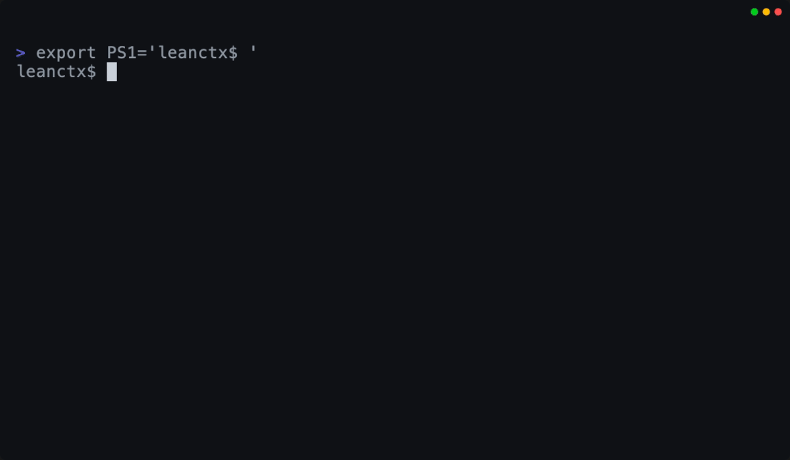
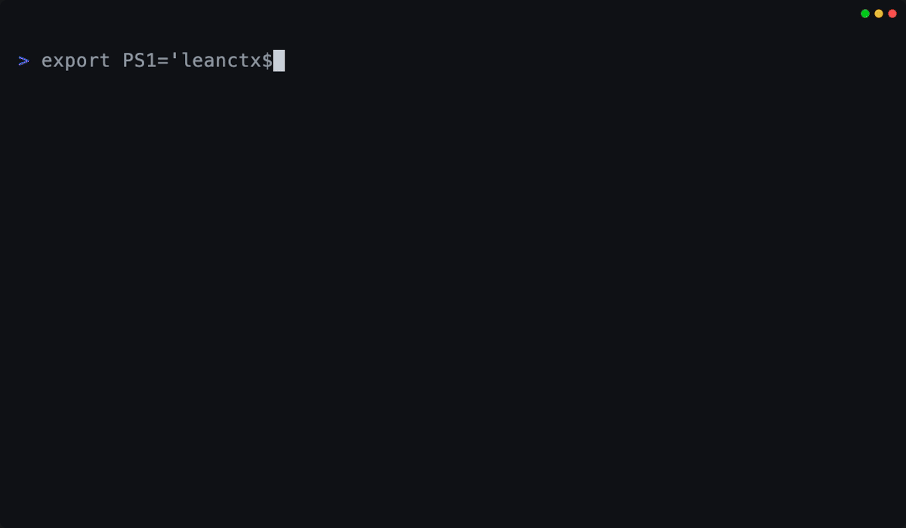
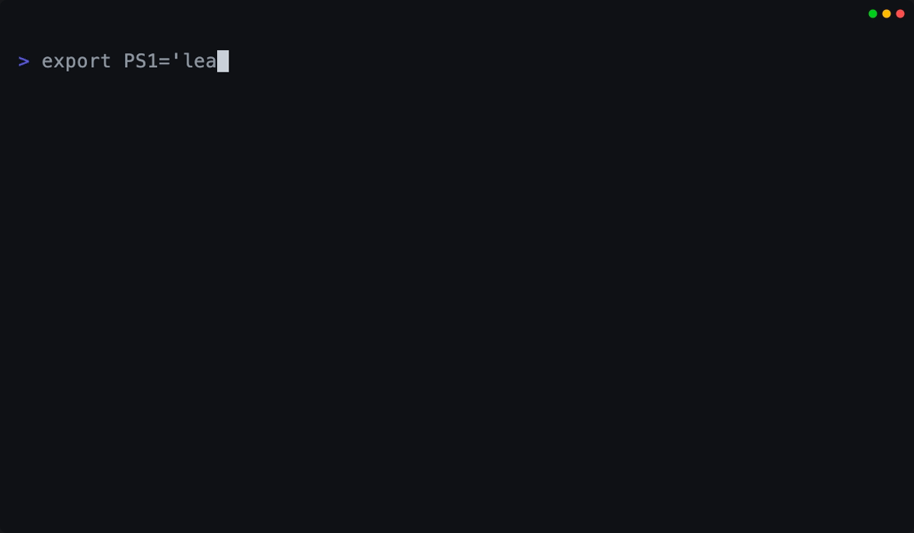

<div align="center">

<pre>
██╗     ███████╗ █████╗ ███╗   ██╗     ██████╗████████╗██╗  ██╗
██║     ██╔════╝██╔══██╗████╗  ██║    ██╔════╝╚══██╔══╝╚██╗██╔╝
██║     █████╗  ███████║██╔██╗ ██║    ██║        ██║    ╚███╔╝
██║     ██╔══╝  ██╔══██║██║╚██╗██║    ██║        ██║    ██╔██╗
███████╗███████╗██║  ██║██║ ╚████║    ╚██████╗   ██║   ██╔╝ ██╗
╚══════╝╚══════╝╚═╝  ╚═╝╚═╝  ╚═══╝     ╚═════╝   ╚═╝   ╚═╝  ╚═╝
</pre>

### **Control what your AI can see.**

**LeanCTX — AI Value Gate for AI Coding Agents**

LeanCTX — short for **Lean Context** — is an AI Value Gate and context
engineering layer for AI coding agents. It runs locally alongside your coding
agent, helping it read repositories, run development commands, and send focused
context to the model: it **understands** the task, **routes** the right context,
**compresses** what it sends, and **tracks** the cost and outcome of that work.
The result: 50–80% fewer tokens where compression applies.
Zero config required.
Local-first.

| Problem | With LeanCTX |
|---------|-------------|
| Repeated file reads: ~2000 tokens each | Cached re-reads: **~13 tokens** |
| Raw `git status`: ~800 tokens | Compressed: **~120 tokens** |
| Every turn re-sends the whole history | Proxy compresses each request, **prompt-cache-safe** |
| Context resets every chat | Session memory persists across chats |
| No visibility into context usage | Real-time dashboard + budget control |

---

<p>
  <a href="https://github.com/yvgude/lean-ctx/stargazers"></a>&nbsp;&nbsp;
  <a href="https://github.com/yvgude/lean-ctx/actions/workflows/ci.yml"></a>
  <a href="https://github.com/yvgude/lean-ctx/actions/workflows/security-check.yml"></a>
  <a href="https://crates.io/crates/lean-ctx"></a>
  <a href="https://crates.io/crates/lean-ctx"></a>
  <a href="https://www.npmjs.com/package/lean-ctx-bin"></a>
  <a href="https://aur.archlinux.org/packages/lean-ctx"></a>
  <a href="LICENSE"></a>
  <a href="https://discord.gg/pTHkG9Hew9"></a>
  <a href="https://x.com/leanctx"></a>
  
</p>

<p>
  <a href="https://leanctx.com">Website</a>&nbsp;&nbsp;·&nbsp;&nbsp;<a href="https://leanctx.com/docs/getting-started">Docs</a>&nbsp;&nbsp;·&nbsp;&nbsp;<a href="#get-started-30-seconds">Install</a>&nbsp;&nbsp;·&nbsp;&nbsp;<a href="#real-world-scenarios">Scenarios</a>&nbsp;&nbsp;·&nbsp;&nbsp;<a href="#demo">Demo</a>&nbsp;&nbsp;·&nbsp;&nbsp;<a href="#benchmarks">Benchmarks</a>&nbsp;&nbsp;·&nbsp;&nbsp;<a href="cookbook/README.md">Cookbook</a>&nbsp;&nbsp;·&nbsp;&nbsp;<a href="SECURITY.md">Security</a>&nbsp;&nbsp;·&nbsp;&nbsp;<a href="CHANGELOG.md">Changelog</a>
</p>

</div>

---

> **Control what your AI can see — and what it costs.** LeanCTX is an **AI Value
> Gate** for coding agents: it understands tasks, routes and compresses context,
> remembers what it learns, and measures cost against accepted outcomes.

> Token savings are the receipt. Intelligence is the product. Works with **Cursor, Claude Code, Copilot, Windsurf, Codex, Gemini** and 30+ other agents — no config needed.

<p align="center"><strong>See it in action:</strong></p>

<table>
  <tr>
    <td align="center" width="33%">
      
      <br/>
      <strong>Read + Shell</strong>
      <br/>
      Map-mode reads + compressed CLI output
    </td>
    <td align="center" width="33%">
      
      <br/>
      <strong>Gain (live)</strong>
      <br/>
      Tokens + USD savings in real time
    </td>
    <td align="center" width="33%">
      
      <br/>
      <strong>Benchmark proof</strong>
      <br/>
      Measure compression by language + mode
    </td>
  </tr>
</table>

<p align="center"><sub>All GIFs are generated from reproducible VHS tapes in <code>demo/</code>.</sub></p>

## Why developers use LeanCTX

- **Longer useful coding sessions** — less context waste = more room for actual code reasoning
- **Lower API costs** — 50–80% fewer tokens on reads and shell output, cached re-reads cost ~13 tokens
- **No more "I already showed you this file"** — session memory persists across chats
- **Works with your existing setup** — one `lean-ctx setup` command, no config changes needed
- **Full visibility** — see exactly where your context window budget goes
- **Model-agnostic & yours** — swap OpenAI/Anthropic/Gemini freely; your context and memory stay local and portable, never locked in a vendor's black box

---

<p align="center">
  <strong>Saves you tokens?</strong> <a href="https://github.com/yvgude/lean-ctx">Give it a star</a> — it helps others discover LeanCTX.
</p>

---

## Why now — own your context

Models are converging on commodity. The durable edge isn't *which* model you call — it's your **context**: what your agents read, what they remember, and what you can prove. And the layer that optimizes and *owns* that context can't come from the vendor that bills per token or keeps your memory in a black box — it has to sit on your side.

That's the shift behind "agent entities" that live in your chat and remember your company (Claude in Slack, ClickUp Brain): a **context login, not a model login** — you end up renting your own company knowledge back. LeanCTX is the opposite layer. It keeps the moat yours: local-first, portable (`.ctxpkg`), and model-agnostic — swap OpenAI, Anthropic or Gemini without losing context or cache. **Own your context; don't rent it back.**

---

## What it does — five capabilities of an AI Value Gate

LeanCTX treats context and AI spend as managed resources, not afterthoughts.
One binary covers the capabilities that decide how well an AI agent performs:

### 1. Context Compression — input efficiency

Your AI agent reads files and runs commands. LeanCTX compresses both automatically.

- **50–80% token reduction** on eligible context while preserving recovery paths

- **File reads**: 10 read modes (`full`, `map`, `signatures`, `diff`, `lines:N-M`, `density:X`, …) — cached re-reads cost ~13 tokens
- **Target density** (`density:0.4`): SDE-style budget compression — keeps the highest-entropy lines until ~40% of the original tokens remain, deterministic
- **JIT disclosure**: `signatures` carries line spans and points at `lines:N-M` for targeted expansion — outline first, bodies on demand
- **Shell output**: 95+ shell-output patterns compress git, npm, cargo, docker, kubectl, terraform and more (270 passthrough rules)
- **Tree-sitter AST**: structural understanding for 27 languages — not just text compression
- **Reversible by design (CCR)**: compression never *discards* content — pruned or truncated payloads move to a content-addressed store with a deterministic handle, so the model can pull the original bytes back on demand via `ctx_expand`, `ctx_retrieve`, an in-band marker, or `GET /v1/references/{id}`. [Five recovery paths →](docs/comparisons/vs-headroom.md#reversibility)

### 2. Intelligent Triage — task understanding

Not every task or file needs the same depth. LeanCTX classifies the task, then
sends the signal rather than the noise.

- **10 read modes**: from full content down to AST signatures and entropy-filtered views
- **Adaptive `ModePredictor`**: learns the optimal read mode per file type from past sessions
- **`IntentEngine`**: classifies query complexity so simple lookups stay cheap

### 3. Knowledge Routing — cross-source context

Relevant code, sessions, and connected sources become focused context instead of
a larger prompt.

- **Session memory (CCP)**: persist task/facts/decisions across chats — structured recovery queries survive compaction
- **Knowledge graph**: temporal facts with validity windows, episodic + procedural memory
- **Property Graph**: multi-edge code graph (imports, calls, exports, type_ref) powers impact analysis and search ranking
- **Yours, not the vendor's**: memory stays local and portable — export it as a `.ctxpkg` package and move it across machines or models, instead of locking it in a vendor's black box

### 4. AI Value Gate — cost and outcome tracking

Performance is the cost of a useful result, not just speed. LeanCTX records
costs and outcomes locally; **CPAO (Cost per Accepted Outcome)** is the north-star
metric for comparing useful AI work.

- **Context Manager**: browser dashboard with real-time token tracking, compression stats, utilization gauge
- **Budgets & SLOs**: profiles, roles, per-agent budgets, and throttling policies
- **Context Proof** (`ctx_proof`, `ctx_verify`): 4-layer verification engine with CI drift gates

### 5. Shadow Recommendations — savings proof

Shadow Mode compares LeanCTX treatment with a configured baseline without
changing the active workflow. Its reports show cost, tokens, CPAO, and whether
quality held, then recommend savings only when the comparison supports them.

## Cost Intelligence

LeanCTX automatically tracks local cost and outcome signals; it does not add
those reports to agent context. CPAO — cost per accepted outcome — is the
north-star metric, while Shadow Mode provides a baseline comparison for savings.

```bash
lean-ctx savings --period week                 # costs, token savings, and CPAO
lean-ctx value-report --format markdown --last 20  # recent outcome quality
lean-ctx shadow --latest                       # latest baseline comparison
```

### Quick start: value tracking

```bash
# Enable shadow mode for savings comparison
echo '[shadow]\nenabled = true' >> ~/.config/lean-ctx/config.toml

# After using LeanCTX for a while:
lean-ctx savings
lean-ctx shadow --latest
```

<details>
<summary><strong>Full feature list (83 MCP tools)</strong></summary>

- **Web & Research** (`ctx_url_read`): pull a public web page, PDF, or YouTube transcript into context as compressed, citation-backed text — `facts`/`quotes` return claims with a confidence score + source URL, relevance-ranked research-compression distils to a token budget, SSRF-guarded (http/https only)
- **Graph-Powered Intelligence**: hybrid search (BM25 + embeddings + graph proximity via RRF), incremental git-diff updates
- **LSP Refactoring** (`ctx_refactor`): language-server-powered rename, references, go-to-definition via rust-analyzer, typescript-language-server, pylsp, gopls
- **Multi-Agent** (`ctx_agent`, `ctx_handoff`): agent handoff with context transfer bundles, diary system, synchronized shared state
- **Archive Full-Text Search** (`ctx_expand search_all`): FTS5-powered cross-archive search over all previously archived tool outputs
- **PR Context Packs**: `lean-ctx pack --pr` builds a PR-ready context pack (changed files, related tests, impact, artifacts)
- **Context Packages**: `lean-ctx pack create` bundles Knowledge + Graph + Session into portable `.ctxpkg` files with SHA-256 integrity
- **Context Time Machine**: `lean-ctx snapshot create|list|show|verify|restore|publish|import` — git-anchored, ed25519-signed snapshots of the layer state (lineage, ledger Φ, ROI, session) on an append-only timeline; replay them in the dashboard, `restore` to resume a session (and `--git` to check out the commit), or `publish`/`import` a signed snapshot to share it ([concept →](docs/concepts/context-time-machine.md))
- **Observability**: `lean-ctx gain --live` for real-time savings, `lean-ctx wrapped` for weekly/monthly summaries (`gain --svg`/`--share` for a shareable card or self-hostable page), `lean-ctx watch` for TUI monitoring
- **Verified savings**: `lean-ctx savings` is an auditable, per-event ledger (tokenizer transparency, bounce-netting, tamper-evident SHA-256 chain) — local-only, on by default
- **HTTP mode**: `lean-ctx serve` for Streamable HTTP MCP + `/v1/tools/call` (used by the Cookbook and external clients)

</details>

## Addons — run the ecosystem through one gateway

You don't have to choose between LeanCTX and the other context tools you already
like. An **addon** wraps any MCP server in a tiny `lean-ctx-addon.toml` manifest;
LeanCTX runs it behind its gateway with one command, then treats what it returns
like your own reads instead of just proxying it.

```bash
lean-ctx addon search memory   # browse the registry by category
lean-ctx addon add headroom    # installs the upstream package + wires the MCP server, on add
lean-ctx addon list            # what's wired into your gateway
```

- **One command to add** — `addon add <name>` installs the upstream package via its native manager (uv, pip, cargo, npm, brew, dotnet) and wires the MCP server into your gateway. No fork, no recompile.
- **Folded in, not just proxied** — opt-in post-processing runs addon output through the same pipeline as your code: compress to a budget, spill oversized blobs to a `ctx_expand` handle, index into BM25 / graph / knowledge. Typed adapters route specific tools straight into `ctx_expand`, `ctx_callgraph` and `ctx_knowledge`.
- **Untrusted by default** — every addon's output is scrubbed for secrets and tagged untrusted before it reaches the model. Always on, not a flag.
- **You stay in control** — pin a machine or fleet to verified-only, an allowlist, or off entirely via one `[addons]` policy a single repo can't override.

The registry spans compression (Headroom, Sophon), code intelligence (Repomix,
Serena), memory (Mem0, Cognee, Letta) and reasoning (Sequential Thinking). See the
**[addon guide](docs/guides/addons.md)** or [browse them all](https://leanctx.com/addons/).

## Where it's going

LeanCTX is growing from a single context *layer* into a full **cognitive context
layer** for whole teams: version-controlled context strategy, one unified graph, and a
governance layer across many agents.

- **Context Time Machine → hosted history** — the snapshot engine, dashboard replay, restore, and signed file-based share/import have shipped (see above); next is a `ctxpkg.com` registry for hosted, versioned context history and a side-by-side model-view ｜ git-diff replay. The temporal axis through everything LeanCTX does — it *decides, remembers, guards, proves, and replays*. ([concept →](docs/concepts/context-time-machine.md))
- **Context as Code** — declarative pipelines, profiles, and policies in TOML, versioned like infrastructure
- **Unified Context Graph** — code, tests, commits, CI runs, and knowledge entries in a single semantic graph
- **Agent Harness** — roles, budgets, and tool permissions for multi-agent governance
- **Context Observability** — SLOs on context consumption, anomaly detection, OpenTelemetry / Prometheus export

The full roadmap lives in **[VISION.md](VISION.md)**.

## How it works (30 seconds)

LeanCTX works on **two planes** — what your agents *read* and what they *send to the model*:

```
read path:   AI tool  →  (MCP tools + shell)  →  lean-ctx  →  your repo + CLI
wire path:   AI tool  →  lean-ctx proxy        →  model provider   (every request, compressed)
```

- **MCP server** *(read path)*: exposes `ctx_*` tools (read modes, caching, deltas, search, memory, multi-agent)
- **Shell hook** *(read path)*: transparently compresses common commands so the LLM sees less noise
- **Request proxy** *(wire path, opt-in)*: `lean-ctx proxy enable` puts a local proxy between your agent and the model that compresses **every request** — system prompt, full history and tool results — prompt-cache-safe, with measured USD spend. It can also pin **one reasoning-effort level across OpenAI, Anthropic & Gemini** (`proxy.effort`) without breaking that cache, cut **output** tokens with a cache-safe verbosity steer plus a measured holdout, and **relocate volatile fields** (dates, UUIDs, commit SHAs) out of the cacheable prefix so a stable system prompt finally caches. Every rewrite is reversible (content-addressed recovery) and byte-stable by contract. Same layer as a standalone request-compression proxy (e.g. Headroom) — you don't need one on top.
- **Property Graph**: multi-edge code graph powers impact analysis, related file discovery, and search ranking
- **Session memory**: persists state with structured recovery so long-running work never "cold starts"
- **Context Manager**: browser dashboard for real-time visibility into what's in your context window

## Get started (30 seconds)

```bash
# 1) Install (pick one)
curl -fsSL https://leanctx.com/install.sh | sh      # universal (no Rust needed)
brew tap yvgude/lean-ctx && brew install lean-ctx    # macOS / Linux
npm install -g lean-ctx-bin                          # Node.js
cargo install lean-ctx                               # Rust

# 2) One-command setup for your agent
lean-ctx wrap cursor      # or: wrap claude / wrap codex / wrap vscode

# Done. Savings appear after your AI's first lean-ctx call.
lean-ctx gain
```

`lean-ctx wrap` installs shell hooks, registers the MCP server, sets up agent hooks, starts the daemon, and verifies the connection — all in one command. Undo anytime with `lean-ctx unwrap cursor`.

<details>
<summary><strong>Alternative: full control</strong></summary>

```bash
lean-ctx onboard          # connect all detected AI tools (zero prompts)
lean-ctx setup            # interactive wizard with every option
```

</details>

**Building from source on Windows?** Clone the repo and run `./install.ps1` in PowerShell — it builds the release binary and installs it into Cargo's bin directory (pass `-BuildOnly` to build without installing).

<details>
<summary><strong>Troubleshooting / Safety</strong></summary>

- Disable immediately (current shell): `lean-ctx-off`
- Run a single command uncompressed: `lean-ctx -c --raw "git status"`
- Only activate in AI agent sessions: set `shell_activation = "agents-only"` in `~/.config/lean-ctx/config.toml`
- Per-project config override: create `.lean-ctx.toml` in your project root (auto-merged with global config)
- Docker projects sharing `/workspace`: create `.lean-ctx-id` with a unique name to prevent context collisions
- Update: `lean-ctx update`
- Diagnose (shareable): `lean-ctx doctor --json`

</details>

## Real-world scenarios

LeanCTX grows with you. Below are the journeys most people actually take — each
links to a complete, function-by-function walkthrough in the
**[Reference](docs/reference/README.md)** (every CLI command and all 79 MCP
tools are documented there).

<table>
<tr>
<td width="50%" valign="top">

### 🟢 Your first 30 seconds
*"I just installed it — now what?"*

```bash
lean-ctx wrap cursor  # one-command setup for your agent
lean-ctx doctor       # confirm you're wired up
```
One command installs hooks, MCP registration, and verifies the connection.
→ **[Journey 1 — Setup & Onboarding](docs/reference/01-setup-and-onboarding.md)**

</td>
<td width="50%" valign="top">

### 📖 Coding every day
*"Stop re-reading the same files."*

```bash
lean-ctx read src/server.rs -m map   # API surface, ~13 tok on re-read
lean-ctx -c "git status"             # compressed shell output
```
Your agent reads less and searches smarter — automatically.
→ **[Journey 2 — Daily Use](docs/reference/02-daily-use.md)**

</td>
</tr>
<tr>
<td width="50%" valign="top">

### 🧠 Resume where you left off
*"My new chat forgot everything."*

```bash
lean-ctx overview                    # task-aware project recap
lean-ctx knowledge recall "auth"     # facts that survive resets
lean-ctx knowledge consolidate       # import session + compact lifecycle
lean-ctx knowledge consolidate --all # compact every project store
```
Session memory + a project knowledge graph persist across chats.
→ **[Journey 3 — Memory & Knowledge](docs/reference/03-memory-and-knowledge.md)**

</td>
<td width="50%" valign="top">

### 🗺️ Understand a new codebase
*"Where does this function ripple to?"*

```bash
lean-ctx graph impact src/auth.rs    # blast radius
lean-ctx smells scan                 # code-smell hotspots
```
A multi-edge property graph powers impact analysis + ranked search.
→ **[Journey 4 — Code Intelligence](docs/reference/04-code-intelligence.md)**

</td>
</tr>
<tr>
<td width="50%" valign="top">

### 🔌 Providers & multi-repo
*"Pull in GitHub issues and our Postgres schema."*

```bash
lean-ctx provider list
lean-ctx serve --root ./api --root ./web   # multi-repo
```
External data flows through the same consolidation pipeline.
→ **[Journey 5 — Advanced & Integrations](docs/reference/05-advanced.md)**

</td>
<td width="50%" valign="top">

### 🛠️ Keep it healthy
*"Update, fix, or cleanly remove."*

```bash
lean-ctx doctor --fix
lean-ctx update
```
Self-healing diagnostics; surgical uninstall that only removes its own blocks.
→ **[Journey 6 — Lifecycle & Troubleshooting](docs/reference/06-lifecycle.md)**

</td>
</tr>
<tr>
<td width="50%" valign="top">

### 🎛️ Take control of the window
*"Budget my context like a pro."*

```bash
lean-ctx plan "refactor billing" --budget 8000
lean-ctx compile --mode balanced
```
Phi-scored planning + knapsack compilation + a context ledger.
→ **[Journey 7 — Context Engineering](docs/reference/07-context-engineering.md)**

</td>
<td width="50%" valign="top">

### 🤝 Run a team of agents
*"Planner + coder + reviewer on one repo."*

```text
ctx_agent action=register role=dev
ctx_handoff action=create        # baton-pass with full context
```
Shared message bus, diaries, knowledge, and deterministic handoffs.
→ **[Journey 8 — Multi-Agent Collaboration](docs/reference/08-multi-agent.md)**

</td>
</tr>
<tr>
<td width="50%" valign="top">

### 🏢 Share across a team / CI
*"One shared index, headless in pipelines."*

```bash
lean-ctx team serve --config team.toml
lean-ctx bootstrap            # zero-prompt CI setup
```
Scoped tokens, optional cloud sync, verifiable context gates.
→ **[Journey 9 — Team, Cloud & CI](docs/reference/09-team-cloud-ci.md)**

</td>
<td width="50%" valign="top">

### 🎚️ Tune & govern
*"Make it behave exactly how we want."*

```bash
lean-ctx compression standard
lean-ctx harden               # enforce token discipline
```
Compression levels, tool profiles, themes, and rules governance.
→ **[Journey 10 — Customization & Governance](docs/reference/10-customization-and-governance.md)**

</td>
</tr>
<tr>
<td width="50%" valign="top">

### 📊 Prove the payoff
*"Show me the numbers."*

```bash
lean-ctx gain --deep          # savings, cost, per-agent, heatmap
lean-ctx wrapped              # shareable recap (also: gain --svg / gain --share)
lean-ctx savings              # verified per-event ledger (auditable; savings verify)
```
All analytics live in the CLI/dashboard — never burning agent tokens.
→ **[Journey 11 — Analytics & Insights](docs/reference/11-analytics-and-insights.md)**

</td>
<td width="50%" valign="top">

### 📚 The full reference
*"I want to read everything."*

Every command and all 83 MCP tools, organized as user journeys, plus
appendices for the [CLI map](docs/reference/appendix-cli-map.md),
[MCP tools](docs/reference/appendix-mcp-tools.md), and
[paths & config](docs/reference/appendix-paths-and-config.md).
→ **[Reference index](docs/reference/README.md)**

</td>
</tr>
</table>

## Supported IDEs & AI tools

LeanCTX is a standard **MCP server**, so it works with any MCP-compatible client. Two integration modes are auto-selected per agent:

| Mode | How it works | Best for |
|---|---|---|
| **Hybrid** | MCP for cached reads (~13 tokens) + shell hooks for command compression | Agents with shell access (Cursor, Claude Code, Codex, ...) |
| **MCP** | All 79 tools via MCP protocol, no shell hooks | Protocol-only agents (JetBrains, VS Code, Zed, ...) |

### Agent compatibility matrix

| Agent | Hybrid | MCP | Setup |
|---|:---:|:---:|---|
| Cursor | ● | | `lean-ctx init --agent cursor` |
| Claude Code | ● | | `lean-ctx init --agent claude` |
| CodeBuddy | ● | | `lean-ctx init --agent codebuddy` |
| Augment CLI / VS Code | ● | | `lean-ctx init --agent augment` |
| Codex CLI | ● | | `lean-ctx init --agent codex` |
| Grok | ● | | `lean-ctx init --agent grok` |
| Gemini CLI | ● | | `lean-ctx init --agent gemini` |
| Windsurf | ● | | `lean-ctx init --agent windsurf` |
| GitHub Copilot | ● | | `lean-ctx init --agent copilot` |
| CRUSH | ● | | `lean-ctx init --agent crush` |
| Hermes | ● | | `lean-ctx init --agent hermes` |
| OpenCode | ● | | `lean-ctx init --agent opencode` |
| Pi | ● | | `lean-ctx init --agent pi` |
| Qoder | ● | | `lean-ctx init --agent qoder` |
| Amp | ● | | `lean-ctx init --agent amp` |
| Cline | ● | | `lean-ctx init --agent cline` |
| Roo Code | ● | | `lean-ctx init --agent roo` |
| Kiro | ● | | `lean-ctx init --agent kiro` |
| Antigravity | ● | | `lean-ctx init --agent antigravity` |
| Amazon Q | ● | | `lean-ctx init --agent amazonq` |
| Qwen | ● | | `lean-ctx init --agent qwen` |
| Trae | ● | | `lean-ctx init --agent trae` |
| Verdent | ● | | `lean-ctx init --agent verdent` |
| Aider | | ● | `lean-ctx init --agent aider` |
| Mistral Vibe | | ● | `lean-ctx init --agent vibe` |
| Continue | | ● | `lean-ctx init --agent continue` |
| JetBrains IDEs | | ● | `lean-ctx init --agent jetbrains` |
| QoderWork | | ● | `lean-ctx init --agent qoderwork` |
| VS Code | | ● | `lean-ctx init --agent vscode` |
| Zed | | ● | `lean-ctx init --agent zed` |
| Neovim | | ● | `lean-ctx init --agent neovim` |
| Emacs | | ● | `lean-ctx init --agent emacs` |
| Sublime Text | | ● | `lean-ctx init --agent sublime` |

> **Any MCP-compatible client** works out of the box — the table above shows agents with first-class auto-setup.

### When to use (and when not to)

**Great fit if you...**
- use AI coding tools daily and your sessions are shell-heavy (git/tests/builds)
- work in medium/large repos (50+ files / monorepos)
- want a local-first layer with **no telemetry by default**

**Skip it if you...**
- mostly work in tiny repos and rarely call the shell from your AI tool
- always need raw/unfiltered logs (you can still use `--raw`, but ROI is lower)

The honest fine print: the payoff depends on three levers — **reach** (own the
window via the proxy/engine, not just the `ctx_*` tool layer), **context
lifetime** (one long-lived session vs. a fresh process per phase), and
**provider pricing** (prompt-cache-priced vs. re-billed every turn). They stack
into a clear win where they line up and net to **break-even** where they don't.
See the [win vs. break-even matrix](docs/reference/14-performance-tuning.md#win-vs-break-even-at-a-glance)
for the full breakdown and how to tune for each case.

<a id="demo"></a>

## Demo

Try these in any repo:

```bash
lean-ctx read rust/src/server/mod.rs -m map
lean-ctx -c "git log -n 5 --oneline"
lean-ctx gain --live
lean-ctx dashboard                              # Context Manager (browser)
lean-ctx watch                                  # TUI monitor
lean-ctx benchmark report .
```

- The repo ships the exact tapes used to render the GIFs in `demo/`
- Regenerate locally:

```bash
vhs demo/leanctx.tape
vhs demo/gain.tape
vhs demo/benchmark.tape
```

<a id="benchmarks"></a>

## Benchmarks

Real, reproduced numbers — never estimated. Measured on this repo with the GPT-4o
tokenizer (`o200k_base`); a tool that isn't installed is reported as such, never
guessed.

| Read mode | Compression | Tokens (50 files) | Quality |
|---|---:|---:|---:|
| Raw read | 0% | 533.2K | 100% |
| `map` | **98.1%** | 8.0K | 78% |
| `signatures` | **96.7%** | 14.0K | 96% |
| Cached re-read | ~99.99% | ~13 tok | 100% |

lean-ctx's **own cost is measured too**: the CI-measured fixed per-session
footprint (advertised tool schemas + MCP instructions + wakeup briefing) is
~3.0K tokens and gated via `lean-ctx doctor overhead --gate`. And the
long-lived proxy rail has a deterministic self-verify —
`lean-ctx benchmark dual-arm --json` replays a 72-turn session and prices it per
model (digest `f5ed145e61ce3689`, 99.4% input-side saving on cache-priced rails;
methodology: [bench/agent-task/r2](bench/agent-task/r2/README.md)).

Accuracy isn't a vibe: the lossy stages are **CI-gated**. A model-free A/B gate
proves the JSON crusher keeps *every* gold answer while cutting tokens, and proxy
rewrites are byte-stable by contract, so Anthropic (90%) / OpenAI (50%) prompt-cache
discounts survive compression. A deterministic **off-vs-on testbench**
(`lean-ctx eval testbench`) extends the proof to *answers*: it runs pinned real repos
through a raw-dump baseline and through lean-ctx at an identical token budget, grades
free-form QA with an LLM judge and code with each repo's own tests, and emits
`FINDINGS.md` (tokens / turns / walltime / quality) plus a regressions file — with a
committed recorded subset that blocks CI on any regression.

- **Latest snapshot**: [BENCHMARKS.md](BENCHMARKS.md)
- **Reproduce**: `lean-ctx benchmark report .`

## By the numbers

- **3,000+ GitHub stars** — and counting
- **280+ forks** — active community contributions
- **200+ releases** — shipped near-daily since launch
- **30+ supported AI coding agents** — broadest MCP compatibility
- **83 MCP tools** — from simple file reads to multi-agent orchestration
- Used in production by teams running Claude Code, Cursor, and Codex daily
- **Live adoption metrics**: [leanctx.com/metrics](https://leanctx.com/metrics/) — installs, stars and savings, updated continuously

## Docs

- **Reference (every function, by user journey)**: [docs/reference/](docs/reference/README.md) — 11 journeys + CLI/MCP/config appendices
- **For AI agents / LLMs**: [llms.txt](llms.txt) — a curated, machine-readable map of lean-ctx (per the [llms.txt](https://llmstxt.org) convention)
- Getting started: https://leanctx.com/docs/getting-started
- Tools reference: https://leanctx.com/docs/tools/
- CLI reference: https://leanctx.com/docs/cli-reference/
- What is LeanCTX: https://leanctx.com/what-is-leanctx/
- Comparison (vs RTK, Context+, MemGPT): https://leanctx.com/compare/
- Pricing & Cloud (local use is free forever): https://leanctx.com/pricing/
- FAQ: [discord-faq.md](discord-faq.md)
- Feature catalog (SSOT snapshot): [LEANCTX_FEATURE_CATALOG.md](LEANCTX_FEATURE_CATALOG.md)
- Monorepo guide: [docs/guides/monorepo.md](docs/guides/monorepo.md)
- Architecture: [ARCHITECTURE.md](ARCHITECTURE.md)
- Vision: [VISION.md](VISION.md)

## Privacy & security

- **No telemetry by default**
- **Optional anonymous stats sharing** (opt-in during setup)
- **Disableable update check** (config `update_check_disabled = true` or `LEAN_CTX_NO_UPDATE_CHECK=1`)
- **40+ security hardening fixes** in v3.5.16 (path traversal, injection, CSPRNG, CSP, resource limits — [details](CHANGELOG.md))
- **Context Governance Benchmark self-assessment**: graded **C2 — Managed** against the 32-control [CGB v1.0-draft](https://github.com/yvgude/context-governance-benchmark) spec, gaps declared — [docs/compliance/cgb-self-assessment.md](docs/compliance/cgb-self-assessment.md)
- Runs locally; your code never leaves your machine unless you explicitly enable cloud sync

See [SECURITY.md](SECURITY.md).

## Uninstall

One command removes **everything** — it stops all processes, then deletes hooks,
editor configs, rules, autostart (LaunchAgent/systemd), the data dir, **and the
binary itself**:

```bash
lean-ctx uninstall                 # full clean removal
lean-ctx uninstall --dry-run       # preview every change, write nothing
lean-ctx uninstall --keep-config   # keep MCP configs + rules (for reinstall)
lean-ctx-off                       # or just disable for the current shell session
```

No binary on PATH (or you used the curl installer)? Run the same removal from the installer:

```bash
curl -fsSL https://leanctx.com/install.sh | sh -s -- --uninstall
```

If you installed via a package manager, `uninstall` removes everything it wrote and
tells you the one command to finish removing the binary:

```bash
brew uninstall lean-ctx        # Homebrew
cargo uninstall lean-ctx       # cargo install
npm uninstall -g lean-ctx-bin  # npm
```

## Star History

<a href="https://star-history.dera.page/#yvgude/lean-ctx&type=Date">
  <picture>
    <source media="(prefers-color-scheme: dark)" srcset="https://star-history.dera.page/svg?repos=yvgude/lean-ctx&type=Date&theme=dark" />
    <source media="(prefers-color-scheme: light)" srcset="https://star-history.dera.page/svg?repos=yvgude/lean-ctx&type=Date" />
    
  </picture>
</a>

## Contributing

Start with [CONTRIBUTING.md](CONTRIBUTING.md). Easy first PR: propose a new CLI compression pattern via the [issue template](.github/ISSUE_TEMPLATE/compression_pattern.md).

## License

Apache License 2.0 — see [LICENSE](LICENSE).
