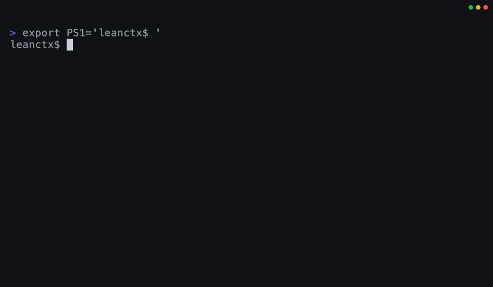
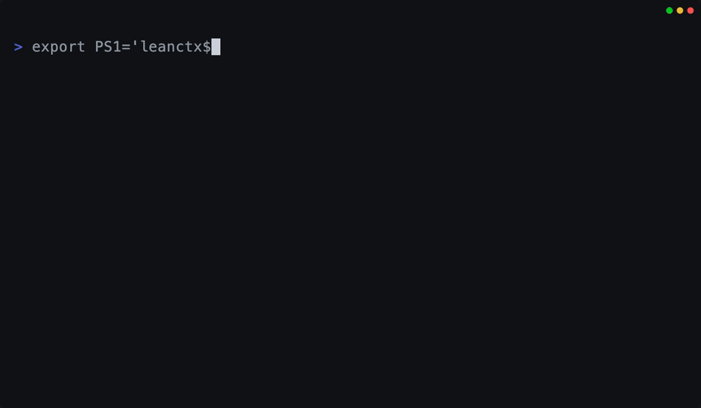
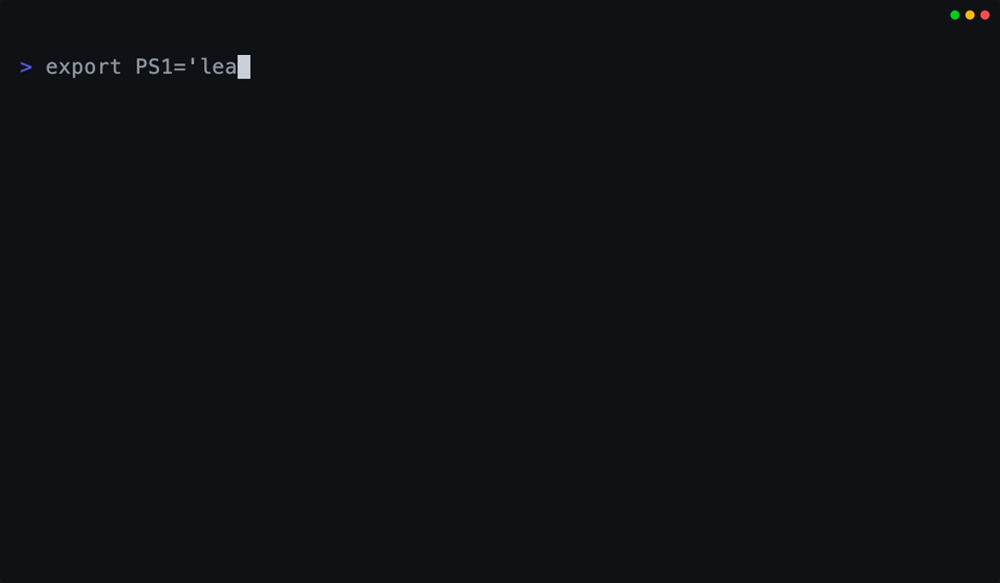

<div align="center">

<pre>
██╗     ███████╗ █████╗ ███╗   ██╗     ██████╗████████╗██╗  ██╗
██║     ██╔════╝██╔══██╗████╗  ██║    ██╔════╝╚══██╔══╝╚██╗██╔╝
██║     █████╗  ███████║██╔██╗ ██║    ██║        ██║    ╚███╔╝
██║     ██╔══╝  ██╔══██║██║╚██╗██║    ██║        ██║    ██╔██╗
███████╗███████╗██║  ██║██║ ╚████║    ╚██████╗   ██║   ██╔╝ ██╗
╚══════╝╚══════╝╚═╝  ╚═╝╚═╝  ╚═══╝     ╚═════╝   ╚═╝   ╚═╝  ╚═╝
</pre>

## LeanCTX

**Context Gateway for AI Systems.**

### **Control what your AI can see.**

LeanCTX sits between AI tools and the information they read. It selects
task-relevant context, applies supported access and content controls before
delivery, and records the context operations and delivery evidence it can observe.
Your application, agent loop and model stay yours.

The open-source **LeanCTX Engine** runs locally through CLI, MCP, hooks and proxy paths.
The **LeanCTX SDK** embeds supported Engine capabilities in your application.

---

<p>
  <a href="https://github.com/yvgude/lean-ctx/stargazers"></a>&nbsp;&nbsp;
  <a href="https://github.com/yvgude/lean-ctx/actions/workflows/ci.yml"></a>
  <a href="https://github.com/yvgude/lean-ctx/actions/workflows/security-check.yml"></a>
  <a href="https://crates.io/crates/lean-ctx"></a>
  <a href="https://crates.io/crates/lean-ctx"></a>
  <a href="https://www.npmjs.com/package/lean-ctx-bin"></a>
  <a href="https://aur.archlinux.org/packages/lean-ctx"></a>
  <a href="LICENSE.md"></a>
  <a href="https://discord.gg/pTHkG9Hew9"></a>
  <a href="https://x.com/leanctx"></a>
  <a href="#privacy--security"></a>
</p>

<p>
  <a href="https://leanctx.com">Website</a>&nbsp;&nbsp;·&nbsp;&nbsp;<a href="https://leanctx.com/docs/getting-started">Docs</a>&nbsp;&nbsp;·&nbsp;&nbsp;<a href="#get-started-30-seconds">Install</a>&nbsp;&nbsp;·&nbsp;&nbsp;<a href="#real-world-scenarios">Scenarios</a>&nbsp;&nbsp;·&nbsp;&nbsp;<a href="#demo">Demo</a>&nbsp;&nbsp;·&nbsp;&nbsp;<a href="#benchmarks">Benchmarks</a>&nbsp;&nbsp;·&nbsp;&nbsp;<a href="cookbook/README.md">Cookbook</a>&nbsp;&nbsp;·&nbsp;&nbsp;<a href="SECURITY.md">Security</a>&nbsp;&nbsp;·&nbsp;&nbsp;<a href="CHANGELOG.md">Changelog</a>
</p>

</div>

---

## Where it sits

```text
Files · repositories · tool results · configured providers
                          │
                          ▼
                LeanCTX Context Gateway
                Select → Control → Prove
                          │
                          ▼
                Your AI application / agent
                          │
                          ▼
                     Your model
```

- **Select:** give AI the context the task needs, with search, structural views,
  compression and reuse.
- **Control:** apply configured path permissions, content filters and context
  budgets to supported calls.
- **Prove:** inspect source references, policy decisions and usage evidence.
  A context-only integration records its prepared result; the host owns the
  subsequent model call.

For coding workflows, start with **Claude Code, Cursor or Codex**.
[The installation matrix](docs/integrations/installation-matrix.md) distinguishes
first-class paths from other compatibility references.

| Your work | Start here |
|---|---|
| Improve the context path of existing AI tools | [Community setup](#get-started-30-seconds) |
| Apply shared context controls across an organization | [Enterprise](https://leanctx.com/enterprise/) — licensed controls and deployment scope |
| Build context control into your application | [LeanCTX SDK](https://github.com/Thinkery-AG/leanctx-sdk) — stable interfaces and separate SDK/OEM terms |

[What is LeanCTX?](docs/what-is-leanctx.md) ·
[Where LeanCTX fits](docs/where-leanctx-fits.md) ·
[Architecture](ARCHITECTURE.md)

<p align="center"><strong>See it in action:</strong></p>

<table>
  <tr>
    <td align="center" width="33%">
      
      <br/>
      <strong>Read + Shell</strong>
      <br/>
      Map-mode reads + compressed CLI output
    </td>
    <td align="center" width="33%">
      
      <br/>
      <strong>Gain (live)</strong>
      <br/>
      Token usage + estimated cost differences
    </td>
    <td align="center" width="33%">
      
      <br/>
      <strong>Benchmark proof</strong>
      <br/>
      Measure compression by language + mode
    </td>
  </tr>
</table>

<p align="center"><sub>All GIFs are generated from reproducible VHS tapes in <code>demo/</code>.</sub></p>

## Why developers use LeanCTX

- **Focused input** — use less of the context window for repeated reads and noisy output.
- **Configured controls** — bound file access and filter supported results before delivery.
- **Continuity** — retain local task, finding and decision records across sessions.
- **Existing tools** — configure a supported integration with `lean-ctx setup`.
- **Inspectable usage** — separate token estimates, provider observations and calculated costs.
- **Model choice** — keep your own model calls and application workflow.

---

<p align="center">
  <strong>Saves you tokens?</strong> <a href="https://github.com/yvgude/lean-ctx">Give it a star</a> — it helps others discover LeanCTX.
</p>

---

## Inside the LeanCTX Engine

Context Intelligence is how LeanCTX selects and prepares information for a task.
These mechanisms support the Gateway's Select → Control → Prove flow.

### 1. Context Compression — input efficiency

For supported read and shell paths, LeanCTX can select compact representations
of the files and command output your AI agent uses.

- **Workload-specific token reduction** on eligible context, with recovery paths
  and a local Shadow Mode baseline for measurement

- **File reads**: 16 read modes (`full`, `map`, `signatures`, `diff`, `lines:N-M`, `density:X`, …) — eligible cached re-reads return a compact reference instead of repeating content
- **Target density** (`density:0.4`): SDE-style budget compression — keeps the highest-entropy lines until ~40% of the original tokens remain, deterministic
- **JIT disclosure**: `signatures` carries line spans and points at `lines:N-M` for targeted expansion — outline first, bodies on demand
- **Shell output**: 85+ shell-output patterns compress git, npm, cargo, docker, kubectl, terraform and more (250+ passthrough rules)
- **Tree-sitter AST**: structural understanding for 27 languages — not just text compression
- **Source recovery (CCR)**: supported compact views retain source or archive references for expansion through `ctx_expand`, `ctx_retrieve` or the reference API. Recovery depends on permissions, retention and the source remaining available. [Read modes and detail →](docs/reference/02-daily-use.md#1-reading-files)

### 2. Intelligent Triage — task understanding

Not every task or file needs the same depth. LeanCTX classifies the task, then
sends the signal rather than the noise.

- **16 read modes**: from full content down to AST signatures and entropy-filtered views
- **Adaptive `ModePredictor`**: learns the optimal read mode per file type from past sessions
- **`IntentEngine`**: classifies query complexity so simple lookups stay cheap

### 3. Knowledge Routing — cross-source context

Relevant code, sessions, and connected sources become focused context instead of
a larger prompt.

- **Session memory (CCP)**: persist task/facts/decisions across chats — structured recovery queries survive compaction
- **Knowledge graph**: temporal facts with validity windows, episodic + procedural memory
- **Property Graph**: multi-edge code graph (imports, calls, exports, type_ref) powers impact analysis and search ranking
- **Yours, not the vendor's**: memory stays local and portable — export it as a `.ctxpkg` package and move it across machines or models, instead of locking it in a vendor's black box

### 4. Usage and outcome evidence

Performance is the cost of a useful result, not just speed. LeanCTX records
costs and outcomes locally; **CPAO (Cost per Accepted Outcome)** is the north-star
metric for comparing useful AI work.

- **Context Manager**: browser dashboard with real-time token tracking, compression stats, utilization gauge
- **Budgets & SLOs**: profiles, roles, per-agent budgets, and throttling policies
- **Context Proof** (`ctx_proof`, `ctx_verify`): exportable audit trail (verifier, SLO, pipeline and provenance records) plus runtime-checked policy claims (PathJail per touched file, budget)

### 5. Shadow Recommendations — savings proof

Shadow Mode estimates what the same work would have cost without LeanCTX,
without changing the active workflow. The baseline is **simulated** from the
uncompressed token counts and the same outcome signals, not a second measured
run, so its reports estimate cost, tokens and CPAO deltas; they do not measure
answer quality.

## Cost Intelligence

LeanCTX automatically tracks local cost and outcome signals; it does not add
those reports to agent context. CPAO — cost per accepted outcome — is the
north-star metric, while Shadow Mode provides a simulated baseline for savings estimates.

```bash
lean-ctx savings --period week                 # costs, token savings, and CPAO
lean-ctx value-report --format markdown --last 20  # recent outcome quality
lean-ctx shadow --latest                       # latest baseline comparison
```

### Quick start: value tracking

```bash
# Enable shadow mode for savings comparison
lean-ctx config set shadow.enabled true

# After using LeanCTX for a while:
lean-ctx savings
lean-ctx shadow --latest
```

<details>
<summary><strong>Feature overview (see generated MCP registry for the current count)</strong></summary>

- **Web & Research** (`ctx_url_read`): pull a public web page, PDF, or YouTube transcript into context as compressed, citation-backed text — `facts`/`quotes` return claims with a confidence score + source URL, relevance-ranked research-compression distils to a token budget, SSRF-guarded (http/https only)
- **Graph-Powered Intelligence**: hybrid search (BM25 + embeddings + graph proximity via RRF), incremental git-diff updates
- **LSP Refactoring** (`ctx_refactor`): language-server-powered rename, references, go-to-definition via rust-analyzer, typescript-language-server, pylsp, gopls
- **Multi-Agent — Research** (`ctx_agent`, `ctx_handoff`): experimental local agent handoff with context transfer bundles, diary system, and shared state; not a hosted or generally available team service
- **Archive Full-Text Search** (`ctx_expand search_all`): FTS5-powered cross-archive search over all previously archived tool outputs
- **PR Context Packs**: `lean-ctx pack --pr` builds a PR-ready context pack (changed files, related tests, impact, artifacts)
- **Context Packages — Research**: `lean-ctx pack create` bundles local Knowledge, Graph and Session state into `.ctxpkg` files with SHA-256 integrity; this is experimental local packaging, not a generally available Context Kits or hosted sharing product
- **Context Time Machine — Research**: `lean-ctx snapshot create|list|show|verify|restore|publish|import` handles git-anchored, signed local snapshots and file-based sharing; dashboard replay and restore are experimental, and hosted history or a hosted registry is not a generally available product ([concept →](docs/concepts/context-time-machine.md))
- **Observability**: `lean-ctx gain --live`, `lean-ctx wrapped`, `lean-ctx watch` and the browser dashboard show local activity and recorded context metrics; `gain --svg`/`--share` creates a shareable card or self-hostable page
- **Verified savings**: `lean-ctx savings` is a local per-event ledger with tokenizer transparency, bounce-netting and a tamper-evident SHA-256 chain; provider-measured savings require the proxy's counterfactual holdout
- **HTTP mode**: `lean-ctx serve` for Streamable HTTP MCP + `/v1/tools/call` (used by the Cookbook and external clients)

</details>

## Addons — Research preview

Addon manifests and gateway integration remain experimental Research interfaces.
Local `addon release|add|list` commands handle signed packages; they do not
provide a public marketplace, hosted registry, managed distribution or `addon
search`. A package can carry a sandboxed WASM module or an `[mcp]` declaration
for an external server.

```bash
lean-ctx addon release ./my-addon   # build a signed .ctxpkg — no artifact host, no CI
lean-ctx addon add ./my-addon-1.0.0.ctxpkg   # verify, disclose, ask, install
lean-ctx addon list                 # what's installed, what loads, what's wired
```

- **Publish it yourself** — the module travels *inside* the signed package, so
  the signature covers the executable bytes. Nothing external to host, hash or
  serve, and no pipeline of your own.
- **Verified locally, then asked** — `add` re-checks the signature on your
  machine rather than trusting its source, checks every module against its
  pinned SHA-256, prints the publisher key and the exact command any declared
  server would run, and only then prompts.
- **LeanCTX never installs the server for you** — no `uv tool install`, no
  `npx`. Fetching a declared tool stays your step, where your own package
  manager's trust model applies. The manifest says how to *run* it.
- **Folded in, not just proxied** — opt-in post-processing runs addon output through the same pipeline as your code: compress to a budget, spill oversized blobs to a `ctx_expand` handle, index into BM25 / graph / knowledge. A typed `integration` routes specific tools straight into `ctx_expand`, `ctx_callgraph` and `ctx_knowledge`.
- **Untrusted by default** — addon results pass through secret scrubbing and are tagged untrusted in the integration pipeline. Scrubbing covers configured detection patterns, not every possible secret.

The local workflow verifies signatures and module hashes, shows the publisher
key and declared command before installation, and never installs the external
server. Opt-in post-processing can send addon results through compression,
`ctx_expand`, BM25, graph and knowledge. Results remain untrusted; configured
secret scrubbing does not cover every possible secret. See the
**[status-qualified addon guide](docs/guides/addons.md)** for the boundary.

## Research directions

LeanCTX remains the Context Gateway for AI Systems. These research directions
extend its context capabilities; they are not supported product commitments.

- **Hosted context history** — local snapshot create/show/verify/restore and signed file-based sharing are experimental Research; a hosted registry and model-view comparison remain future work. ([concept →](docs/concepts/context-time-machine.md))
- **Context as Code** — declarative pipelines, profiles, and policies in TOML, versioned like infrastructure
- **Unified Context Graph** — code, tests, commits, CI runs, and knowledge entries in a single semantic graph
- **Cross-agent context controls** — explore context roles, budgets, and permissions while the host retains agent scheduling and workflow execution
- **Context Observability** — SLOs on context consumption, anomaly detection, OpenTelemetry / Prometheus export

The full roadmap lives in **[VISION.md](VISION.md)**.

## How it works

LeanCTX works on **two planes** — what your agents *read* and what they *send to the model*:

```
read path:   AI tool  →  (MCP tools + shell)  →  lean-ctx  →  your repo + CLI
wire path:   AI tool  →  lean-ctx proxy        →  model provider   (supported, configured requests)
```

- **MCP server** *(read path)*: exposes `ctx_*` tools (read modes, caching, deltas, search, memory, multi-agent)
- **Shell hook** *(read path)*: transparently compresses common commands so the LLM sees less noise
- **Request proxy** *(wire path, opt-in)*: `lean-ctx proxy enable` routes supported requests through a local proxy. Configured transformations can reduce eligible prompt, history and tool-result content while respecting supported provider-cache boundaries. Provider-specific effort mapping (`proxy.effort`), verbosity controls and volatile-prefix handling have their own compatibility limits. Recovery requires retained, authorized artifacts; usage and cost evidence depend on the provider data the path observes.
- **Property Graph**: multi-edge code graph powers impact analysis, related file discovery, and search ranking
- **Session memory**: persists selected session state for recovery when authorized records remain available
- **Context Manager**: browser dashboard for inspecting context activity and records visible to LeanCTX

<a id="get-started-30-seconds"></a>

## Get started

```bash
# 1) Install (pick one)
curl -fsSL https://leanctx.com/install.sh | sh      # universal (no Rust needed)
brew tap yvgude/lean-ctx && brew install lean-ctx    # macOS / Linux
npm install -g lean-ctx-bin                          # Node.js
cargo install lean-ctx                               # Rust

# 2) One-command setup for your agent
lean-ctx wrap cursor      # or: wrap claude / wrap codex

# Inspect recorded context metrics after your AI's first lean-ctx call.
lean-ctx gain
```

`lean-ctx wrap` registers the MCP server and configures the supported local
transport for that agent. Undo anytime with `lean-ctx unwrap cursor`.

> **Claude Pro/Max:** subscription OAuth cannot use a custom
> `ANTHROPIC_BASE_URL`. `lean-ctx wrap claude` therefore adds no proxy redirect
> while enabling the `ctx_*` tools and shell-output compression; an existing
> custom endpoint remains untouched.
> Claude wire-level request compression requires `ANTHROPIC_API_KEY`. See
> [advanced proxy setup](docs/reference/05-advanced.md).

<details>
<summary><strong>Alternative: full control</strong></summary>

```bash
lean-ctx onboard          # connect all detected AI tools (zero prompts)
lean-ctx setup            # interactive wizard with every option
```

</details>

**Building from source on Windows?** Clone the repo and run `./install.ps1` in PowerShell — it builds the release binary and installs it into Cargo's bin directory (pass `-BuildOnly` to build without installing).

<details>
<summary><strong>Windows code signing and Smart App Control</strong></summary>

The current release workflow signs new Windows binaries as **Thinkery AG**,
including the binaries inside ZIP archives and Python companion wheels.
Earlier releases may still contain unsigned executables. Signing does not
guarantee acceptance by every Windows security policy.

If Windows blocks an older unsigned download, use WSL or build locally with
`cargo install lean-ctx`; do not disable system-wide security protections for
this tool. Windows-side MCP clients can launch the WSL installation with
`wsl lean-ctx mcp`.

See [Windows signing and verification](docs/windows-signing.md) and
[#1820](https://github.com/yvgude/lean-ctx/issues/1820) for verification status.

</details>

<details>
<summary><strong>Troubleshooting / Safety</strong></summary>

- Disable immediately (current shell): `lean-ctx-off`
- Run a single command uncompressed: `lean-ctx -c --raw "git status"`
- Only activate in AI agent sessions: set `shell_activation = "agents-only"` in `~/.config/lean-ctx/config.toml`
- Per-project config override: create `.lean-ctx.toml` in your project root (auto-merged with global config)
- Docker projects sharing `/workspace`: create `.lean-ctx-id` with a unique name to prevent context collisions
- Update: `lean-ctx update`
- Diagnose (shareable): `lean-ctx doctor --json`

</details>

## Real-world scenarios

LeanCTX grows with you. Below are the journeys most people actually take — each
links to a complete, function-by-function walkthrough in the
**[Reference](docs/reference/README.md)** (every CLI command and the complete MCP
tools are documented there).

<table>
<tr>
<td width="50%" valign="top">

### 🟢 Your first setup
*"I just installed it — now what?"*

```bash
lean-ctx wrap cursor  # one-command setup for your agent
lean-ctx doctor       # confirm you're wired up
```
`wrap` configures the supported integration; `doctor` checks the resulting setup.
→ **[Journey 1 — Setup & Onboarding](docs/reference/01-setup-and-onboarding.md)**

</td>
<td width="50%" valign="top">

### 📖 Coding every day
*"Stop re-reading the same files."*

```bash
lean-ctx read src/server.rs -m map   # API surface, ~13 tok on re-read
lean-ctx -c "git status"             # compressed shell output
```
Your agent reads less and searches smarter — automatically.
→ **[Journey 2 — Daily Use](docs/reference/02-daily-use.md)**

</td>
</tr>
<tr>
<td width="50%" valign="top">

### 🧠 Resume where you left off
*"My new chat forgot everything."*

```bash
lean-ctx overview                    # task-aware project recap
lean-ctx knowledge recall "auth"     # facts that survive resets
lean-ctx knowledge consolidate       # import session + compact lifecycle
lean-ctx knowledge consolidate --all # compact every project store
```
Session memory + a project knowledge graph persist across chats.
→ **[Journey 3 — Memory & Knowledge](docs/reference/03-memory-and-knowledge.md)**

</td>
<td width="50%" valign="top">

### 🗺️ Understand a new codebase
*"Where does this function ripple to?"*

```bash
lean-ctx graph impact src/auth.rs    # blast radius
lean-ctx smells scan                 # code-smell hotspots
```
A multi-edge property graph powers impact analysis + ranked search.
→ **[Journey 4 — Code Intelligence](docs/reference/04-code-intelligence.md)**

</td>
</tr>
<tr>
<td width="50%" valign="top">

### 🔌 Providers & multi-repo
*"Pull in GitHub issues and our Postgres schema."*

```bash
lean-ctx provider list
lean-ctx serve --root ./api --root ./web   # multi-repo
```
External data flows through the same consolidation pipeline.
→ **[Journey 5 — Advanced & Integrations](docs/reference/05-advanced.md)**

</td>
<td width="50%" valign="top">

### 🛠️ Keep it healthy
*"Update, fix, or cleanly remove."*

```bash
lean-ctx doctor --fix
lean-ctx update
```
Self-healing diagnostics; surgical uninstall that only removes its own blocks.
→ **[Journey 6 — Lifecycle & Troubleshooting](docs/reference/06-lifecycle.md)**

</td>
</tr>
<tr>
<td width="50%" valign="top">

### 🎛️ Take control of the window
*"Budget my context like a pro."*

```bash
lean-ctx plan "refactor billing" --budget 8000
lean-ctx compile --mode balanced
```
Phi-scored planning + knapsack compilation + a context ledger.
→ **[Journey 7 — Context Engineering](docs/reference/07-context-engineering.md)**

</td>
<td width="50%" valign="top">

### 🤝 Run a team of agents
*"Planner + coder + reviewer on one repo."*

```text
ctx_agent action=register role=dev
ctx_handoff action=create        # baton-pass with full context
```
Shared message bus, diaries, knowledge, and deterministic handoffs.
→ **[Journey 8 — Multi-Agent Collaboration](docs/reference/08-multi-agent.md)**

</td>
</tr>
<tr>
<td width="50%" valign="top">

### 🏢 Explore team and CI context — Research
*"One shared index, headless in pipelines."*

```bash
lean-ctx team serve --config team.toml
lean-ctx bootstrap            # zero-prompt CI setup
```
Experimental local team-server path with scoped tokens and verifiable context
gates; no hosted team or cloud service is publicly available.
→ **[Journey 9 — Team, Cloud & CI](docs/reference/09-team-cloud-ci.md)**

</td>
<td width="50%" valign="top">

### 🎚️ Tune & govern
*"Make it behave exactly how we want."*

```bash
lean-ctx compression standard
lean-ctx harden               # enforce token discipline
```
Compression levels, tool profiles, themes, and rules governance.
→ **[Journey 10 — Customization & Governance](docs/reference/10-customization-and-governance.md)**

</td>
</tr>
<tr>
<td width="50%" valign="top">

### 📊 Prove the payoff
*"Show me the numbers."*

```bash
lean-ctx gain --deep          # savings, cost, per-agent, heatmap
lean-ctx wrapped              # shareable recap (also: gain --svg / gain --share)
lean-ctx savings              # verified per-event ledger (auditable; savings verify)
```
All analytics live in the CLI/dashboard — never burning agent tokens.
→ **[Journey 11 — Analytics & Insights](docs/reference/11-analytics-and-insights.md)**

</td>
<td width="50%" valign="top">

### 📚 The full reference
*"I want to read everything."*

Every command and the generated MCP registry, organized as user journeys, plus
appendices for the [CLI map](docs/reference/appendix-cli-map.md),
[MCP tools](docs/reference/appendix-mcp-tools.md), and
[paths & config](docs/reference/appendix-paths-and-config.md).
→ **[Reference index](docs/reference/README.md)**

</td>
</tr>
</table>

## Supported IDEs & AI tools

LeanCTX provides an **MCP server**. Client support depends on transport, tool
handling, and configuration; the matrix below records the integration scope.
Two integration modes are selected for supported agents:

| Mode | How it works | Best for |
|---|---|---|
| **Hybrid** | MCP for cached reads and references + shell hooks for command compression | Agents with shell access (Cursor, Claude Code, Codex, ...) |
| **MCP** | Complete tool set via MCP protocol, no shell hooks | Protocol-only agents (JetBrains, VS Code, Zed, ...) |

### Agent compatibility matrix

| Agent | Hybrid | MCP | Setup |
|---|:---:|:---:|---|
| Cursor | ● | | `lean-ctx init --agent cursor` |
| Claude Code | ● | | `lean-ctx init --agent claude` |
| CodeBuddy | ● | | `lean-ctx init --agent codebuddy` |
| Augment CLI / VS Code | ● | | `lean-ctx init --agent augment` |
| Codex CLI | ● | | `lean-ctx init --agent codex` |
| Grok | ● | | `lean-ctx init --agent grok` |
| Gemini CLI | ● | | `lean-ctx init --agent gemini` |
| Windsurf | ● | | `lean-ctx init --agent windsurf` |
| GitHub Copilot | ● | | `lean-ctx init --agent copilot` |
| CRUSH | ● | | `lean-ctx init --agent crush` |
| Hermes | ● | | `lean-ctx init --agent hermes` |
| OpenCode | ● | | `lean-ctx init --agent opencode` |
| Pi | ● | | `lean-ctx init --agent pi` |
| Qoder | ● | | `lean-ctx init --agent qoder` |
| Amp | ● | | `lean-ctx init --agent amp` |
| Cline | ● | | `lean-ctx init --agent cline` |
| Roo Code | ● | | `lean-ctx init --agent roo` |
| Kiro | ● | | `lean-ctx init --agent kiro` |
| Antigravity | ● | | `lean-ctx init --agent antigravity` |
| Amazon Q | ● | | `lean-ctx init --agent amazonq` |
| Qwen | ● | | `lean-ctx init --agent qwen` |
| Trae | ● | | `lean-ctx init --agent trae` |
| Verdent | ● | | `lean-ctx init --agent verdent` |
| Aider | | ● | `lean-ctx init --agent aider` |
| Mistral Vibe | | ● | `lean-ctx init --agent vibe` |
| Continue | | ● | `lean-ctx init --agent continue` |
| JetBrains IDEs | | ● | `lean-ctx init --agent jetbrains` |
| QoderWork | | ● | `lean-ctx init --agent qoderwork` |
| VS Code | | ● | `lean-ctx init --agent vscode` |
| Zed | | ● | `lean-ctx init --agent zed` |
| Neovim | | ● | `lean-ctx init --agent neovim` |
| Emacs | | ● | `lean-ctx init --agent emacs` |
| Sublime Text | | ● | `lean-ctx init --agent sublime` |

> MCP clients need compatible transport, tool support, and configuration. The table lists setup targets; the [client constraints](docs/integrations/client-constraints-matrix-v1.md) distinguish verified integrations from generic compatibility.

### When to use (and when not to)

**Great fit if you...**
- use AI coding tools daily and your sessions are shell-heavy (git/tests/builds)
- work in medium/large repos (50+ files / monorepos)
- want local context processing with inspectable network and telemetry controls

**Skip it if you...**
- mostly work in tiny repos and rarely call the shell from your AI tool
- always need raw/unfiltered logs (you can still use `--raw`, but ROI is lower)

The honest fine print: the payoff depends on three levers — **reach** (own the
window via the proxy/engine, not just the `ctx_*` tool layer), **context
lifetime** (one long-lived session vs. a fresh process per phase), and
**provider pricing** (prompt-cache-priced vs. re-billed every turn). They stack
into a clear win where they line up and net to **break-even** where they don't.
See the [win vs. break-even matrix](docs/reference/14-performance-tuning.md#win-vs-break-even-at-a-glance)
for the full breakdown and how to tune for each case.

<a id="demo"></a>

## Demo

Try these in any repo:

```bash
lean-ctx read rust/src/server/mod.rs -m map
lean-ctx -c "git log -n 5 --oneline"
lean-ctx gain --live
lean-ctx dashboard                              # Context Manager (browser)
lean-ctx benchmark report .
```

- The repo ships the exact tapes used to render the GIFs in `demo/`
- Regenerate locally:

```bash
vhs demo/leanctx.tape
vhs demo/gain.tape
vhs demo/benchmark.tape
```

<a id="benchmarks"></a>

## Benchmarks

Measurements and estimates require a declared workload and method. The earlier per-read-mode
compression table (`map` / `signatures` over 50 files) is **withdrawn** along
with the other historical figures in [BENCHMARKS.md](BENCHMARKS.md); measure
your own repository with `lean-ctx benchmark report .` instead. Cache references
can reduce repeated context; their token cost depends on the emitted result and tokenizer.

Measure the Engine's own advertised schema, instruction, and briefing overhead
with `lean-ctx doctor overhead --gate`. The deterministic
`lean-ctx benchmark dual-arm --json` replay reports a **synthetic upper bound**:
its baseline never uses the provider's prompt cache, while agent hosts can cache
the prefix with or without LeanCTX. It is not a provider invoice, an on/off
comparison or an outcome-quality evaluation. Available comparison methods include
the `lean-ctx eval ab` subcommand (requires a suite file via `--suite`), the
injected-context footprint comparison in `lean-ctx eval footprint` (requires a
suite via `--suite` and a baseline via `--compare`), and the proxy's opt-in compression holdout
(`[proxy] compression_holdout`).

Accuracy is gated, within stated limits. A model-free A/B gate checks that the JSON
crusher keeps every gold answer in its fixtures while cutting tokens, and proxy
rewrites preserve stable output for prompt-cache eligibility under the same inputs and settings.
Actual cache hits, prices, and discounts depend on the provider. The **off-vs-on testbench** (`lean-ctx eval testbench`)
runs pinned real repos through a raw-dump baseline and through lean-ctx at an
identical token budget, grades free-form QA with an LLM judge and code with each
repo's own tests, and emits `FINDINGS.md` (tokens / turns / walltime / quality) plus a
regressions file. What CI replays is a small committed recording: it is a
**mechanism gate** (it catches a broken pipeline or a changed grade), not evidence
that compression preserves answer quality. Every eval report states its evidence
tier (A mechanism … E production); a run below 30 paired tasks is
`UNDERPOWERED` and fails `--gate` unless run as an explicit `--mechanism` check — see
[context-quality-v1](docs/contracts/context-quality-v1.md).
A powered with/without quality study has not been run yet; the proxy's
compression holdout measures prompt size on real traffic and reports answer
quality as `unknown`. What each number can and cannot show, per data path:
[measurement scope](docs/concepts/measurement-scope.md).

- **Latest snapshot**: [BENCHMARKS.md](BENCHMARKS.md)
- **Reproduce**: `lean-ctx benchmark report .`

## Adoption and compatibility

- [GitHub activity](https://github.com/yvgude/lean-ctx) and [releases](https://github.com/yvgude/lean-ctx/releases) show the current repository counts and release history.
- [Supported integration paths](docs/integrations/installation-matrix.md) distinguish verified setups from protocol compatibility.
- [Generated MCP registry](docs/reference/appendix-mcp-tools.md) shows the current tool count and status.
- [Published metrics](https://leanctx.com/metrics/) state their measurement scope; adoption counts do not establish savings or outcome quality.

## Docs

- **Reference (every function, by user journey)**: [docs/reference/](docs/reference/README.md) — 11 journeys + CLI/MCP/config appendices
- **For AI agents / LLMs**: [llms.txt](llms.txt) — a curated, machine-readable map of lean-ctx (per the [llms.txt](https://llmstxt.org) convention)
- Getting started: https://leanctx.com/docs/getting-started
- Tools reference: https://leanctx.com/docs/tools/
- CLI reference: https://leanctx.com/docs/cli-reference/
- What is LeanCTX: https://leanctx.com/what-is-leanctx/
- Comparison (vs RTK, Context+, MemGPT): https://leanctx.com/compare/
- Community and commercial options: https://leanctx.com/pricing/
- FAQ: [discord-faq.md](discord-faq.md)
- Feature catalog (SSOT snapshot): [LEANCTX_FEATURE_CATALOG.md](LEANCTX_FEATURE_CATALOG.md)
- Monorepo guide: [docs/guides/monorepo.md](docs/guides/monorepo.md)
- Semantic code intelligence: [docs/guides/semantic-intelligence.md](docs/guides/semantic-intelligence.md)
- Architecture: [ARCHITECTURE.md](ARCHITECTURE.md)
- Vision: [VISION.md](VISION.md)

## Privacy & security

- **Inspectable telemetry controls:** run `lean-ctx telemetry status` to see the effective setting and `lean-ctx telemetry show` to inspect the payload; `lean-ctx telemetry disable` turns reporting off.
- **Disableable update check** (config `update_check_disabled = true` or `LEAN_CTX_NO_UPDATE_CHECK=1`)
- **40+ security hardening fixes** in v3.5.16 (path traversal, injection, CSPRNG, CSP, resource limits — [details](CHANGELOG.md))
- **Context Governance Benchmark self-assessment**: graded **C2 — Managed** against the 32-control [CGB v1.0-draft](https://github.com/yvgude/context-governance-benchmark) spec, gaps declared — [docs/compliance/cgb-self-assessment.md](docs/compliance/cgb-self-assessment.md)
- Context processing runs locally; configured source providers, proxy/model requests, submitted feedback, updates, and enabled telemetry have their own network paths.

See [SECURITY.md](SECURITY.md).

## Uninstall

One command removes **everything** — it stops all processes, then deletes hooks,
editor configs, rules, autostart (LaunchAgent/systemd), the data dir, **and the
binary itself**:

```bash
lean-ctx uninstall                 # full clean removal
lean-ctx uninstall --dry-run       # preview every change, write nothing
lean-ctx uninstall --keep-config   # keep MCP configs + rules (for reinstall)
lean-ctx-off                       # or just disable for the current shell session
```

No binary on PATH (or you used the curl installer)? Run the same removal from the installer:

```bash
curl -fsSL https://leanctx.com/install.sh | sh -s -- --uninstall
```

If you installed via a package manager, `uninstall` removes everything it wrote and
tells you the one command to finish removing the binary:

```bash
brew uninstall lean-ctx        # Homebrew
cargo uninstall lean-ctx       # cargo install
npm uninstall -g lean-ctx-bin  # npm
```

## Star History

<a href="https://star-history.dera.page/#yvgude/lean-ctx&type=Date">
  <picture>
    <source media="(prefers-color-scheme: dark)" srcset="https://star-history.dera.page/svg?repos=yvgude/lean-ctx&type=Date&theme=dark" />
    <source media="(prefers-color-scheme: light)" srcset="https://star-history.dera.page/svg?repos=yvgude/lean-ctx&type=Date" />
    
  </picture>
</a>

## Contributing

Start with [CONTRIBUTING.md](CONTRIBUTING.md). Easy first PR: propose a new CLI compression pattern via the [issue template](.github/ISSUE_TEMPLATE/compression_pattern.md).

## License

Mixed licensing: the Trust Core remains Apache-2.0 while explicitly mapped v4
modules may use commercial source-visible terms. See [LICENSE.md](LICENSE.md)
and [LICENSE_MATRIX.toml](LICENSE_MATRIX.toml).
