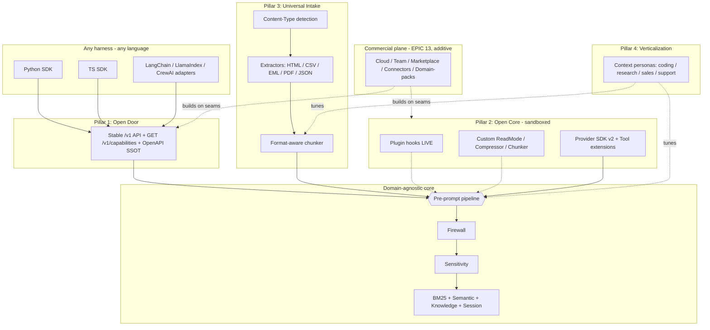

# RFC v1 — lean-ctx Context OS: a Universal Context Infrastructure for Any Agent

| | |
|---|---|
| **Status** | Draft |
| **Author(s)** | lean-ctx core |
| **Created** | 2026-06-07 |
| **Tracking** | GitLab `[LeanCTX][EPIC 12]` (open core) + `[LeanCTX][EPIC 13]` (commercial plane) |
| **Supersedes** | — |
| **Related** | `docs/cognition-interface.md`, `docs/contracts/http-mcp-contract-v1.md`, `docs/contracts/provider-framework-contract-v1.md`, `docs/contracts/context-ir-v1.md`, `docs/contracts/team-server-contract-v1.md`, `docs/reference/09-team-cloud-ci.md`, `docs/reference/16-signed-savings-ledger.md` |

---

## 1. Summary

lean-ctx today is the best-in-class **pre-prompt context layer for coding agents**. Its
engine is, however, already largely domain-agnostic: a single pre-prompt choke point
(firewall → sensitivity → model), three delivery surfaces (stdio-MCP, CLI, HTTP `/v1/*`
+ SSE + MCP), versioned contracts, and generic stores (BM25, semantic, knowledge,
session, gateway).

This RFC proposes turning that engine into a **Context OS**: a deterministic, governed
pre-prompt runtime that *any* developer can embed into *any* agent harness — in any
language, for any domain (lead-gen, research, support, data analysis, …) — via a stable
API, an open extension model, universal ingestion, and verticalized personas.

It also defines the **commercial architecture** as a first-class constraint, anchored on
one rule: the **Local-Free Invariant** — everything a single developer does on their own
machine is free, ungated, and best-in-class forever. Monetization is purely additive, on
a Team/Cloud plane, and never removes a local capability.

Deliverables of this RFC round are documentation + roadmap only: **this document** plus
**EPIC 12** (open core, four equal pillars) and **EPIC 13** (commercial plane). No
production code lands in this round.

---

## 2. Motivation

### 2.1 Where we are

The value-add of lean-ctx is currently consumed almost entirely through coding harnesses
(Claude Code, Cursor, …). But the same primitives — compress, retrieve, remember, govern,
verify — are valuable for **any** agent that has a context window. A developer building a
lead-gen agent, a research agent, or a support agent has the exact same problems lean-ctx
already solves for code: too much context, untrusted/oversized tool output, no memory, no
governance, no proof.

### 2.2 The opportunity

Make lean-ctx the **infrastructure layer** under all of those harnesses. The engine is
ready; what is missing is the *opening* of that engine:

- a **stable, discoverable API** so any language/runtime can integrate over a process
  boundary;
- an **extension model** so third parties add behavior without forking;
- **domain-agnostic ingestion** so non-code corpora reach the same stores;
- **personas** so the same engine ships tuned defaults per domain.

### 2.3 The commercial question

We want users to *always* have the best locally, with **no feature gating**, yet we want a
path to commercialize. This RFC resolves that tension explicitly (see §6) instead of
leaving it to chance, so the four pillars are built with clean commercial seams from day
one — without ever degrading the local product.

---

## 3. Vision & Positioning

> **lean-ctx = the Context OS.** A deterministic, governed pre-prompt layer that every
> developer embeds — over a stable API — into any agent harness, language- and
> domain-independent. Not just *"compress what your coding agent reads"*, but *"govern,
> retrieve, remember, and shape context for **any** agent."*

This extends, and does not replace, the **Cognition Interface** framing
(`docs/cognition-interface.md`): lean-ctx shapes a model's *effective* reasoning by
controlling **what it sees**, **how it is budgeted**, **what is remembered**, and **what
must be verified**. The Context OS is the Cognition Interface made *open and universal*.

---

## 4. Leitprinzip — the Local-Free Invariant

> **Everything a single developer does on their own machine, for their own work, is free,
> ungated, and best-in-class — forever.** Monetization applies only to **coordination,
> hosting, scale, governance, and ecosystem** — value that exists at the Team / Org /
> Cloud level — and is always *additive*, never the removal of a local capability.

This is the **open-core / local-first** model (Tailscale, Sentry, GitLab). lean-ctx
already half-lives it:

- `rust/src/cloud_server/` is a full account backend, opt-in via the `cloud-server`
  Cargo feature (`deadpool-postgres`, `tokio-postgres`, `lettre`/SMTP, `jsonwebtoken`,
  `argon2`, `uuid`, …) — i.e., accounts, email verification, auth.
- `team-server` ships **in the default feature set** (`Cargo.toml` `default = [… "team-server" …]`)
  — local/self-host stays free.
- `lean-ctx upgrade` already models a plan-upgrade flow (`docs/reference/09-team-cloud-ci.md`).
- The Ed25519-**signed savings ledger** (`rust/src/core/savings_ledger/`,
  `rust/src/core/agent_identity.rs`) is a ready-made ROI / metering substrate.
- The docs already state the principle: *"LeanCTX Cloud is an optional, account-based sync
  … It is not required for any local feature."* (`docs/reference/09-team-cloud-ci.md`).

The invariant is **enforced by a CI conformance test** (see §6.3 and ticket 12.19) — it is
proven, not merely promised. That proof is the trust moat for a developer tool.

---

## 5. Target Architecture

The core insight: there is **one** pre-prompt pipeline. Every pillar widens what can
*enter* it (more clients, more extensions, more formats, more personas) **without widening
the model's context window**, and the commercial plane plugs into the same seams without
touching the local path.

---

## 6. The Local-Free / Commercial layering (Value architecture)

### 6.1 Two planes

| Plane | Runs where | Pricing | Scope |
|-------|-----------|---------|-------|
| **Personal plane** | the developer's own machine | **Free forever, ungated** | the *entire* single-user product — all tools, read modes, search, semantic, knowledge, session, firewall, sensitivity, gateway, all SDKs, every locally-built extension, every persona, every ingestion format |
| **Team / Cloud plane** | shared server / managed cloud | **Commercial (additive)** | coordination, hosting, scale, governance, ecosystem |

### 6.2 Per-pillar free / commercial mapping

| Pillar | Free (Personal plane, forever) | Commercial (Team/Cloud plane, additive) |
|--------|-------------------------------|------------------------------------------|
| 1 — API/SDK | Local server, all SDKs, all tools | **lean-ctx Cloud**: hosted Context-OS endpoint, cross-machine sync, hosted embeddings/retrieval at scale (`cloud_server/`, `upgrade`) |
| 2 — Extensions | Build/run any extension locally, full SDK | **Marketplace**: hosting, signed/verified publishing, private org registries, revenue share |
| 3 — Ingestion | All local extractors/chunkers/indexes | **Managed connectors**: hosted continuous sync (CRM/Drive/Notion), large managed indexes |
| 4 — Personas | All built-in + self-authored personas | **Curated domain packs**: maintained personas + eval suites + support (sales/support/legal) |
| Cross-cutting | Local knowledge/session/scorecard/ledger | **Team/Org plane**: shared knowledge graph, RBAC/SSO/SCIM, audit retention, compliance/sensitivity dashboards, ledger-as-procurement-evidence |

### 6.3 Architectural enablers (built into the open core, gating-free)

1. **Plane separation** — a clean seam between Personal and Team/Cloud planes, so the
   commercial layer is purely additive over a process/service boundary
   (`rust/src/http_server/team.rs`, `rust/src/cloud_server/`). Ticket **12.19**.
2. **Local-Free-Invariant conformance test** — CI fails if any local capability becomes
   gated behind account/license/plan. Ticket **12.19**.
3. **Metering / ROI substrate** — the signed savings ledger
   (`rust/src/core/savings_ledger/`) + CEP/stats become the usage-metering and billing
   basis for the Cloud plane, **read-only** with respect to the local experience.
   Ticket **12.20**.

### 6.4 Licensing strategy

The local engine stays **Apache-2.0** to maximize local adoption. The commercial control
plane (Cloud backend, Marketplace, enterprise governance) is a separately
licensed/hosted service. **No re-license of the local core** (no BSL on the engine).

---

## 7. The Four Pillars (equal priority)

### 7.1 Pillar 1 — Open Door: stable API + multi-language SDKs

Process-boundary integration is the safe path to "any developer, any language" (preferred
over linking the full Rust crate).

- **OpenAPI spec as SSOT**, generated from code. Today the contract is a hand-maintained
  manifest plus `HTTP_MCP_CONTRACT_VERSION = 1` (`rust/src/core/contracts.rs`,
  `docs/contracts/http-mcp-contract-v1.md`). Add a formal deprecation policy.
- **`GET /v1/capabilities`** — a client discovers an instance's presets, extensions,
  formats, and tools at runtime.
- **Python SDK** (`lean-ctx-client` on PyPI), mirroring the TS client `cookbook/sdk/src/client.ts`
  / `cookbook/sdk/src/types.ts` (async + SSE).
- **TS SDK GA** (`lean-ctx-client`) + a shared **conformance test kit** that both SDKs run.
- **Framework adapters**: LangChain / LlamaIndex / CrewAI tool wrappers + an OpenAI-tools
  shim.

Contracts to define: `capabilities-contract-v1`. Tickets **12.1, 12.4, 12.5, 12.6**.

### 7.2 Pillar 2 — Open Core: plugin / extension system (sandboxed)

- **Critical first step:** wire the plugin hooks. `rust/src/core/plugins/` defines
  `pre_read`, `post_compress`, `on_knowledge_update`, `on_session_*`, but
  `PluginManager::fire_hook` / `fire_hook_background` are only invoked from tests — the
  seam is **inert** in production. Wire it into the pipeline.
- **Sandboxed extension runtime** (language-independent, secure): a WASM ABI + host
  functions + lifecycle + resource limits. Builds on `rust/src/core/pathjail.rs`.
- **Pluggable read modes / compressors / chunkers** via a registry. Today these are
  hardcoded (`rust/src/tools/ctx_read/render.rs`, `rust/src/core/compressor.rs`,
  `rust/src/shell/compress/`).
- **Provider SDK v2** — beyond the REST-only `ConfigProvider`
  (`rust/src/core/providers/config_provider/`): streaming, pagination, custom chunking;
  WASM providers (see `docs/contracts/provider-framework-contract-v1.md`).
- **Native tool registration without forking** — today only via the gateway `ctx_tools`
  or a `build_registry()` fork: define a tool-extension manifest → WASM/subprocess.

Contracts to define: `extension-abi-v1`. Tickets **12.7, 12.8, 12.9, 12.10, 12.11**.

### 7.3 Pillar 3 — Universal Intake: domain-agnostic ingestion

- **Generic ingestion front-door** — decouple from `is_code_file`
  (`rust/src/core/bm25_index/mod.rs:872`, duplicated in `rust/src/cli/index_cmd.rs:198`)
  so *any* corpus reaches BM25 / semantic / knowledge.
- **Content-type detection + format extractors/chunkers**: HTML, CSV/TSV (table-aware),
  email/MIME (thread-aware), PDF locally (today blocked by
  `rust/src/core/binary_detect.rs`), JSON/NDJSON records (CRM exports).
- **Non-code tuning**: `rust/src/core/adaptive_thresholds.rs` + `rust/src/core/entropy.rs`
  + per-format terse dictionaries (HTML/CSV/EML are missing today).

Contracts to define: `ingestion-spec-v1`. Tickets **12.12, 12.13, 12.14**.

### 7.4 Pillar 4 — Verticalization: context personas / presets

- **Persona model** — a declarative bundle of: tool surface + read-mode defaults +
  compression dictionaries + chunker + intent taxonomy + sensitivity defaults.
- **Built-in presets**: `coding` (today), `research`, `sales/lead-gen`, `support`,
  `data-analysis`.
- **Persona-parametrized intent engine** — `rust/src/core/intent_engine.rs` `TaskType` is
  coding-only today (`Generate`, `FixBug`, `Refactor`, `Explore`, `Test`, `Debug`,
  `Config`, `Deploy`, `Review`) — and terse prompts (`rust/src/core/terse/agent_prompts.rs`).
- **Developer-definable personas** (declarative), building on
  `rust/src/core/tool_profiles.rs` + `rust/src/core/roles.rs`.

Contracts to define: `persona-spec-v1`. Tickets **12.15, 12.16**.

---

## 8. Cross-cutting foundation (enables all pillars)

- **Trust & sandbox**: extension signing, capability grants, WASM/subprocess sandbox
  (on `pathjail.rs`), sensitivity for third-party data. Ticket **12.3**.
- **Embedding boundary**: a thin, stable `lean-ctx-client` crate instead of
  `pub mod everything` in `rust/src/lib.rs`; document library non-goals. Ticket **12.2**.
- **Plane separation + Local-Free-Invariant conformance** (see §6.3). Ticket **12.19**.
- **Metering / ROI substrate** (see §6.3). Ticket **12.20**.
- **Conformance & reproducibility**: extend the scorecard (`rust/src/core/scorecard/`) to
  non-code corpora; ship an extension/SDK conformance suite as a CI gate. Ticket **12.17**.

---

## 9. Contracts to define

These become versioned documents under `docs/contracts/` (mirroring the existing v1
contracts), each with a `_CONTRACT_VERSION` constant and an `*_up_to_date` drift test.

| Contract | Purpose | Pillar |
|----------|---------|--------|
| `capabilities-contract-v1` | shape of `GET /v1/capabilities` (presets/extensions/formats/tools) | 1 |
| `extension-abi-v1` | WASM ABI, host functions, lifecycle, resource limits, signing | 2 |
| `ingestion-spec-v1` | content-type detection, extractor/chunker interface, format manifest | 3 |
| `persona-spec-v1` | declarative persona bundle schema | 4 |

---

## 10. Security & Trust model

- **Sandbox by default**: extensions and third-party providers run WASM/subprocess
  sandboxed, with explicit capability grants (filesystem, network, env), built on
  `pathjail.rs`. No ambient authority.
- **Signing**: extensions and persona/domain packs are signed; the runtime verifies
  signatures before load. Reuses the Ed25519 machinery already used by the savings ledger
  (`agent_identity.rs`).
- **Sensitivity for third-party data**: the existing per-item sensitivity floor
  (`[sensitivity]`) applies to *ingested* and *provider* data, not just file reads.
- **Plane isolation**: the commercial plane never has a path to gate or degrade the local
  plane; enforced by the conformance test (§6.3).

---

## 11. Non-Goals

- **No model training / weights** — lean-ctx stays the *Cognition Interface*, not a
  *Cognition Lab*.
- **No break of existing coding-agent integrations** — persona `coding` == today's default
  behavior.
- **No local feature gating — ever.** No local capability behind account/license/plan
  (enforced by conformance test). Commercialization is additive on the Team/Cloud plane
  only.
- **No marketplace in the open core** — first the ABI + trust model (12.x); the marketplace
  is EPIC 13.3.
- **No re-license of the local core** — stays Apache-2.0; only the control plane is
  commercial.
- **No supported full-crate library linking** — integration is over the process boundary
  (HTTP/MCP). The embedding boundary is the thin `lean-ctx-client` crate only.

---

## 12. Roadmap — mapping to EPICs

### EPIC 12 — Context OS (open core)

| Phase | Tickets |
|-------|---------|
| A — Foundation | 12.1 API-contract SSOT + versioning + `/v1/capabilities` · 12.2 Embedding boundary (`lean-ctx-client`) · 12.3 Extension trust & sandbox model |
| B — Open Door | 12.4 Python SDK (PyPI) · 12.5 TS SDK GA + conformance kit · 12.6 Framework adapters |
| C — Open Core | 12.7 Wire plugin hooks · 12.8 WASM extension runtime · 12.9 Pluggable read-mode/compressor/chunker · 12.10 Provider SDK v2 + WASM providers · 12.11 Native tool registration without fork |
| D — Universal Intake | 12.12 Generic ingestion front-door · 12.13 Format extractors/chunkers (HTML/CSV/EML/PDF/JSON) · 12.14 Non-code compression tuning |
| E — Verticalization | 12.15 Context persona model · 12.16 Built-in presets + persona-parametrized intent/terse |
| Cross-cutting | 12.17 Conformance & reproducibility · 12.18 Docs & positioning · 12.19 Plane separation + Local-Free-Invariant conformance test · 12.20 Metering/ROI substrate |

**Phase logic:** A (API/boundary/trust + plane separation) unblocks B–E *and* EPIC 13.
B delivers immediate external value (any language can use lean-ctx as a service). C opens
the core. D makes the agnostic core reachable for non-code. E verticalizes. Cross-cutting
runs in parallel as a quality gate.

### EPIC 13 — Commercial plane (additive)

Builds strictly on EPIC 12 seams (12.19/12.20 + extension ABI + provider SDK). Never a
prerequisite for any local feature.

| Ticket | Scope |
|--------|-------|
| 13.1 | lean-ctx Cloud — hosted Context-OS endpoint + cross-machine sync (on `cloud_server/`) |
| 13.2 | Team/Org plane — RBAC/SSO/SCIM, shared knowledge graph, audit retention |
| 13.3 | Extension/persona Marketplace — hosting, signing, revenue share, private registries |
| 13.4 | Managed connectors / hosted ingestion |
| 13.5 | Curated domain packs — premium personas + eval suites |
| 13.6 | Billing & plans — `upgrade` flow → real plans + metering |

---

## 13. Open questions

1. **WASM vs. subprocess** as the default extension boundary — WASM for portability/safety,
   subprocess for language reach. Likely both, WASM first.
2. **Capabilities granularity** — how fine-grained should grants be (per-host, per-path,
   per-tool)?
3. **Persona distribution format** — single signed bundle vs. composable layers.
4. **Metering privacy** — what is the minimal aggregate the Cloud plane needs, keeping the
   savings-ledger privacy guarantees intact?

---

## 14. References

- `docs/cognition-interface.md` — the Cognition Interface framing.
- `docs/contracts/http-mcp-contract-v1.md` — current HTTP/MCP contract (v1).
- `docs/contracts/provider-framework-contract-v1.md` — provider framework.
- `docs/contracts/context-ir-v1.md` — context intermediate representation.
- `docs/contracts/team-server-contract-v1.md` — team server contract.
- `docs/reference/09-team-cloud-ci.md` — team/cloud/CI surfaces.
- `docs/reference/16-signed-savings-ledger.md` — signed savings ledger (ROI/metering substrate).
