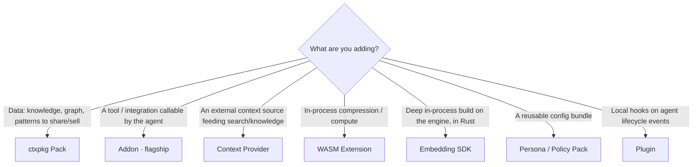

# Extending lean-ctx — one decision, one trust model

lean-ctx can be extended in several ways. They look similar from the outside
(they all "add capabilities"), but each targets a different job and a different
trust model. This guide is the **single entry point**: pick the right mechanism
in one decision, then follow its dedicated guide.

> TL;DR — building a **tool or integration** (in any language)? Build an
> [**Addon**](addons.md). Everything else is for a narrower job below.

## Pick your extension type



- **Share or sell *data*** (knowledge, graph edges, session, patterns, gotchas)
  → [**ctxpkg Pack**](publishing-packages.md)
- **A *tool / integration* the agent can call** (any language, via MCP)
  → [**Addon**](addons.md) — the flagship path
- **An external *context source*** (issues, tickets, DB rows, a REST API,
  another MCP server's resources) that should flow into search + knowledge
  → [**Context Provider**](../contracts/provider-framework-contract-v1.md)
- **In-process compression / compute** → **WASM Extension**
  ([WASM ABI](../contracts/wasm-abi-v1.md))
- **Deep, in-process build on the engine, in Rust** →
  [**Embedding SDK**](embed-sdk.md) (`lean-ctx-sdk`)
- **A reusable configuration bundle** → [**Persona**](../contracts/persona-spec-v1.md)
  / [**Policy Pack**](policy-packs.md)
- **Local hooks on agent lifecycle events** (pre/post tool, plus local tools)
  → **Plugin** ([extension trust](../contracts/extension-trust-v1.md))

## The mechanisms at a glance

| Mechanism | Job | Lives where | Distribution | Trust model |
|---|---|---|---|---|
| **Addon** | Expose **tools** to the agent | External MCP server (stdio/http) | Registry (`lean-ctx addon`) | Declared `[capabilities]` → per-addon OS sandbox + env scrub + install consent |
| **Context Provider** | Feed an external **data source** into the pipeline | `[providers.*]` / `~/.config/lean-ctx/providers/` | Config (+ tokens) | Token-scoped; data redacted on ingest |
| **Plugin** | **Hooks** on lifecycle events + local tools | Local subprocess | Local install | `[trust]` permissions → env scrub + cwd jail + timeout |
| **WASM Extension** | In-process **compressor/provider** | Sandboxed WASM in the engine | Extension registry | WASM sandbox (no ambient host access) |
| **ctxpkg Pack** | Ship/sell **data** | Signed archive | Hosted registry (`lean-ctx pack`) | Ed25519 signing + publisher identity |
| **Persona / Policy Pack** | Reusable **config** | TOML bundle | File / registry | Inherits engine config trust (global-only floors) |
| [**Embedding SDK**](embed-sdk.md) | **In-process** build in Rust | Your binary links the crate | crates.io | Runs in your process — you own the trust boundary |

## Resolving the common overlaps

Four mechanisms can all involve "an external MCP server" or "extra tools", which
is the usual source of confusion. Disambiguation:

### Addon vs `[[gateway.servers]]`

Same runtime, two layers. `[[gateway.servers]]` is the **raw config primitive**:
a downstream MCP server the gateway aggregates. An **Addon** is the
**packaged, distributable, capability-governed** form of exactly that — a
`lean-ctx-addon.toml` manifest + registry entry + install consent + per-addon
sandbox. `lean-ctx addon add` *writes* a `[[gateway.servers]]` entry for you and
records the granted capabilities. Hand-editing `[[gateway.servers]]` is the
escape hatch; an Addon is the supported, shareable artifact.

### Addon vs `[providers.mcp_bridges.<name>]`

Both connect to an external MCP server, but for **opposite purposes**:

- **Addon** exposes the server's **tools** so the agent can *call* them
  (`ctx_tools find` / `call`). Use it for *actions*.
- **MCP Bridge** (a Context Provider) pulls the server's **resources** into the
  consolidation pipeline — BM25 index, graph, knowledge, session — so they
  become *context* (searchable via `ctx_semantic_search`, recallable via
  `ctx_knowledge`). Use it for *data*.

If you want the agent to *do something*, build an Addon. If you want lean-ctx to
*know something*, configure a Provider/MCP Bridge.

### Addon vs Plugin

- **Addon** = an MCP server whose **tools** plug into the gateway. Cross-language
  (anything that speaks MCP), distributed via the registry. This is the path for
  third-party tools/integrations.
- **Plugin** = a local subprocess that runs on **lifecycle hooks** (pre/post
  tool call, etc.) and may register a few local manifest tools. Use it to *react
  to* agent activity locally, not to ship a distributable tool.

## Naming: `@ns/name`

Distributable artifacts (Addons and Packs) use a namespaced identity so the same
short name from two authors never collides:

```
@<publisher>/<name>
```

- `<publisher>` is your registry namespace (your verified publisher handle or org).
- `<name>` is the artifact slug — lowercase `[a-z0-9-]`, no leading/trailing dash.
- The bare `<name>` (no `@ns/`) refers to a built-in/first-party entry.

Examples: `@dastholo/lean-md`, `@acme/jira-tools`, `@acme/payments-knowledge`.
Local-only mechanisms (Plugins, Providers, Personas) are addressed by their local
id and are not namespaced.

## Start building (scaffolds)

Each executable mechanism has a one-command scaffold so you start from a valid,
secure-by-default artifact:

| You want | Command | Then |
|----------|---------|------|
| An addon (tool/integration) | `lean-ctx addon init [name] [--http]` | `lean-ctx addon audit ./lean-ctx-addon.toml` → `addon add ./…` |
| A config provider (REST source) | `lean-ctx provider init <id>` | edit `.lean-ctx/providers/<id>.toml`; auto-discovered |

Validate before you publish: `lean-ctx addon audit` runs the capability +
malware gate on a single manifest, and `lean-ctx addon registry validate [path]`
runs the full security + quality bar over a registry file (the dry-run CI uses).

## One trust model

All executable extensions converge on **declared, least-privilege capabilities**
rather than ambient trust:

- **Addons** declare `[capabilities]` (`network`, `filesystem`, `env`, `exec`).
  The declaration drives a **per-addon OS sandbox** (`sandbox-exec` on macOS,
  `bwrap` on Linux) for `network` + `filesystem` — inherited by any child process
  — plus an **environment allowlist** at the single gateway spawn point, so host
  secrets never reach a child unless the addon lists the variable name. `exec` is
  a **declared + audited** capability (disclosure, not OS-enforced — child
  processes are already bound by the inherited net/fs sandbox). You see exactly
  what you grant at install. See
  [`addon-manifest-v1`](../contracts/addon-manifest-v1.md).
- **Plugins** declare `[trust]` permissions (`network`, `fs_write`,
  `env_passthrough`) and share the same environment allowlist; subprocesses get a
  scrubbed env + cwd jail + per-call timeout.
- **WASM Extensions** run in a WASM sandbox with no ambient host access.
- **Packs** carry no executable code; they are Ed25519-signed and bound to a
  publisher identity.

Secure-by-default: an Addon that declares a `[capabilities]` block but omits a
field gets the most restrictive value (no network, read-only filesystem,
scrubbed env). An Addon with no block keeps the legacy global `addons.sandbox`
behaviour.

## See also

- [Addons — community extensions](addons.md) (flagship; build & publish)
- [Publishing context packages](publishing-packages.md)
- [Context policy packs](policy-packs.md)
- [Provider framework contract](../contracts/provider-framework-contract-v1.md)
- [Addon manifest contract](../contracts/addon-manifest-v1.md)
