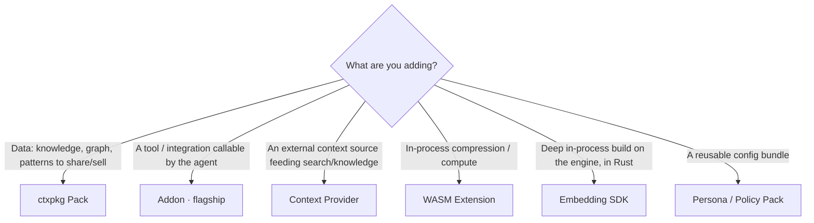

# Extending lean-ctx — one decision, one trust model

> **Status: Preview for the local addon channel; the rest is design.** Building,
> installing and running an addon on your own machine is supported as of 3.10.1
> (see [addons](addons.md)). LeanCTX still does **not** offer a marketplace, a
> curated registry, ranking, or managed binary distribution, and this document is
> not a promise of one. Current scope and status are governed by
> [`public-product-claims-v1`](../contracts/public-product-claims-v1.md).

lean-ctx can be extended in several ways. They look similar from the outside
(they all "add capabilities"), but each targets a different job and a different
trust model. This guide is the **single entry point**: pick the right mechanism
in one decision, then follow its dedicated guide.

> TL;DR — building a **tool or integration** (in any language)? Build an
> [**Addon**](addons.md). Everything else is for a narrower job below.

## Pick your extension type


```mermaid
flowchart TD
  Q0{What are you adding?}
  Q0 -->|Data: knowledge, graph, patterns to share/sell| PACK[ctxpkg Pack]
  Q0 -->|A tool / integration callable by the agent| ADDON[Addon · flagship]
  Q0 -->|An external context source feeding search/knowledge| PROV[Context Provider]
  Q0 -->|In-process compression / compute| WASM[WASM Extension]
  Q0 -->|Deep in-process build on the engine, in Rust| SDK[Embedding SDK]
  Q0 -->|A reusable config bundle| PERSONA[Persona / Policy Pack]
```

- **Share or sell *data*** (knowledge, graph edges, session, patterns, gotchas)
  → [**ctxpkg Pack**](publishing-packages.md)
- **A *tool / integration* the agent can call** (any language, via MCP)
  → [**Addon**](addons.md) — the flagship path
- **An external *context source*** (issues, tickets, DB rows, a REST API,
  another MCP server's resources) that should flow into search + knowledge
  → [**Context Provider**](../contracts/provider-framework-contract-v1.md)
- **In-process compression / compute** → **WASM Extension**
  ([WASM ABI](../contracts/wasm-abi-v1.md))
- **Deep, in-process build on the engine, in Rust** →
  [**Embedding SDK**](embed-sdk.md) (`lean-ctx-sdk`)
- **A reusable configuration bundle** → [**Persona**](../contracts/persona-spec-v1.md)
  / [**Policy Pack**](policy-packs.md)

## The mechanisms at a glance

| Mechanism | Job | Lives where | Distribution | Trust model |
|---|---|---|---|---|
| **Addon** | Expose **tools**, or a WASM compressor | Declared MCP server (stdio/http), and/or a WASM module in the pack | Signed `.ctxpkg` (`lean-ctx addon`) | Signature re-verified locally + module digests + install consent; a declared server is an ordinary process, disclosed as such |
| **Context Provider** | Feed an external **data source** into the pipeline | `[providers.*]` / `~/.config/lean-ctx/providers/` | Config (+ tokens) | Token-scoped; data redacted on ingest |
| **WASM Extension** | In-process **compressor/provider** | Sandboxed WASM in the engine | Extension registry | WASM sandbox (no ambient host access) |
| **ctxpkg Pack** | Ship/sell **data** | Signed archive | Hosted registry (`lean-ctx pack`) | Ed25519 signing + publisher identity |
| **Persona / Policy Pack** | Reusable **config** | TOML bundle | File / registry | Inherits engine config trust (global-only floors) |
| [**Embedding SDK**](embed-sdk.md) | **In-process** build in Rust | Your binary links the crate | crates.io | Runs in your process — you own the trust boundary |

## Resolving the common overlaps

Several mechanisms can all involve "an external MCP server" or "extra tools",
which is the usual source of confusion. Disambiguation:

### Addon vs `[[gateway.servers]]`

Same runtime, two layers. `[[gateway.servers]]` is the **raw config primitive**:
a downstream MCP server the gateway aggregates. An **Addon** is the
**packaged, distributable, signed** form of exactly that — a
`lean-ctx-addon.toml` manifest inside a signed `.ctxpkg`, whose signature is
re-verified on your machine before you are shown the exact command and asked.
`lean-ctx addon add` *writes* the `[[gateway.servers]]` entry for you and
`addon remove` takes it away again. Hand-editing `[[gateway.servers]]` is the
escape hatch; an Addon is the supported, shareable artifact.

lean-ctx does **not** install the server itself — no `uv tool install`, no
`npx`. The manifest records how to run a tool you already have.

### Addon vs `[providers.mcp_bridges.<name>]`

Both connect to an external MCP server, but for **opposite purposes**:

- **Addon** exposes the server's **tools** so the agent can *call* them
  (`ctx_tools find` / `call`). Use it for *actions*.
- **MCP Bridge** (a Context Provider) pulls the server's **resources** into the
  consolidation pipeline — BM25 index, graph, knowledge, session — so they
  become *context* (searchable via `ctx_semantic_search`, recallable via
  `ctx_knowledge`). Use it for *data*.

If you want the agent to *do something*, build an Addon. If you want lean-ctx to
*know something*, configure a Provider/MCP Bridge.

> The line is softer than it used to be: an Addon's output can **also** flow into
> the consolidation pipeline when you enable the gateway's deep-integration flags
> (`index_output`, and category adapters), so a tool's results become searchable
> + graphable too. The split is now about intent (a callable *action* vs a
> standing *data source*), not capability — see
> [Why an addon goes deeper](addons.md#why-an-addon-goes-deeper-than-a-passthrough).

### Whatever happened to Plugins

Removed in 3.9.20 and not coming back. `lean-ctx plugin` exits with a pointer to
`lean-ctx addon help`. Subprocess plugins asked users to trust that an arbitrary
local binary behaved; an addon either runs bounded inside the engine as WASM, or
is a server whose exact command you read before consenting. The lifecycle hook
events (`pre_read`, `post_compress`, `on_session_*`) went with them — the hooks
lean-ctx has today are the agent-tool hooks in `lean-ctx hooks`, a different
mechanism.

## Naming: `@ns/name`

Distributable artifacts (Addons and Packs) use a namespaced identity so the same
short name from two authors never collides:

```
@<publisher>/<name>
```

- `<publisher>` is your registry namespace (your verified publisher handle or org).
- `<name>` is the artifact slug — lowercase `[a-z0-9-]`, no leading/trailing dash.
- The bare `<name>` (no `@ns/`) refers to a built-in/first-party entry.

Examples: `@dastholo/lean-md`, `@acme/jira-tools`, `@acme/payments-knowledge`.
Local-only mechanisms (Providers, Personas) are addressed by their local
id and are not namespaced.

## Start building

There is no `addon init` scaffold: an addon directory is a manifest and,
optionally, the `.wasm` files beside it, which is little enough to write by
hand and one less thing to keep in sync with the format.

| You want | Command | Then |
|----------|---------|------|
| An addon (WASM module and/or MCP server) | write `lean-ctx-addon.toml` next to your `.wasm`, if any | `lean-ctx addon release ./my-addon` → `lean-ctx addon add ./my-addon-1.0.0.ctxpkg` |
| A config provider (REST source) | `lean-ctx provider init <id>` | edit `.lean-ctx/providers/<id>.toml`; auto-discovered |

`release` validates as it builds — a manifest that declares neither a module nor
an `[mcp]` server is refused, as is half-configured wiring or a `.wasm` that is
not WebAssembly — and then self-checks the package it just signed before writing
it. `add` re-verifies that signature on the installing machine.

## One trust model

Executable extensions differ in how much can be *enforced*, and the guide says
which is which rather than implying one level everywhere:

- **WASM addons** are bounded by the engine: no ambient environment, a fresh
  store per call, and the host applies the output budget after decoding. The
  package signature is re-verified on the installing machine, and every module
  is checked against its pinned SHA-256 and its WebAssembly magic bytes before
  anything is written. Modules are stored read-only and never marked executable.
- **A declared `[mcp]` server is not sandboxed.** The per-addon OS sandbox
  (`sandbox-exec` / `bwrap`) and the `[capabilities]` table were removed with
  the rest of the pre-3.9.20 addon stack. Such a server is an ordinary process
  with your privileges, so `addon add` prints its exact argv and says so before
  asking, and lean-ctx never fetches or installs the binary for you. An `http`
  endpoint gets the disclosure that fits it instead. When `[mcp] sha256` is set,
  the gateway hashes the resolved binary and refuses to spawn a mismatch. See
  [`addon-manifest-v1`](../contracts/addon-manifest-v1.md) § What 3.10.1
  implements.
- **Plugins** are gone: `lean-ctx plugin` exits with a pointer to
  `lean-ctx addon help`.
- **Packs** carry no executable code; they are Ed25519-signed and bound to a
  publisher identity.

What is *not* enforced is stated rather than implied: `[capabilities]`,
`addons.sandbox` and the per-addon OS sandbox are gone. A declared server's
bound is the user reading its command before saying yes, plus an optional
`sha256` pin the gateway checks on every spawn.

## See also

- [Addons — community extensions](addons.md) (flagship; build & publish)
- [Publishing context packages](publishing-packages.md)
- [Context policy packs](policy-packs.md)
- [Provider framework contract](../contracts/provider-framework-contract-v1.md)
- [Addon manifest contract](../contracts/addon-manifest-v1.md)
