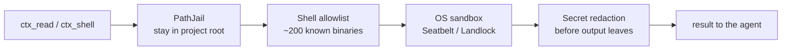

# Journey 13 — Security & Governance

> You're putting lean-ctx in front of real code — possibly on a shared machine,
> in CI, or under a security policy. This journey covers every guardrail lean-ctx
> applies by default and every dial you can tighten: filesystem jail, shell
> allowlist, secret redaction, OS sandboxing, harden mode, and role policies.

Source files:
- `rust/src/core/pathjail.rs` — filesystem boundary (PathJail)
- `rust/src/core/shell_allowlist.rs` — command allowlist
- `rust/src/core/secret_detection.rs` — secret scanning & redaction
- `rust/src/core/sandbox.rs`, `sandbox_seatbelt.rs`, `sandbox_landlock.rs` — OS sandbox
- `rust/src/cli/harden.rs` — `harden` (soft/hard/undo)
- `rust/src/core/context_policies.rs` — role policies
- `rust/src/core/owasp_alignment.rs`, `audit_trail.rs` — alignment & audit

---

## 0. The defense-in-depth model

Every file read and shell command flows through layered guardrails, **on by
default** — you don't opt in:



You can tighten each layer (stricter shell parsing, harden mode, role policies)
but you cannot accidentally turn off the baseline.

---

## 1. PathJail — stay inside the project

**What it does:** confines file access to the resolved project root. Absolute
paths outside the jail are rejected, so a stray `read /etc/passwd` or a
path-traversal `../../` cannot escape the workspace.

- Re-rooting to a different project root is **off by default**
  (`allow_auto_reroot = false`) — lean-ctx will not silently follow an absolute
  path into another tree.
- Multi-root setups (`lean-ctx serve --root a:A --root b:B`) jail each root
  independently (`server/multi_path.rs`).

This is the foundation every other layer assumes.

---

## 2. Shell allowlist & strict mode

**What it does:** the shell hook only compresses/executes commands whose binary
is on the allowlist (~200 common dev tools: `git`, `cargo`, `npm`, `node`,
`python`, …). Anything else passes through untouched rather than being wrapped.

```toml
# config.toml
shell_allowlist = ["git", "cargo", "npm", "…"]   # REPLACE the default set
shell_allowlist_extra = ["just", "task"]          # ADD to the default set
shell_strict_mode = false                         # set true to block $() and backticks
excluded_commands = []                            # never intercept these
```

- **`docker` / `podman` are deliberately *not* in the default allowlist** —
  mount flags can bypass PathJail. Add them explicitly only if you accept that.
- `shell_strict_mode = true` blocks command substitution (`$(…)`, backticks) for
  environments that must forbid dynamic command construction.
- Replace the whole list via `LEAN_CTX_SHELL_ALLOWLIST` (comma-separated), or
  just **add** a few extras with `shell_allowlist_extra`. The
  `lean-ctx allow <cmd>` CLI edits `shell_allowlist_extra` for you, and
  `lean-ctx allow --list` prints the effective allowlist plus any parse errors so
  a typo can never silently drop your overrides.

---

## 3. OS sandboxing for executed code

**What it does:** when lean-ctx executes code (`ctx_execute`), it runs under the
OS sandbox — **Seatbelt** on macOS and **Landlock** on Linux — so the executed
process gets a restricted filesystem/network view, not your full user
privileges. On platforms without a supported sandbox, execution is gated rather
than run unconfined.

This is separate from PathJail (which guards lean-ctx's *own* reads); the sandbox
guards *child processes* lean-ctx spawns on your behalf.

---

## 4. Secret redaction — nothing leaks to the model

**What it does:** before any shell output or file content is returned, lean-ctx
scans it for credentials (AWS keys, tokens, etc.) and replaces matches with
`[REDACTED:<kind>]`. It is **on by default**.

```toml
[secret_detection]
enabled = true
redact = true
custom_patterns = ["MYCORP_[A-Z0-9]{20}"]   # add org-specific secret shapes
```

Built-in patterns cover common cloud/credential formats; `custom_patterns` lets
you redact organization-specific secret shapes. Matches are reported with a safe
preview (e.g. `AKIA…`) so you know redaction fired without seeing the secret.

### 4.1 Sensitivity policy floor — per-item levels

Where `[secret_detection]` masks *known credential shapes*, the **sensitivity
floor** classifies every item by a level and enforces one uniform **policy
floor** just before content reaches the model. It is **off by default** (fully
no-op) and covers both tool outputs and injected knowledge facts.

```toml
[sensitivity]
enabled = true            # off by default → no-op
policy_floor = "secret"   # public < internal < confidential < secret
action = "redact"         # "redact" masks the spans, "drop" withholds the item
```

| Level | Raised by (high-precision signals only) |
|-------|------------------------------------------|
| `secret` | secret-like paths (`.env`, `.ssh/…`, `*.pem`) or detected credentials |
| `confidential` | Luhn-validated card numbers, mod-97-validated IBANs |
| `internal` | reserved for explicit tagging |
| `public` | default |

Anything classified **at or above** `policy_floor` is dropped or redacted: with
`action = "drop"` the whole item is replaced by a short notice; with `redact`
only the offending spans are masked. Knowledge facts store their level at
creation (`KnowledgeFact.sensitivity`) and are re-checked at injection time, so a
floor change takes effect immediately. The classifier uses **only high-precision
signals** (no speculative heuristics) to avoid false positives; `LEAN_CTX_SENSITIVITY=0|1`
toggles enforcement for a single run. This section lives in the **global**
`~/.lean-ctx/config.toml` only — an untrusted project file cannot lower the floor.

---

## 5. Harden mode — force the compressed path

**What it does:** `harden` makes the agent use lean-ctx's compressed `ctx_*`
tools by **denying native Read/Grep** (except immediately after an Edit). Two
levels:

```bash
lean-ctx harden            # soft: sets LEAN_CTX_HARDEN=1 in MCP configs
lean-ctx harden --hard     # also adds "Bash" to ~/.claude/settings.json deny
lean-ctx harden --undo     # remove both — native tools allowed again
```

Real output:

```text
lean-ctx harden (level: soft)

  [OK] /Users/you/.cursor/mcp.json
  [OK] /Users/you/.claude.json
  [OK] Set LEAN_CTX_HARDEN=1 in MCP configs

Harden active. Native Read/Grep will be denied (except after Edit).
Undo with: lean-ctx harden --undo
```

Soft harden is reversible and config-only; `--hard` additionally blocks the
Claude Bash tool. Both are fully undone by `--undo` (see also
[Journey 12 → §4](12-troubleshooting.md)).

---

## 6. Role policies — least privilege per agent

**What it does:** role policies (`context_policies.rs`, set via
`ctx_session action=role` / `lean-ctx session role`) scope what a session may do
— e.g. a `reviewer` role that cannot write, or limiting privileged search
(`ctx_search ignore_gitignore=true` requires an admin-class role). Use this to
give a sub-agent or teammate a least-privilege surface.

---

## 7. Audit & alignment

lean-ctx maintains an **audit trail** (`audit_trail.rs`) of security-relevant
actions and ships an **OWASP alignment** map (`owasp_alignment.rs`) documenting
which controls address which risks — useful when answering a security review.

---

## Governance checklist

| Goal | Control |
|------|---------|
| Keep file access in-project | PathJail (on by default) |
| Restrict which commands run | `shell_allowlist` + `shell_strict_mode` |
| Never wrap docker mount-escapes | docker/podman off the default allowlist |
| Confine executed code | Seatbelt (macOS) / Landlock (Linux) |
| Stop secrets reaching the model | `[secret_detection]` (on by default) |
| Block whole sensitivity levels (PII/secret) pre-prompt | `[sensitivity]` policy floor (off by default) |
| Force compressed reads | `lean-ctx harden [--hard]` |
| Least-privilege agents | role policies |
| Answer a security review | audit trail + OWASP alignment |

> Tuning *how much* lean-ctx compresses or *which tools* it exposes lives in
> [Journey 10 — Customization & Governance](10-customization-and-governance.md);
> this journey is specifically the **security** surface.
