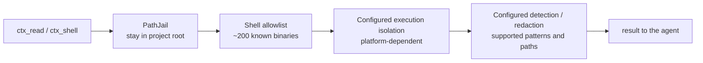

# Journey 13 — Security & Governance

> You're putting lean-ctx in front of real code — possibly on a shared machine,
> in CI, or under a security policy. This journey covers supported controls
> and their configuration boundaries: filesystem jail, shell
> allowlist, secret redaction, OS sandboxing, harden mode, and role policies.

Source files:
- `rust/src/core/pathjail.rs` — filesystem boundary (PathJail)
- `rust/src/core/shell_allowlist.rs` — command allowlist
- `rust/src/core/secret_detection.rs` — secret scanning & redaction
- `rust/src/core/sandbox.rs`, `sandbox_seatbelt.rs`, `sandbox_landlock.rs` — OS sandbox
- `rust/src/core/tcc_guard_sandbox.rs` — macOS launchd seatbelt wrapper (deny `~/Documents`, #356)
- `rust/src/cli/harden.rs` — `harden` (soft/hard/undo)
- `rust/src/core/context_policies.rs` — role policies
- `rust/src/core/owasp_alignment.rs`, `audit_trail.rs` — alignment & audit

---

## 0. The defense-in-depth model

Supported paths apply layered controls according to the integration, role,
configuration, and platform. The diagram names the layers; it does not assert
that every path traverses every layer or that all layers are enabled:


```mermaid
flowchart LR
  R[ctx_read / ctx_shell] --> PJ[PathJail<br/>stay in project root]
  PJ --> AL[Shell allowlist<br/>~200 known binaries]
  AL --> SB[Configured execution isolation<br/>platform-dependent]
  SB --> SD[Configured detection / redaction<br/>supported patterns and paths]
  SD --> OUT[result to the agent]
```

Review the effective posture with `lean-ctx security status` and `lean-ctx doctor`.
Allow roots, roles, warning modes, and disabled controls can widen the boundary.

---

## 0.1 See and flip the whole posture — `lean-ctx security`

lean-ctx's guardrails fall into **two independent planes**. Keeping them separate
is deliberate: changing containment does not itself change secret-redaction
configuration. Detection still has coverage limits and cannot guarantee that
no secret reaches a model provider.

| Plane | Protects | Controls |
|-------|----------|----------|
| **Containment** | your *machine* from the agent | PathJail + shell gating |
| **Secret defense** | your *secrets* from the LLM provider | `.env` / credential redaction |

One command shows the live posture and how to change it:

```bash
lean-ctx security status        # posture board: jail, shell, secret redaction
```

Two master switches flip **containment** in one step — secret redaction is never
touched by them:

```bash
lean-ctx yolo                   # OPEN: any path + any command (containment off)
lean-ctx secure                 # STRICT: restore the secure defaults
```

`yolo` writes `path_jail = false` and `shell_security = "off"` to your global
config and takes effect immediately (no restart). It is fully reversible, and you
re-enable pieces **granularly** afterwards — the array/blanket dichotomy works in
both directions:

```bash
lean-ctx config set shell_security warn   # log violations, block nothing
lean-ctx config set path_jail true        # re-enable the filesystem jail
lean-ctx allow acli                       # permit one extra command (additive)
```

Secret/`.env` redaction is a **separate** toggle — `yolo` leaves it on:

```bash
lean-ctx security secrets off   # stop masking secrets (NOT recommended)
lean-ctx security secrets on    # re-enable masking
```

`lean-ctx security status` (and `lean-ctx doctor`) print a coarse label —
**STRICT** (both planes enforced), **RELAXED** (partially loosened), or **OPEN**
(containment fully off) — so the active posture can never hide.

> Mental model: **containment** is "what the agent may touch on this machine";
> **secret defense** is "what may leave this machine for the provider". `yolo`
> only drops the first.

---

## 1. PathJail — stay inside the project

**What it does:** confines file access to the resolved project root. Absolute
paths outside the jail are rejected, so a stray `read /etc/passwd` or a
path-traversal `../../` cannot escape the workspace.

- Re-rooting to a different project root is **off by default**
  (`allow_auto_reroot = false`) — lean-ctx will not silently follow an absolute
  path into another tree.
- Multi-root setups (`lean-ctx serve --root a:A --root b:B`) jail each root
  independently (`server/multi_path.rs`).
- **Widen it (array):** add trusted roots with `allow_paths` / `extra_roots`
  (or `LEAN_CTX_ALLOW_PATH`) — reads/writes resolve under those prefixes too.
- **Disable it (blanket):** set `path_jail = false` to allow *any* path — the
  blanket equivalent of `allow_paths = ["/"]`, for containers/sandboxes where the
  boundary is already external. `lean-ctx yolo` sets this for you, and
  `lean-ctx doctor` flags it loudly while it is active.

This is the foundation every other layer assumes.

---

## 1.5 Workspace trust — gate untrusted project-local config

**What it does:** a cloned repo ships its own `.lean-ctx.toml`, which is merged
over your global config. That merge can raise **security-sensitive** settings —
replace the `shell_allowlist`, widen the jail via `allow_paths` / `extra_roots`,
repoint a `proxy.*_upstream`, define `custom_aliases`, or flip
`rules_scope` / `rules_injection`. lean-ctx treats those as *trusted-only*.

For a workspace you have **not** trusted, the sensitive overrides are **withheld**
(comfort knobs like `compression_level` / `theme` still apply) and a `[SECURITY]`
warning is logged. Grant trust explicitly:

```bash
lean-ctx trust              # trust the current project root
lean-ctx trust status       # show trust state + which overrides are gated
lean-ctx trust --list       # list all trusted workspaces
lean-ctx untrust            # revoke trust for the current root
```

Trust is pinned to **both** the workspace path **and** a content hash of
`.lean-ctx.toml` — editing the file after trust re-gates it, so a "trust once,
modify later" change can't take effect silently. `lean-ctx doctor` shows the
state. Headless / fleet environments can opt in without a prompt via
`LEAN_CTX_TRUST_WORKSPACE=1` or a `LEAN_CTX_TRUSTED_ROOTS=/path/a,/path/b` list.

> Review a clone's `.lean-ctx.toml` before you `lean-ctx trust` it — trusting is
> what lets its security-sensitive settings widen lean-ctx's own boundaries.

---

## 2. Shell allowlist & strict mode

**What it does:** the shell hook only compresses/executes commands whose
tokens match an allowlist entry (~200 common dev tools by default: `git`,
`cargo`, `npm`, `node`, `python`, …). Anything else passes through untouched
rather than being wrapped.

Entry grammar (`shell_allowlist_subcommand_scoping = true`, the default):
- A single word (`"cargo"`) matches the binary plus any subcommand/args.
- A multi-word entry with no trailing `*` (`"git status"`) matches that
  exact command only — `git stash` needs its own entry.
- A multi-word entry ending in `*` (`"terraform plan *"`) matches that
  subcommand plus any (or no) further arguments.

Set `shell_allowlist_subcommand_scoping = false` to fall back to matching
only the base binary (the behavior before this grammar existed) as a
compat/rollback path; a trusted workspace only, since it widens access.

**Pipelines & chains (`|`, `&&`, `||`, `;`):** a compound command is wrapped as a
*single* `lean-ctx -c "<whole>"` only when **every** stage is gate-clean — then
the pipe/chain runs natively inside one profile-free shell and just the *final*
output is compressed (so `git log | wc -l` counts the raw log, not a digest). If
any stage is not gate-clean (an interpreter `-c`, a non-allowlisted sink such as
`kubectl`, …) the **whole** command is left raw for the agent's shell. lean-ctx
never wraps only part of a pipe (which would compress mid-pipe data the next stage
still needs) and never relaxes the gate to wrap a tricky sink — the rewrite can
only ever route commands the same chokepoint would already allow.

```toml
# config.toml
shell_allowlist = ["git", "cargo", "npm", "…"]   # REPLACE the default set
shell_allowlist_extra = ["just", "task"]          # ADD to the default set
shell_strict_mode = false                         # set true to block $() and backticks
excluded_commands = []                            # never intercept these
```

- **`docker` / `podman` are deliberately *not* in the default allowlist** —
  mount flags can bypass PathJail. Add them explicitly only if you accept that.
- `shell_strict_mode = true` blocks command substitution (`$(…)`, backticks) for
  environments that must forbid dynamic command construction.
- Replace the whole list via `LEAN_CTX_SHELL_ALLOWLIST` (comma-separated), or
  just **add** a few extras with `shell_allowlist_extra`. The
  `lean-ctx allow <cmd>` CLI edits `shell_allowlist_extra` for you, and
  `lean-ctx allow --list` prints the effective allowlist plus any parse errors so
  a typo can never silently drop your overrides.

### 2.1 Shell-security mode (`enforce` | `warn` | `off`)

One switch governs **all** command gating — the allowlist *and* the hard blocks
(`eval`/`exec`/`source`, `$()`/backticks at command position, interpreter `-c`).
It is applied at a single chokepoint, so MCP `ctx_shell` and the CLI
(`lean-ctx -c` / `-t`) behave identically.

```toml
# config.toml
shell_security = "enforce"   # default — secure
# shell_security = "warn"    # run the checks, log violations via tracing, never block
# shell_security = "off"     # skip command gating entirely — compression stays active
```

| Mode | Allowlist | Hard blocks (`eval`, `$()`, …) | Compression |
|---|---|---|---|
| `enforce` (default) | enforced | blocked | on |
| `warn` | logged only | logged only | on |
| `off` | skipped | skipped | **on** |

- **Resolution:** `LEAN_CTX_SHELL_SECURITY` env → `shell_security` in config →
  default `enforce`. An unknown value falls back to `enforce` (never fails open).
- **Why `enforce` is the default, even for beginners:** lean-ctx mediates the
  agent's shell, so a weaker default would silently downgrade security for every
  install on upgrade. In practice the default allowlist already covers normal
  workflows (`git`/`cargo`/`npm`/`node`/`python`/…), so beginners rarely hit it —
  the friction is for power users running exotic tools, who opt into `off`.
- **`off` is the "YOLO" escape hatch.** It disables *command gating* only; it does
  **not** lift the read-only-output doctrine in `ctx_shell` (no `>`/`tee`/heredoc
  file writes — use the native write tool). Compression is unaffected in every mode.
  Set it together with `path_jail = false` in one step via `lean-ctx yolo`
  (and revert both with `lean-ctx secure`).
- `lean-ctx doctor` surfaces the active mode whenever it is not `enforce`, so a
  relaxed posture can never hide.
- This supersedes the CLI-only `LEAN_CTX_ALLOWLIST_WARN_ONLY` (which still works
  for backward compatibility); `shell_security` is the canonical, global switch.

---

## 3. OS sandboxing for executed code

**What it does:** `ctx_execute` supports OS isolation when configured with
`sandbox_level >= 1`: **Seatbelt** on macOS and **Landlock** on Linux.
Level 0 provides timeout/output limits without that OS boundary. Unsupported
platforms can fall back to level 0; verify the effective platform and settings
before depending on isolation.

This is separate from PathJail (which guards lean-ctx's *own* reads); the sandbox
guards *child processes* lean-ctx spawns on your behalf.

### 3.1 launchd seatbelt — no macOS "Documents" prompt (#356)

On macOS the daemon, proxy and auto-updater run as LaunchAgents — i.e. as their
own TCC identity (`ppid 1`), which does **not** inherit your terminal's or
editor's privacy grants. Any access they make under `~/Documents`, `~/Desktop`
or `~/Downloads` would pop the "lean-ctx would like to access files in your
Documents folder" prompt, and because every release re-signs the binary a
granted permission is voided on the next update — so the prompt returns forever.

lean-ctx therefore bakes a **deny-`~/Documents` Seatbelt profile** into the
LaunchAgent invocation itself (`rust/src/core/tcc_guard_sandbox.rs`): the plist
runs `sandbox-exec -p '(allow default) (deny file-read* file-write* …)' lean-ctx
…`. The kernel refuses any access to the three protected directories *silently*
with `EPERM` — the TCC subsystem is never consulted, so the prompt can never
appear and no "Allow" is ever required. Everything outside those directories
stays permitted, so the processes keep full functionality. The path guards
(`pathutil::may_probe_path`) and the optional stable code-signing identity
(`lean-ctx codesign-setup`) remain underneath as defense-in-depth. Verified by
`rust/tests/tcc_sandbox.sh`, which boots the daemon under the production wrapper.

---

## 4. Secret redaction — configured detection coverage

**What it does:** supported output paths scan for configured credential patterns
and can replace matches with `[REDACTED:<kind>]`. Coverage depends on the active
configuration, role, detector patterns, and integration path. Unknown formats
or excluded matches may pass through; warning does not redact or block.

```toml
[secret_detection]
enabled = true
redact = true
custom_patterns = ["MYCORP_[A-Z0-9]{20}"]   # add org-specific secret shapes
exclude_patterns = ["LCTX_PUBLIC_\\w+"]     # carve out known-safe matches (subtractive)
```

Built-in patterns cover common cloud/credential formats; `custom_patterns` lets
you redact organization-specific secret shapes. Matches are reported with a safe
preview (e.g. `AKIA…`) so you know redaction fired without seeing the secret.

`exclude_patterns` is the subtractive counterpart (#718): a detected match
covered by any of these regexes is neither reported nor redacted — carve out a
repo's own naming conventions without disabling secret detection wholesale.
Since v3.9.2 the detector also skips benign non-values on its own: unquoted
identifier/property references (`serverEnv.getStripeSecretKey`), camelCase
subwords (`superuserPassword:` as a key), and obvious placeholders
(`ghp_change_me`, `your_key_here`). Quoted string literals and digit-bearing
values remain protected.

### 4.1 Sensitivity policy floor — per-item levels

Where `[secret_detection]` masks *known credential shapes*, the **sensitivity
floor** classifies every item by a level and enforces one uniform **policy
floor** just before content reaches the model. It is **off by default** (fully
no-op) and covers both tool outputs and injected knowledge facts.

```toml
[sensitivity]
enabled = true            # off by default → no-op
policy_floor = "secret"   # public < internal < confidential < secret
action = "redact"         # "redact" masks the spans, "drop" withholds the item
```

| Level | Raised by (high-precision signals only) |
|-------|------------------------------------------|
| `secret` | secret-like paths (`.env`, `.ssh/…`, `*.pem`) or detected credentials |
| `confidential` | Luhn-validated card numbers, mod-97-validated IBANs |
| `internal` | reserved for explicit tagging |
| `public` | default |

Anything classified **at or above** `policy_floor` is dropped or redacted: with
`action = "drop"` the whole item is replaced by a short notice; with `redact`
only the offending spans are masked. Knowledge facts store their level at
creation (`KnowledgeFact.sensitivity`) and are re-checked at injection time, so a
floor change takes effect immediately. The classifier uses **only high-precision
signals** (no speculative heuristics) to avoid false positives; `LEAN_CTX_SENSITIVITY=0|1`
toggles enforcement for a single run. This section lives in the **global**
`~/.lean-ctx/config.toml` only — an untrusted project file cannot lower the floor.

### 4.2 Context Gateway admission — before cache and compression

Output redaction (§4) masks credentials in what the model sees. **Context
admission** acts earlier: a source file an agent acquires passes the built-in
detectors *before* the session cache, the compressor or any read mode
(`full`, `raw`, `map`, `lines:…`, …) touches it. This covers `ctx_read` and
the tools sharing its admitted reader (`ctx_symbol`, `ctx_compose`,
`ctx_execute`), search and index paths (`ctx_search`, the trigram index, the BM25 index behind
`ctx_semantic_search`, dense-backend snippets, the shared content cache), every
recovery path and provider data (see *Derived stores and recovery* below).
(The CLI `lean-ctx read` used by shell hooks is not yet covered unless a
policy pack is active; output redaction still applies there.) A credential cut
in half by compression can therefore no longer slip past a pattern, and a
search cannot surface a value the read would have masked. It is **on by
default**.

```toml
[context_gateway]
enabled = true              # LEAN_CTX_CONTEXT_GATEWAY=off disables for one run
mode = "developer"          # governed|sovereign: unclassified content counts as internal
secrets = "redact"          # off | warn | redact | block (patterns from [secret_detection])
pii = "redact"              # checksum-validated only: AHV, IBAN, payment cards
injection = "warn"          # prompt-injection heuristic; content stays, signal is shown
classification = "warn"     # CONFIDENTIAL / TOP SECRET markings raise the level
max_inspected_bytes = 8388608
detector_timeout_ms = 2000
hud = "auto"                # auto | in_band | status_line
```

- **Blocking sees the original.** A `block` is evaluated before any redaction
  can hide what triggered it.
- **Fail closed.** If a redaction leaves a detectable secret or PII value
  behind, the content is withheld instead of delivered.
- **Visible.** A read that was changed or flagged ends with one line such as
  `[lean-ctx gateway: 1 secret(s) redacted · 2 PII value(s) redacted]`; a
  withheld read names its reason codes (`injection.blocked`). Values never
  appear in that line.
- **Classified.** Each admission records a classification
  (`public < internal < confidential < restricted`) — `.env`-style paths are
  `restricted` — and one decision in the Context Gateway v1 vocabulary
  (`docs/contracts/context-gateway-v1.md`).
- **Honest coverage.** Detectors scan line-aligned chunks within
  `max_inspected_bytes` (default 8 MiB) and `detector_timeout_ms` (default
  2000 ms). A detector reports `complete` only when it saw every byte; a
  budget, a timeout, an invalid custom pattern or an unreadable medium (an
  image) is reported as `partial`, `timed_out`, `failed` or `unsupported` —
  never as clean. In `developer` mode such content is delivered with a
  "not fully inspected (…)" line; in `governed` and `sovereign` mode every
  enabled detector is mandatory and the content is withheld.
- **Global only.** Like `[sensitivity]`, this section is never taken from a
  project-local `.lean-ctx.toml`, trusted or not.
- `secret_detection.enabled = false` also switches the secrets detector off.

`lean-ctx doctor` shows the effective state on its **Context gateway** line.

#### Derived stores and recovery

Everything lean-ctx keeps for later is built from admitted text only:

- **Restricted content is never stored.** Withheld objects, `.env`-style and
  other secret-like paths and content classified `restricted` never enter the
  BM25 index, the trigram index, the shared content cache, archives and their
  full-text index, the tee store, reference results, project knowledge,
  handoffs (`ctx_share`) or provider artifacts. Everything else is stored
  masked, so a search can never match a value the read would have masked.
- **Stores are bound to the policy.** The persisted BM25 index records the
  digest of the policy it was admitted under; an index from another policy —
  or one written before admission existed — is rebuilt, never served.
  Resident stores (content cache, trigram index) are dropped when the policy
  changes, and a build still running under the old policy cannot repopulate
  them. Archive full-text rows written before admission are dropped once.
- **Recovery is re-authorized.** `ctx_expand` (archives, tee files,
  references, `search_all`), `ctx_retrieve`, proxy in-band recovery (CCR) and
  every `ctx_knowledge` view hand stored text back only after admitting it
  again under the *current* policy. A tightened policy applies to old
  records; withheld content is refused with its reason codes, never returned
  in part.
- **Providers are admitted before consolidation.** Issue bodies, titles,
  references, metadata, extracted facts, graph edges and cache entries pass
  the gateway before any of them reaches a store; an object with a withheld
  field is dropped whole. Provider results shown to the model are admitted
  like a file read and appear in the call's receipt.

#### Proxy egress — the last check before a model provider

With the BYOK proxy in the path, every request is admitted one final time on
exactly the body that leaves the machine — after compression, routing,
translation and every cache-safety revert. This covers Anthropic Messages,
OpenAI Chat Completions and Responses (HTTP and WebSocket), Gemini, Bedrock,
and the token-count probe used for counterfactual metering.

- **Every content string** — system prompt, messages, tool results, tool
  arguments — passes the gateway under the current policy. Masked values are
  rewritten in place; a withheld object is replaced by
  `[lean-ctx gateway: content withheld — <reasons>]`. Identifiers and
  structure (`model`, `role`, `tool_use_id`, …) are never touched.
- **Prompt caches stay warm.** Admission is deterministic, so a conversation
  prefix is rewritten to the same bytes on every turn, and a request with
  nothing to change is forwarded byte-identical.
- **Sealed content is never rewritten.** Thinking blocks with a provider
  signature and `encrypted_content` are inspected; a finding there is
  delivered unchanged and flagged in `developer` mode and refuses the request
  in `governed`/`sovereign` mode — rewriting would break the request.
- **Honest about what it cannot read.** Images and other inline media, and
  bodies the proxy cannot parse (opaque content encodings), are recorded as
  not inspected; `governed`/`sovereign` mode refuses them.
- **The destination is part of the decision.** Content classified
  `restricted` (an explicit `TOP SECRET`/`SECRET`/`RESTRICTED` banner, a
  credential delivered under `secrets = "warn"`) never goes to a remote model;
  a local upstream (`localhost`, loopback) may receive it.
- **One receipt per request** names the provider, model and locality, the
  policy digest and the SHA-256 of the forwarded bytes: `lean-ctx inspect
  --proxy`. A refused request answers `403` and its receipt names the reason.
- Not model traffic, not inspected: the ChatGPT `/backend-api` passthrough
  (account and pairing calls) and its remote-control WebSocket tunnel.

#### Decision receipts and `lean-ctx inspect`

Every tool call that admits a source produces one **Decision Receipt**: which
sources were inspected, delivered or withheld, why (reason codes), what the
detectors covered, the original and delivered token counts, the digest of the
policy that decided and the SHA-256 of exactly the bytes that were returned.
Receipts hold no content. They are stored content-addressed under the lean-ctx
data directory (`gateway/receipts/<sha256>.json`), and any receipt with a
security action is anchored by its digest in the signed audit trail.

```bash
lean-ctx inspect              # the latest round of this project, explained
lean-ctx inspect --last 5     # the five newest rounds
lean-ctx inspect --json       # machine-readable, with verification status
lean-ctx inspect --task <ID>  # one task: plan, deliveries, cost and outcome
```

`--task` joins one task's entries in the execution ledger (task start, plan,
context decision, model and engine invocations, signed receipts, outcome) with
every Decision Receipt the gateway wrote for that task. Each missing link —
no plan, no delivery, no outcome, an unverifiable ledger or receipt — is named
as a gap; an outcome that was never recorded stays `unknown`. Lineage is looked
up within the task's tenant/project scope (`--project-id`, `--tenant-id`;
default: the current project root), so equal task ids in two projects never
mix, and ledger entries are shown only when the task's envelope proves that
scope.

A receipt whose bytes no longer match its digest is reported as
**NOT VERIFIED (tampered)** and not shown. The status line and `lean-ctx value`
count the gateway's actions from the same receipts (secrets and personal data
kept out of context, sources withheld, sources not fully inspected), proven
from the audit trail.

`hud = "auto"` (default) keeps pure redaction counts out of the model's
context when lean-ctx's Claude Code status line is installed — the
`[REDACTED:…]` markers already tell the model, the status line tells you.
Notices the model must act on (prompt-injection signals, incomplete
inspection, withheld content) are always delivered with the result.
`hud = "in_band"` always appends the summary; `hud = "status_line"` never
appends redaction counts.

---

## 5. Harden mode — force the compressed path

**What it does:** `harden` makes the agent use lean-ctx's compressed `ctx_*`
tools by **denying native Read/Grep** (except immediately after an Edit). Two
levels:

```bash
lean-ctx harden            # soft: sets LEAN_CTX_HARDEN=1 in MCP configs
lean-ctx harden --hard     # also adds "Bash" to ~/.claude/settings.json deny
lean-ctx harden --undo     # remove both — native tools allowed again
```

Real output:

```text
lean-ctx harden (level: soft)

  [OK] /Users/you/.cursor/mcp.json
  [OK] /Users/you/.claude.json
  [OK] Set LEAN_CTX_HARDEN=1 in MCP configs

Harden active. Native Read/Grep will be denied (except after Edit).
Undo with: lean-ctx harden --undo
```

Soft harden is reversible and config-only; `--hard` additionally blocks the
Claude Bash tool. Both are fully undone by `--undo` (see also
[Journey 12 → §4](12-troubleshooting.md)).

---

## 6. Role policies — least privilege per agent

**What it does:** role policies (`context_policies.rs`, set via
`ctx_session action=role` / `lean-ctx session role`) scope what a session may do
— e.g. a `reviewer` role that cannot write, or limiting privileged search
(`ctx_search ignore_gitignore=true` requires an admin-class role). Use this to
give a sub-agent or teammate a least-privilege surface.

---

## 7. Audit & alignment

lean-ctx maintains an **audit trail** (`audit_trail.rs`) of security-relevant
actions and ships an **OWASP alignment** map (`owasp_alignment.rs`) documenting
which controls address which risks — useful when answering a security review.

For a structured external yardstick, lean-ctx publishes a self-assessment
against the 32-control [Context Governance Benchmark](https://github.com/yvgude/context-governance-benchmark)
(v1.0-draft): graded **C2 — Managed** with declared gaps — see
[docs/compliance/cgb-self-assessment.md](../compliance/cgb-self-assessment.md).

---

## Governance checklist

| Goal | Control |
|------|---------|
| See / flip the whole posture | `lean-ctx security status` · `yolo` · `secure` |
| Disable containment for a trusted machine | `lean-ctx yolo` (keeps secret redaction on) |
| Keep file access in-project | PathJail (on by default) |
| Gate a cloned repo's `.lean-ctx.toml` | Workspace trust (`lean-ctx trust`) |
| Restrict which commands run | `shell_allowlist` + `shell_strict_mode` |
| Never wrap docker mount-escapes | docker/podman off the default allowlist |
| Confine executed code | Seatbelt (macOS) / Landlock (Linux) |
| Stop secrets reaching the model | `[secret_detection]` (on by default) |
| Block whole sensitivity levels (PII/secret) pre-prompt | `[sensitivity]` policy floor (off by default) |
| Force compressed reads | `lean-ctx harden [--hard]` |
| Least-privilege agents | role policies |
| Answer a security review | audit trail + OWASP alignment |

> Tuning *how much* lean-ctx compresses or *which tools* it exposes lives in
> [Journey 10 — Customization & Governance](10-customization-and-governance.md);
> this journey is specifically the **security** surface.
