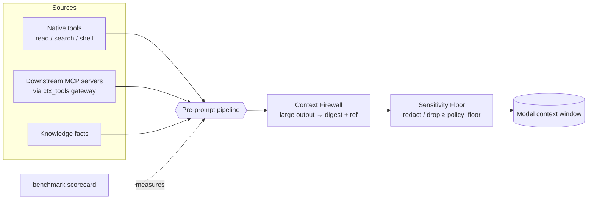

# lean-ctx User Journeys — The Governed, Scalable Context OS

> **Audience:** website / product narrative. Each journey is a persona-driven
> story: *who* hits a wall, *what* they do with lean-ctx, *what runs under the
> hood*, and the *payoff*. Every command and config key below is real and shipped
> — copy-paste them.

lean-ctx started as a way to **compress what your agent reads**. It has grown into
a **Context OS**: a local-first, governed context runtime that *any* developer can
build their own agent on — coding or not — and roll out to a team without ever
gating what a single developer gets locally.

This page tells that story as journeys, in two acts. **Act I** governs and scales
the context window. **Act II** turns lean-ctx into infrastructure you build *on* —
stable SDKs, domain personas, universal ingestion, and a sandboxed extension
surface — monetized by coordination, never by subtracting local power (the
**Local-Free Invariant**).

The through-line: **one pre-prompt choke point**. Everything an agent is about to
see — native tool output, downstream MCP results, knowledge facts — passes through
the same pipeline, so the firewall, the sensitivity floor, and the gateway all
compose instead of fighting each other.

### Act I — Govern & scale the context window

| Feature | Persona it unblocks | One-line value | Surface |
|---|---|---|---|
| **MCP Tool-Catalog Gateway** | Agent with 5+ MCP servers | Unlimited downstream tools at constant context cost | `ctx_tools`, `[gateway]` |
| **Context Firewall** | Anyone running shell/search through an agent | Runaway outputs become a digest + retrieval ref | `[archive].ephemeral` |
| **Per-item Sensitivity Floor** | Regulated / security-conscious teams | Secrets & PII are redacted or dropped *before* the model | `[sensitivity]` |
| **Reproducible Scorecard** | Buyers, maintainers, CI | Self-verifying proof of savings + retrieval quality | `lean-ctx benchmark scorecard` |

### Act II — Build your own agent on lean-ctx

| Feature | Persona it unblocks | One-line value | Surface |
|---|---|---|---|
| **Open Door: `/v1` API + SDKs** | Developers in any language | Embed lean-ctx in your own harness over a stable contract | `lean-ctx serve`, `/v1/*`, `lean-ctx-client` |
| **Context Personas** | Non-coding agents (sales/research/support) | One runtime, many verticals — reshape the whole surface | `LEAN_CTX_PERSONA`, `persona` |
| **Universal Intake** | Research / data / support | Index PDF, CSV, email, HTML, JSON — not just code | format extractors, `ctx_index` |
| **Open Core: plugins + WASM** | Platform engineers | Add tools / compressors / providers without forking | `plugin.toml`, `LEAN_CTX_WASM_DIR`, `/v1/capabilities` |
| **Commercial Plane (Local-Free)** | Teams & buyers | Team RBAC, real plans & reproducible ROI — local stays free | `lean-ctx team`, `billing`, `savings roi` |

---

## Journey 1 — "My agent is drowning in tools" → MCP Tool-Catalog Gateway

**Persona:** Maya, a platform engineer. Her agent is wired to filesystem, GitHub,
Linear, Postgres and two internal MCP servers. Every request now ships *dozens* of
tool schemas in the system prompt. The agent has gotten **slower, pricier, and
worse at picking the right tool** — the well-documented "more tools → less
adoption" curve.

**The wall:** every connected MCP server injects its *entire* catalog, on every
request, whether or not the task needs it. lean-ctx used to shrink only its *own*
surface; Maya's pain is the *external* surface.

**The journey:**

1. Maya points lean-ctx at her servers — once, globally (this is privileged: it
   can spawn processes and open connections, so it is **never** read from a
   project-local config):

```toml
# ~/.lean-ctx/config.toml
[gateway]
enabled = true
top_n = 5
cache_ttl_secs = 300

[[gateway.servers]]
name = "linear"
transport = "http"
url = "https://mcp.linear.app/mcp"
headers = { Authorization = "Bearer ${LINEAR_TOKEN}" }

[[gateway.servers]]
name = "fs"
transport = "stdio"          # spawned as a child process
command = "mcp-server-filesystem"
args = ["/srv/project"]
```

2. Her agent now sees **one** tool, `ctx_tools`, instead of the whole union. It
   describes the task in natural language:

```jsonc
ctx_tools {"action":"find","query":"open an issue with a title and assignee"}
```

3. lean-ctx returns a ranked shortlist — the few tools that actually matter, plus
   a count of everything it shielded:

```text
gateway: 3 tool(s) for "open an issue" (catalog: 47 tool(s) across 5 server(s))

1. linear::create_issue — Create a Linear issue   params: title*, assignee, team
2. github::create_issue — Open a GitHub issue      params: repo*, title*, body
3. linear::update_issue — Update an existing issue  params: id*, state
```

4. The agent invokes the chosen handle; lean-ctx **proxies** the call to the
   owning server and streams back the result:

```jsonc
ctx_tools {"action":"call","tool":"linear::create_issue",
           "arguments":{"title":"Fix login","assignee":"maya"}}
```

**Under the hood** (`rust/src/core/gateway/`):
- `client.rs` — a real MCP client on the official `rmcp` SDK. `stdio` spawns the
  server; `http` uses streamable-HTTP with custom headers. Every connect/list/call
  is bounded by `call_timeout_secs`; sessions open per-operation and shut down
  cleanly (no orphaned child processes).
- `catalog.rs` — aggregates each server's tools into a namespaced `server::tool`
  catalog behind a **TTL cache**. Per-server errors are surfaced, never hidden.
- `router.rs` — builds an **ephemeral BM25 index** over the catalog per query (the
  same engine as `ctx_search`) and returns the top-N, deterministically.
- `ctx_tools.rs` — gates on config, routes the action, and proxies the call;
  downstream results flow back through the *same* firewall + sensitivity floor as
  native tools.

**Payoff:** Maya can connect *as many* MCP servers as she likes. The model's
per-request tool surface stays flat at one meta-tool, tool-selection accuracy
recovers, and the catalog refreshes itself on a TTL. Full reference:
[Journey 5 §10](reference/05-advanced.md).

---

## Journey 2 — "One `grep` blew up my context window" → Context Firewall

**Persona:** Sam, who lets the agent run `ctx_shell`, `ctx_search` and `ctx_tree`
freely. One `rg` across a monorepo, one noisy build log, and **30k tokens of
output** lands in the window — pushing out the code the agent was actually editing.

**The journey:** Sam does nothing. The firewall is **on by default**. When a
firewallable tool's output crosses the token threshold, lean-ctx stores the full
output out-of-band and returns a compact, deterministic **digest** instead:

```text
[ctx_search output: 31,402 tokens stored]
… head (20 lines) …
… tail (8 lines) …
Retrieve in full: ctx_expand(id="a1b2c3", search="TODO", start_line=…, end_line=…)
```

The agent keeps a small, navigable footprint and can drill into the *exact* slice
it needs with `ctx_expand` — by line range or full-text search across the archive.

**Under the hood** (`rust/src/core/firewall.rs`):
- Scope is deliberately narrow: `ctx_shell`, `ctx_execute`, `ctx_search`,
  `ctx_tree`. **Explicit file reads are never firewalled** —
  `is_protected_read()` makes `ctx_read` / `ctx_multi_read` / `ctx_smart_read`
  the single source of truth for "a read always returns content the agent can
  edit against," honoured by both the firewall and the `reference_results` path.
- The digest is built without an LLM (head/tail or char-bounded excerpt for single
  giant lines) so it is reproducible and cheap.

**Config:**

```toml
[archive]
ephemeral = true             # default on. Env: LEAN_CTX_EPHEMERAL
ephemeral_min_tokens = 4000  # threshold. Env: LEAN_CTX_EPHEMERAL_MIN_TOKENS
```

**Payoff:** runaway outputs can no longer evict the working set, with **zero loss**
— the raw output is one `ctx_expand` away.

---

## Journey 3 — "We can't let secrets reach the model" → Per-item Sensitivity Floor

**Persona:** Dana, security lead at a fintech. Policy is non-negotiable:
credentials and customer PII must never leave the building inside an LLM prompt —
even by accident, even in a stack trace an agent happened to `cat`.

**The journey:** Dana sets a **policy floor** once, globally:

```toml
[sensitivity]
enabled = true               # no-op until set. Env: LEAN_CTX_SENSITIVITY
policy_floor = "confidential" # public < internal < confidential < secret
action = "redact"            # redact (mask spans) | drop (withhold whole item)
```

From then on, every item heading to the model is classified and enforced at the
pre-prompt choke point. With `redact`, a leaked AWS key or card number is masked in
place; with `drop`, the offending item is withheld entirely.

**Under the hood** (`rust/src/core/sensitivity/`):
- Ordered levels `Public < Internal < Confidential < Secret` drive a single
  `level >= floor` comparison.
- **Honest classification only** — no speculative heuristics. Secret-like paths and
  detected secrets → `Secret`; **Luhn-validated** card numbers and **ISO-7064**
  IBANs → `Confidential`. This keeps false positives from silently degrading good
  context.
- One `enforce_text()` entry point is applied uniformly to **tool outputs** and
  **knowledge injection** — including downstream results coming back through the
  gateway (Journey 1).

**Payoff:** a uniform, auditable guarantee that sensitive data is handled *before*
it reaches the model — off by default, so nothing changes for users who don't opt
in. Full reference: [Security & Governance](reference/13-security-and-governance.md).

---

## Journey 4 — "Prove the savings are real" → Reproducible Scorecard

**Persona:** Priya, an engineering manager evaluating lean-ctx. Marketing numbers
don't survive procurement. She wants a measurement she can **re-run and get the
same answer** — on her laptop and in CI.

**The journey:**

```bash
lean-ctx benchmark scorecard          # human-readable
lean-ctx benchmark scorecard --json   # machine-readable artifact
```

She gets compression savings (per mode), retrieval **recall@5 / recall@10 / MRR**,
and latency over a fixed scenario matrix — plus a `determinism_digest`:

```jsonc
{
  "schema_version": 1,
  "tokenizer": "…",
  "determinism_digest": "…",   // fingerprint of the latency-free metrics
  "scenarios": [ /* per-scenario savings + recall + mrr */ ],
  "aggregate": { "avg_savings_pct": …, "avg_recall_at_5": …, "avg_mrr": … }
}
```

**Under the hood** (`rust/src/core/scorecard/`): the corpus is generated
deterministically and retrieval is pure BM25, so the **quality** metrics are
identical run-to-run and machine-to-machine. Latency is reported but deliberately
**excluded** from the digest (it's wall-clock). Two runs of the same code anywhere
produce the same `determinism_digest` — the artifact is **self-verifying**, and CI
uploads it on every build.

**Payoff:** Priya can independently reproduce the headline numbers and diff them
across versions — trust by construction, not by claim.

---

## Act II — Build your own agent on lean-ctx

Act I made the context window safe and scalable. Act II opens the runtime itself:
embed it from any language, point it at any corpus, reshape it for any domain, and
extend it without forking — then take it to a team while every local feature stays
free. Full developer map: [The Context OS Guide](context-os/guide.md).

---

## Journey 5 — "I want to build my *own* agent — in any language" → Open Door

**Persona:** Leo, building an **outbound-sales agent** (not a coding agent) in
Python. He wants lean-ctx's compression, retrieval and memory — but driven from
*his* loop, in *his* language, against a contract that won't break under him.

**The wall:** lean-ctx looked coding-agent shaped (stdio MCP, IDE configs). Leo
needs a stable, language-neutral way to call it from his own harness — and a way
to *discover* what a given server can do instead of trial-and-error.

**The journey:**

1. Leo runs the local HTTP server (REST + SSE + MCP on one port):

```bash
lean-ctx serve                      # → http://127.0.0.1:8080  (prints a loopback bearer token)
```

2. He **discovers capabilities** instead of guessing — contract version, active
   persona, transports, presets, the live tool surface, and every extension:

```bash
curl -s --oauth2-bearer "$TOKEN" http://127.0.0.1:8080/v1/capabilities
```

3. He installs an SDK — same wire contract in every language — and calls tools:

```python
# pip install lean-ctx-client
from leanctx import LeanCtxClient
client = LeanCtxClient("http://127.0.0.1:8080", bearer_token=TOKEN)

caps = client.capabilities()                       # branch on real features
text = client.call_tool_text("ctx_read", {"path": "notes/acme.md"})
```

4. He wires lean-ctx tools straight into his existing LLM loop via a **framework
   adapter** — no glue code:

```python
from leanctx.adapters import to_openai_tools, run_openai_tool_call
tools = to_openai_tools(client)                    # pass to your OpenAI call
result = run_openai_tool_call(client, tool_call)   # when the model picks one
```

**Under the hood:**
- **Stable `/v1` contract** (`rust/src/http_server/`): `GET /v1/capabilities`
  ([`capabilities-contract-v1`](contracts/capabilities-contract-v1.md)) and
  `GET /v1/openapi.json` are the SSOT, generated from code and drift-tested —
  generate a typed client in any language.
- **Three first-party SDKs**, all thin wire clients (no engine linking): Python
  [`clients/python`](../clients/python), TypeScript [`lean-ctx-client`](../cookbook/sdk),
  Rust [`clients/rust/lean-ctx-client`](../clients/rust/lean-ctx-client).
- **Adapters** for OpenAI, LangChain, LlamaIndex and CrewAI — present when the
  framework is installed, with a helpful `ImportError` when it isn't.

**Payoff:** lean-ctx becomes a **service any developer embeds**, in any language,
behind a versioned contract — verified by a shared conformance kit
(`run_conformance`) before you ship.

---

## Journey 6 — "My agent isn't about code" → Context Personas

**Persona:** the same sales team. The defaults are tuned for software work — the
full power tool surface, a code-oriented intent taxonomy, identity compression.
Leo wants a surface shaped for **prospecting**, not refactoring.

**The wall:** one-size-fits-code defaults bury a non-coding agent in irrelevant
tools and the wrong compression/chunking for prose.

**The journey:** Leo selects a **persona** — one switch that reshapes the whole
context surface (tool set + read-mode + compressor + chunker + intent taxonomy +
sensitivity floor):

```bash
export LEAN_CTX_PERSONA=lead-gen     # or: research · support · data-analysis · coding
```

Each persona is a real, shipped bundle — the surface, compressor, chunker, intents
and sensitivity floor all change together:

```text
coding                              → Power profile · identity · lines · auto · floor=public
research                           → Standard profile · markdown · paragraph · map · floor=public
support · data-analysis            → Standard profile · prose/identity · floor=internal
lead-gen (alias: sales)            → Custom 6-tool surface · prose · paragraph · floor=confidential
        tools: ctx_read · ctx_search · ctx_url_read · ctx_knowledge · ctx_semantic_search · ctx_session
```

The lead-gen surface is genuinely **narrowed** to those six prospecting tools — the
refactor/code tools are gone — while `coding` keeps the full Power surface.

Not one of the built-ins? Ship a declarative persona file and select it — no fork:

```toml
# <personas_dir>/compliance.toml  (default <OS-config-dir>/lean-ctx/personas; override via LEAN_CTX_PERSONAS_DIR)
name = "compliance"
tool_profile = "custom"
tools = ["ctx_read", "ctx_search", "ctx_semantic_search", "ctx_knowledge"]
default_read_mode = "map"
compressor = "prose"
chunker = "paragraph"
intent_taxonomy = ["scan", "flag", "cite", "report"]
sensitivity_floor = "confidential"
```

**Under the hood** (`rust/src/core/persona.rs`,
[`persona-spec-v1`](contracts/persona-spec-v1.md)): `Persona::resolve` reads
`LEAN_CTX_PERSONA` › `config.persona` › default `coding`; an unknown name falls
back to `coding`, never an error. The resolved profile drives `list_tools`, so the
surface genuinely shrinks/grows per persona. **Backward-compatible:** an explicit
tool-profile always wins, so existing coding installs are untouched.

**Payoff:** **one runtime, many verticals.** A sales, research, support or data
agent gets a surface built for its domain — and the `coding` default behaves
exactly as before.

---

## Journey 7 — "Feed it my PDFs, CRM exports and emails" → Universal Intake

**Persona:** Nadia, a research analyst. Her corpus is reports (PDF), web captures
(HTML), CRM exports (CSV/JSON) and a mailbox (EML) — **not source code**.

**The wall:** lean-ctx historically indexed *code*. Nadia's documents never reached
the BM25 / semantic / knowledge stores, so retrieval couldn't see them.

**The journey:** Nadia points the index at a mixed-format directory. The
**ingestion front-door** admits documents and data, and a **format extractor**
picks the right reader per file — no per-format flags:

```python
client.call_tool_text("ctx_index", {"action": "build", "project_root": "./reports"})
hits = client.call_tool_text("ctx_semantic_search", {"query": "Q3 churn drivers"})
```

| Format | What the extractor does |
|---|---|
| **PDF** | local text extraction → paragraph chunks (no upload) |
| **HTML** | rendered to clean Markdown, paragraph-chunked |
| **CSV/TSV** | RFC-4180 parse (quoted fields/embedded delimiters) → labeled record chunks |
| **EML** | salient header summary (From/To/Subject/Date) + `text/plain` body, MIME stripped |
| **JSON/NDJSON** | chunked per array element / object entry |

**Under the hood:** `rust/src/core/ingestion.rs` decides *whether* a file is
indexable (code · document · data · text); `rust/src/core/extractors/`
([`extractors-v1`](contracts/extractors-v1.md)) decides *how* to read it. Each
text format also registers as a named **chunker** in the extension registry, so
it shows up in `/v1/capabilities` and is conformance-checked for determinism and
coverage.

**Payoff:** **any corpus reaches the same engine.** The retrieval, knowledge and
compression that powered coding agents now power a research, support or data agent
over the documents that domain actually uses.

---

## Journey 8 — "Extend it — without forking the engine" → Open Core

**Persona:** Priya, a platform engineer. She needs a **domain tool** (an internal
lookup) and a **custom compressor** for her data shape. Forking and maintaining a
patched build is a non-starter.

**The wall:** historically, adding a tool or a transform meant forking
`build_registry()`. That doesn't scale to a team or survive upgrades.

**The journey — three escalating options, no fork:**

1. **A tool the agent can call** — declare it in a plugin manifest; lean-ctx
   registers it as a native MCP tool at startup and advertises it in
   `/v1/capabilities`:

```toml
# plugin.toml
[plugin]
name = "crm"
version = "0.1.0"

[[tools]]
name = "crm_lookup"
description = "Look up an account in the CRM"
command = "crm-bin"                 # gets JSON args on stdin, returns text on stdout
timeout_ms = 8000
input_schema = { type = "object", properties = { account = { type = "string" } }, required = ["account"] }

[trust]
permissions = ["network"]          # declared + surfaced for consent
```

2. **React to lifecycle events** — a hook command per event
   (`pre_read`, `post_compress`, `on_knowledge_update`, `on_session_*`); zero-cost
   when nothing listens.

3. **A custom compressor / read-mode / chunker** — compile it to a sandboxed
   **WASM** module (any language) and drop it in a directory; lean-ctx discovers
   it by file stem and registers it as a first-class extension:

```bash
export LEAN_CTX_WASM_DIR=~/.lean-ctx/wasm    # *.wasm → registered compressors
lean-ctx conformance                          # your extension is checked like a built-in
```

```text
/v1/capabilities → extensions.compressors: ["identity","markdown","prose","whitespace","my_ext"]
conformance scorecard → [ok] extensions/compressor:my_ext
```

**Under the hood:** plugins live in `rust/src/core/plugins/` (manifest tools +
fired hooks), the WASM host in `rust/src/core/wasm_ext.rs`
(`wasm-abi-v1`: `alloc` + `lctx_compress`/`lctx_provider_fetch`, **host-enforced**
byte budget so a faulty guest can never overrun). Everything is governed by the
[extension trust model](contracts/extension-trust-v1.md) (scrubbed env + cwd jail
+ timeout, declared permissions surfaced for consent) and proven by
[`conformance-v1`](contracts/conformance-v1.md).

**Payoff:** the engine is **extensible in any language, sandboxed, discoverable
and conformance-checked** — your tools and transforms are first-class without ever
touching lean-ctx's source.

---

## Journey 9 — "Roll it out to my team & prove ROI — without gating my devs" → Commercial Plane

**Persona:** Marco, an engineering manager. He wants shared coordination, RBAC and
a procurement-grade ROI number — **without** taking away anything his developers
get for free locally.

**The wall:** most tools monetize by gating features. Marco needs the opposite:
local stays best-in-class and ungated; only **team coordination** is paid.

**The journey:**

1. **Local stays free.** Billing is informational only — it *describes* plans and
   *meters* local savings; it never gates a local capability:

```bash
lean-ctx billing plans               # free · team · enterprise (additive entitlements)
lean-ctx billing usage --json        # metered from the signed ledger, read-only
```

2. **Team coordination, with real RBAC.** Issue role-scoped tokens and serve a
   shared, audited team endpoint:

```bash
lean-ctx team token create --config team.json --id alice --role viewer   # viewer·member·admin·owner
lean-ctx team serve --config team.json
```

   A `viewer` may search but is denied mutations/audit (`403 scope_denied`); an
   `admin` has the full scope set — every decision written to an audit log.

3. **Prove the value** with a reproducible, signed ROI artifact:

```bash
lean-ctx savings roi                 # net tokens, USD, top tools — SHA-256 chain + Ed25519 signature
```

**Under the hood:** the Team/Org plane is `rust/src/http_server/team/` (bearer
auth, `TeamRole` → scope expansion in `roles.rs`, per-request audit). Billing is
`rust/src/core/billing/` — `entitlement_allows` returns **`true` for every local
feature on every plan**, the billing-layer expression of the **Local-Free
Invariant**. The savings ledger (`rust/src/core/savings_ledger/`) is the metering
substrate. The invariant is not a promise but a **CI gate**:
[`local-free-invariant-v1`](contracts/local-free-invariant-v1.md) fails the build
if any local capability is ever put behind an account, license or plan.

**Payoff:** a genuinely monetizable **Team/Cloud plane** that adds coordination,
governance and scale — while the local engine every developer runs stays **free,
ungated and best-in-class, forever**.

---

## How it all connects



- The **gateway** widens what can *enter* the pipeline (unbounded external tools)
  without widening the window.
- The **firewall** caps the *size* of anything that enters.
- The **sensitivity floor** caps the *sensitivity* of anything that enters.
- The **scorecard** measures the whole pipeline, reproducibly.

Because they share one choke point, a downstream gateway result is firewalled and
sensitivity-checked exactly like a native one — no feature can be bypassed by
routing around it.

**Act II wraps this same pipeline.** SDKs and the `/v1` API are the *door* into it;
personas *shape* it per domain; ingestion + extractors *widen what can enter* from
any corpus; plugins and WASM *extend* the transforms inside it — all discoverable
via `/v1/capabilities` and conformance-checked. The Team/Cloud plane adds
coordination *around* the runtime without ever reaching in to gate a local feature.

---

## What changed under the hood (engineering summary)

| Feature | New / changed code | Tests | Config / surface |
|---|---|---|---|
| **MCP Gateway** | `core/gateway/{config,client,catalog,router,mod}.rs`, `tools/ctx_tools.rs`, `tools/registered/ctx_tools.rs` | `tests/gateway_e2e.rs` (in-process `rmcp` echo server), gateway unit tests | `[gateway]`, `[[gateway.servers]]`; tool `ctx_tools` (granular surface → **72**) |
| **Context Firewall** | `core/firewall.rs` (`is_protected_read` SSOT, digest builder) | firewall + `archive_expand_tests` | `[archive].ephemeral`, `ephemeral_min_tokens` |
| **Sensitivity Floor** | `core/sensitivity/{mod,classify}.rs`, `enforce_text` choke point | `tests/sensitivity_floor.rs` (8) | `[sensitivity]` (`enabled`, `policy_floor`, `action`) |
| **Scorecard** | `core/scorecard/{mod,scenarios}.rs`, `benchmark scorecard` CLI | `tests/scorecard_determinism.rs` (2) | `lean-ctx benchmark scorecard [--json]` |
| **Open Door (SDKs + `/v1`)** | `http_server/` (`/v1/capabilities`, `/v1/openapi.json`), `clients/{python,rust}`, `cookbook/sdk` | SDK conformance kits; `tests/capabilities_*`, OpenAPI drift | `lean-ctx serve`; `lean-ctx-client` |
| **Context Personas** | `core/persona.rs`, `core/config` resolution | persona resolution + tool-surface tests | `LEAN_CTX_PERSONA`, `config.persona`; `<personas_dir>/*.toml` |
| **Universal Intake** | `core/ingestion.rs`, `core/extractors/{json,csv,eml,html,pdf,text}.rs` | extractor + chunker conformance | `ctx_index`; auto per-format |
| **Open Core (plugins + WASM)** | `core/plugins/`, `core/wasm_ext.rs` (`wasm-abi-v1`) | plugin/hook + WASM host tests; `conformance` | `plugin.toml` `[[tools]]`, hooks; `LEAN_CTX_WASM_DIR` |
| **Commercial Plane** | `http_server/team/`, `core/billing/`, `core/savings_ledger/` | RBAC + billing + `local-free-invariant` CI gate | `lean-ctx team`, `billing`, `savings roi` |

**Cross-cutting consistency (this pass):** every "tool count" reference across
README, `ARCHITECTURE.md`, `VISION.md`, guides, comparisons, Discord FAQ,
marketing and skills was reconciled to the runtime SSOT of **72** tools — enforced
by `tests/docs_tool_counts_up_to_date.rs`, which fails CI on drift. The generated
appendices ([MCP tools](reference/generated/mcp-tools.md),
[config keys](reference/generated/config-keys.md)) and the website manifest are
regenerated from code.

---

## Where to go next

- **Build your own tool (developer map):** [The Context OS Guide](context-os/guide.md)
- **Non-coding recipes (lead-gen / research / support / data):** [Non-Coding Cookbook](context-os/cookbook-non-coding.md)
- **The vision & rationale:** [Context OS RFC v1](context-os/rfc-v1.md)
- **The contracts you build against:** [docs/contracts/](contracts/) — capabilities · persona-spec · extractors · extension-trust · wasm-abi · conformance · local-free-invariant
- **Full feature reference, as journeys:** [docs/reference/README.md](reference/README.md)
- **The gateway in depth:** [Advanced & Integrations §10](reference/05-advanced.md)
- **Security surface:** [Security & Governance](reference/13-security-and-governance.md)
- **Always-current tool list:** [generated MCP tools](reference/generated/mcp-tools.md)
